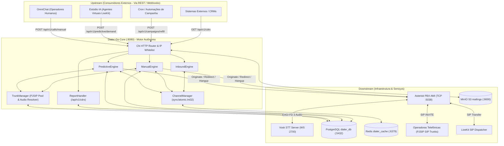

# Arquitetura Mestre do Projeto: Dialer-Go

Documento Mestre Canônico de Arquitetura, Invariantes, Grafo de Execução e Diretrizes de Governança do subsistema **Dialer-Go** (`go 1.25.0`), regido pelas diretrizes canônicas do protocolo **Bootstrap Zero** (conforme Seção 0.1 de `RULE[user_global]`).

> [!CAUTION]
> **REGRA INVIOLÁVEL DE ESCOPO E AUTONOMIA ABSOLUTA:**
> **NUNCA ALTERAR CÓDIGO DE OUTROS SISTEMAS! O DIALER-GO É UM SISTEMA 100% AUTÔNOMO, NÃO TEM QUE SE METER COM OUTROS SISTEMAS!**
> 
> O Dialer-Go é um motor soberano e agnóstico de telefonia ("caixa-preta"). Ele **JAMAIS** altera, refatora, edita, compila ou adiciona arquivos em repositórios de outros sistemas (como o repositório do OmniChat, CRMs, chat-frontends ou serviços satélites).
> 
> Toda e qualquer interação com sistemas externos — incluindo o OmniChat — ocorre **exclusivamente através de contratos de API REST padronizados (RFC 7807)** e **Webhooks tipados de saída**. Qualquer plataforma que precise consumir dados, desfechos ou gravações de chamadas deve obrigatoriamente consumir as APIs canônicas do Dialer-Go (`/api/v1/cdrs`, etc.).

> [!NOTE]
> Este arquivo é a **ÚNICA FONTE CANÔNICA DE VERDADE** da arquitetura do Dialer-Go. Para aprofundamento operacional e contratos de rotas:
> - 👉 [Manual de Arquitetura Operacional Exaustivo (2.000+ linhas): `.agents/ARCHITECTURE.md`](file:///home/marcio/ominichat/dialer-go/.agents/ARCHITECTURE.md)
> - 👉 [Catálogo Oficial de Endpoints & RFC 7807: `.agents/workflows/API_REFERENCE.md`](file:///home/marcio/ominichat/dialer-go/.agents/workflows/API_REFERENCE.md)
> - 👉 [Índice do Repositório & Grafo de Componentes: `docs/MAP.md`](file:///home/marcio/ominichat/dialer-go/docs/MAP.md)
> - 👉 [Regras Gerais e Governança de Agentes: `.agents/AGENTS.md`](file:///home/marcio/ominichat/dialer-go/.agents/AGENTS.md)

---

## 1. Responsabilidade Unívoca

O **Dialer-Go** é o orquestrador e motor central de alta performance para sinalização, comutação e controle de chamadas telefônicas em **Go puro (Go 1.25)**, responsável por:
1. **Discagem Multimodelo:**
   - **Preditiva:** Algoritmo de pacing em tempo real com auto-balanceamento de overdialing baseado em agentes disponíveis, TMA, TMR e taxa de contato.
   - **Manual:** Atendimento a operadores humanos com preempção prioritária sobre campanhas automatizadas.
   - **Receptiva:** Lookup em sub-milissegundo $O(1)$ para direcionamento inteligente de chamadas entrantes via tabela indexada `phone_trunk_mappings`.
2. **Controle de Concorrência & Troncos:**
   - Gestão thread-safe de capacidade global e granular de canais por tronco SIP/PJSIP via `sync/atomic.Int32`.
   - Hot-reload dinâmico de troncos SIP sem perda de chamadas ativas.
3. **Telefonia de Baixa Latência:**
   - Conexão persistente via socket TCP nativo AMI (:5038) com o Asterisk PBX 20 LTS.
4. **Triagem Ultrarrápida de Atendimento Humano vs. Máquina (AMD Híbrido):**
   - Triagem em duas etapas: Asterisk `app_amd` nativo seguido de análise semântica em tempo real com Vosk STT via EAGI Go (`cmd/vosk-eagi`) na porta :2700, entregando o áudio ao operador em menos de 1,5 segundo.
5. **Comutação e Destino de Áudio:**
   - Comutação via protocolo SIP para operadores humanos e salas de agentes virtuais de voz (LiveKit).
6. **Soberania do Histórico e Gravações:**
   - Persistência atômica de CDRs com caminhos físicos (`recording_file`) e URLs de streaming (`recording_url`) na tabela `cdrs` do `dialer_db`.

### O que o Dialer-Go NÃO faz:
- ❌ **NÃO altera, modifica ou edita código de outros sistemas:** Proibido tocar no código do OmniChat, CRMs, bots ou outras aplicações.
- ❌ **NÃO processa regras de CRM, funis de venda ou cadastro de clientes:** Exclusividade dos sistemas clientes externos.
- ❌ **NÃO executa raciocínio de LLM ou síntese de voz (TTS) de agentes conversacionais:** Responsabilidade do Estúdio IA / LiveKit Agents.
- ❌ **NÃO gerencia servidores WebRTC de borda de mídia:** Responsabilidade do LiveKit Server.
- ❌ **NÃO transcreve conversas completas pós-atendimento:** O Vosk STT via EAGI atua exclusivamente na triagem inicial de até 3 segundos para identificação de secretária vs. humano.
- ❌ **NÃO depende de bancos ou tabelas externas:** Proibição absoluta de utilizar `call_history` ou qualquer estrutura de banco externa ao `dialer_db`.

---

## 2. Invariantes Arquiteturais (Regras Inquebráveis)

1. **Autonomia Soberana e Isolamento Absoluto (Cláusula Pétrea):**
   - O Dialer-Go é um motor autônomo, agnóstico e independente. Nunca altera código de terceiros e nunca delega sua persistência a tabelas alheias. O ecossistema cliente interage exclusivamente via API REST e Webhooks.
2. **Linguagem Única e Binário Estático (100% Go):**
   - Sem runtimes externos (Node.js, Python, Ruby) no discador. Binário estático Go 1.25 com baixo consumo de memória e CPU sob alta concorrência.
3. **Limite Rígido de 500 Linhas por Arquivo:**
   - Nenhum arquivo `.go` ultrapassa 500 linhas. Ao atingir 350 linhas, o plano de segregação modular deve ser acionado imediatamente.
4. **Tipagem Estrita e Validação de Bordas:**
   - Proibição absoluta de `interface{}` / `any`. Structs tipadas em `internal/domain/`. Respostas de erro no padrão RFC 7807 / RFC 9457 (`ProblemDetails`).
5. **Fronteira de Segurança por IP Whitelist em Memória:**
   - Autorização de requisições REST internas via lookup thread-safe em memória (`sync.Map`), operando em tempo sub-microssegundo.
6. **Persistência Standalone Exclusiva (`dialer_db`):**
   - Banco relacional PostgreSQL isolado exclusivamente para a telefonia, evitando contenção de locks com sistemas consumidores.
7. **Lookup Receptivo $O(1)$ em Tabela Auxiliar Indexada:**
   - Chamadas entrantes consultam exclusivamente a tabela indexada B-Tree `phone_trunk_mappings`, sem varreduras pesadas em tabelas de CDR.
8. **Zero Normalização de Dígitos Telefônicos no Discador:**
   - O discador preserva estritamente os dígitos do número (`10`, `11`, `12`, `13`, `14` dígitos). Prefixos de operadora são aplicados via parametrização do tronco (`tech_prefix`).
9. **Quota de Reserva de Canais Humanos (10 Canais):**
   - O motor preditivo jamais consome toda a capacidade. No mínimo 10 canais globais permanecem rigidamente reservados para chamadas manuais (`HumanReserveQuota`).
10. **Abandono Regulatório Estrito (< 2 Segundos):**
    - Chamadas atendidas sem operador ou sala disponível em até 2 segundos são desligadas com motivo regulatório (`ABANDONED`) e registradas em auditoria.
11. **Rastreabilidade Ponta a Ponta com CorrelationID:**
    - Toda chamada recebe um `correlation_id` único propagado até a tabela `execution_traces`, permitindo auditoria ponta a ponta e detecção de quebra de processo.
12. **Soberania Absoluta de CDRs e Gravações de Áudio:**
    - Toda chamada, metadados de tarifação, desfechos e os links de áudio gravado (`recording_file` e `recording_url`) residem nativamente na tabela `cdrs` do `dialer_db` e são consultados via `GET /api/v1/cdrs` e `GET /api/v1/cdrs/{id}`.

---

## 3. Padrões de Design Patterns Adotados

| Subsistema / Domínio | Padrão Adotado | Justificativa Arquitetural | Localização |
| :--- | :--- | :--- | :--- |
| **Motores de Discagem** | **Strategy Pattern** | Permite alternar dinamicamente entre as estratégias (`PredictiveEngine`, `ManualEngine`, `InboundEngine`) respeitando contratos unificados de ciclo de vida. | `internal/core/` |
| **Comunicação Telefônica (AMI)** | **Adapter Pattern** | Isola o protocolo TCP puro do Asterisk Manager Interface atrás do contrato canônico `ports.AMIPort`. | `internal/adapters/ami/` |
| **Persistência Relacional** | **Repository Pattern** | Segrega as queries SQL do PostgreSQL atrás de interfaces canônicas (`TrunkRepository`, `LeadRepository`, `ReportRepository`, etc.). | `internal/adapters/postgres/` |
| **Eventos de Telefonia** | **Observer / Pub-Sub** | O leitor de socket AMI distribui eventos assíncronos (`AsyncAGI`, `UserEvent`, `Hangup`, `Newchannel`) via canais Go desacoplados. | `internal/adapters/ami/` |
| **Controle de Acesso HTTP** | **Middleware (Chain of Resp.)** | `IPWhitelistMiddleware` intercepta as requisições Chi antes de qualquer processamento, validando IPs em sub-microssegundo. | `internal/adapters/http/` |
| **Resiliência de Rede** | **Circuit Breaker / Retry Backoff** | Conexões com PostgreSQL e AMI implementam retentativas com backoff exponencial para absorver reinicializações de infraestrutura sem panics. | `internal/adapters/{ami, postgres}` |
| **Atomicidade de Mailing** | **Transactional Outbox / Stored Procedures ACID** | Stored procedures PostgreSQL (`fn_audit_claim_predictive_batch`, `fn_audit_persist_predictive_result`) garantem consistência transacional sob concorrência massiva. | `database/schema.sql` |
| **Notificação de Desfecho** | **Adapter & Observer Pattern** | Despacha eventos assíncronos de término e falha de chamada via Webhook HTTP com timeout estrito de 5s para o upstream. | `internal/core/call_notifier.go` |

---

## 4. Tech Stack e Runtimes

- **Arquitetura Base:** Arquitetura Hexagonal (Ports and Adapters) com Clean Architecture segregada em `domain`, `ports`, `core` e `adapters`.
- **Linguagem e Runtime:** Go 1.25 (`go 1.25.0 linux/amd64`).
- **Roteamento HTTP:** Chi Router v5 (`github.com/go-chi/chi/v5`).
- **Central Telefônica:** Asterisk PBX v20 LTS (AMI TCP Socket porta :5038, Dialplan `extensions.conf`, PJSIP).
- **Mecanismo de STT / AMD:** Vosk Speech-to-Text (`alphacep/kaldi-vosk-server:latest`) via WebSocket RFC 6455 em script EAGI Go (`cmd/vosk-eagi`) na porta :2700.
- **Persistência Relacional:** PostgreSQL 16 Alpine (`pgx/v5` connection pool com pooling transacional).
- **Cache Rápido e Filas:** Redis 7 Alpine (`github.com/redis/go-redis/v9`).
- **Armazenamento de Objetos (Mailings):** MinIO S3 API (`github.com/minio/minio-go/v7`).
- **Síntese de Nomes Prévia (TTS Offline):** Piper TTS pt-BR CLI (`internal/adapters/tts/piper_adapter.go`).
- **Contêineres e Deploy:** Docker, Docker Compose e orquestração via Portainer com Traefik Reverse Proxy.

---

## 5. Grafo de Dependências

### Eventos Produzidos / Consumidos:
- **Consumidos do Asterisk AMI:** `AsyncAGIStart`, `AsyncAGIExec`, `UserEvent` (`PredictiveHuman`, `InboundCall`), `Hangup`, `Newchannel`, `Newstate`.
- **Disparados para o Asterisk AMI:** `Originate`, `Redirect`, `Hangup`, `PJSIPShowEndpoints`, `Command` (`pjsip reload`).
- **Persistência e Auditoria:** Registros em `execution_traces`, persistência atômica com áudio em `cdrs` (`recording_file`, `recording_url`) e disponibilização via endpoint `/api/v1/cdrs`.

---

## 6. Master Route (Fluxos Principais de Execução)

### 6.1. Rota Preditiva (`POST /api/v1/predictive/demand`)
1. **Entrada HTTP:** `httpAdapter.PredictiveHandler.HandleDemand` interceptado por `IPWhitelistMiddleware`.
2. **Validação de Contrato:** Parsing e validação da struct `domain.PredictiveDemandRequest`.
3. **Checagem de Estado:** Verifica se campanha está pausada ou sem operadores disponíveis no Redis (`IsCampaignPaused`, `StoreAvailableAgents`).
4. **Cálculo de Pacing:** `PredictiveEngine.CalculateOverdialing` calcula número de canais a disparar baseado em operadores livres, TMR, TMA, probabilidade de contato e agressividade.
5. **Arbitragem de Slot:** `ChannelManager.CanAcquireSlot` valida capacidade global (`MaxGlobalChannels - HumanReserveQuota`) e capacidade por tronco.
6. **Reserva Atômica FILO:** `leadRepo.PopLead` invoca stored procedure ACID `fn_audit_claim_predictive_batch` para reservar leads elegíveis.
7. **Disparo Telefônico AMI:** `AMIPort.Originate` envia ação para o Asterisk no contexto de triagem AMD (`from-dialer-amd`).
8. **Triagem de Voz AMD Híbrida:** Asterisk executa `app_amd`. Se inconclusivo/fala longa, aciona `vosk-eagi` via streaming WebSocket.
9. **Entrega de Chamada:** Ao confirmar atendimento humano (`PredictiveHuman`), Asterisk AMI executa `Redirect` para a sala do operador ou sala LiveKit (`AGENT_ROOM`).
10. **Persistência Pós-Execução:** Na desconexão (`Hangup`), `TrunkManager` vincula o áudio gravado e `ReportRepo.SaveCDR` / `fn_audit_persist_predictive_result` gravam o CDR com caminho físico e URL de streaming na tabela `cdrs`.

### 6.2. Rota Manual (`POST /api/v1/calls/manual`)
1. **Entrada HTTP:** `httpAdapter.ManualHandler.HandleCall` validado por IP Whitelist.
2. **Validação de Contrato:** Validação de `domain.ManualCallRequest` (número de telefone, operador, rota SIP de destino).
3. **Prioridade Preemptiva:** `ChannelManager.AcquireSlot` consome prioritariamente a quota reservada (`HumanReserveQuota`), garantindo que operadores manuais nunca sofram bloqueio por campanhas automáticas.
4. **Disparo Telefônico:** `AMIPort.Originate` conecta diretamente o operador ao cliente via contexto `manual-outbound` com injeção de pre-dial headers.
5. **Auditoria:** Gravação de áudio com `MixMonitor` e log com `correlation_id` em `execution_traces`.

### 6.3. Rota Receptiva (Inbound Telephony)
1. **Entrada Telefônica:** Chamada externa atinge o Asterisk no contexto `[receptivo]`.
2. **Gatilho de Evento AMI:** Dialplan dispara `UserEvent(InboundCall, Channel, Phone, DID, Uniqueid)`.
3. **Lookup $O(1)$:** `InboundEngine` consulta `phone_trunk_mappings` buscando `last_trunk` e `last_project`.
4. **Decisão de Roteamento:** Se encontrado retorno, comuta para a rota SIP prévia do cliente; caso contrário, direciona para o tronco receptivo padrão.
5. **Comutação Asterisk:** AMI despacha `Redirect` para o contexto `cos-inbound` com entrega sem fila residual.

### 6.4. Rota Canônica de Consulta e Áudios (`GET /api/v1/cdrs` e `GET /api/v1/cdrs/{id}`)
1. **Entrada HTTP:** Requisição validada com suporte a filtros (`tenant_id`, `call_type`, `disposition`, `phone`, `date_start`, `date_end`, paginação `page`, `page_size`).
2. **Consulta Relacional Soberana:** `ReportRepo.ListCDRs` consulta diretamente o banco relacional isolado `dialer_db`.
3. **Retorno Enriquecido:** Entrega dados de tarifação, durações (`duration`, `billsec`), status, e os links completos para reprodução de áudio (`recording_file`, `recording_url`).
