# Documento Arquitetural Exaustivo: Dialer-Go
**Subsolo e Motor Central de Telefonia Preditiva, Receptiva e Manual**  
**Linguagem Unica:** GoLang (100% Go)  
**Ecossistema:** Asterisk PBX (AMI TCP Socket + Dialplans) & Troncos SIP / WebRTC (LiveKit)  
**Destinos Primários:** Estúdio IA (Agentes Virtuais de Voz) e OmniChat (Operadores Humanos)  

---

## 1. Visão Geral Executiva e Princípios de Engenharia

O **Dialer-Go** é o subsistema de telefonia de alta performance, projetado do zero em **GoLang**, atuando como orquestrador central de sinalização e comutação telefônica da plataforma. Ele elimina intermediários desnecessários e opera estritamente nos protocolos fundamentais de comunicação: **REST API** para comandos e controle, **AMI TCP Socket** persistente para controle de baixa latência com a central telefônica Asterisk, e **SIP Trunks** para tráfego de mídia em tempo real.

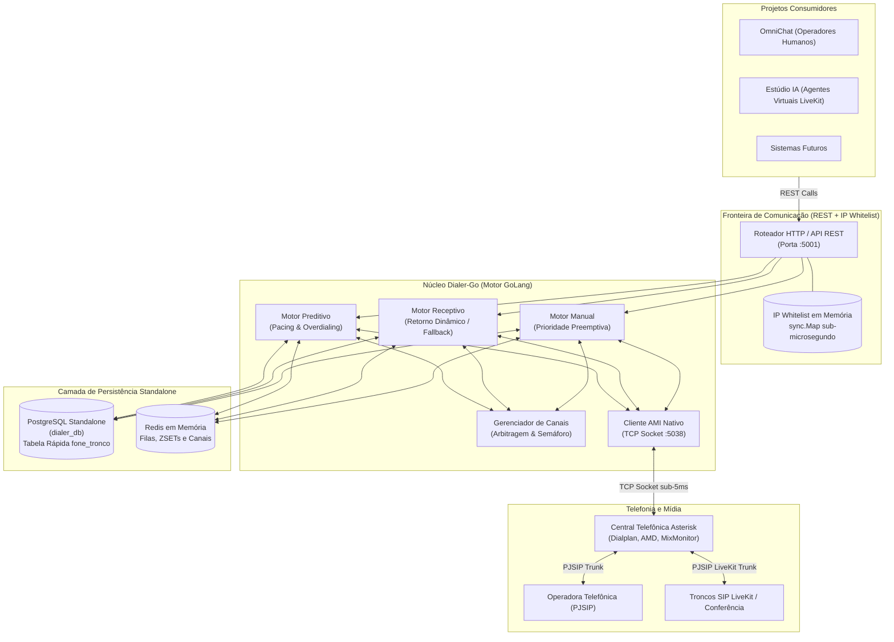

### 1.1. Princípios Arquiteturais Inegociáveis
1. **Linguagem Única (GoLang):** Nenhum interpretador externo (Node.js, Python) faz parte do binário de execução ou do loop operacional de controle. O binário Go é compilado de forma estática com alta eficiência e baixo consumo de CPU/RAM sob concorrência maciça de I/O.
2. **Arquitetura em Camadas e Limite de 500 Linhas por Arquivo:** A base de código respeita estritamente o princípio da responsabilidade única (SRP), desacoplando transporte HTTP, protocolos de rede (AMI), lógica de negócio (motores) e adaptadores de banco. Nenhum arquivo Go (.go) ultrapassa 500 linhas.
3. **Comunicação Direta (REST + SIP Trunk):** Descarte completo de dependências de WebSockets inter-serviços ou mensagerias pesadas intermediárias. Controle trafega por REST API e mídia trafega por Troncos SIP.
4. **Segurança de Rede com IP Whitelist em Memória:** As requisições REST não utilizam tokens JWT ou handshakes de autenticação de sessão custosos. A autorização é baseada estritamente em validação de endereço IP contra uma lista branca mantida em memória (`sync.Map`), proporcionando validação sub-microssegundo.
5. **Base de Dados Postgres Standalone Exclusiva (`dialer_db`):** Isolamento total da base de dados relacional. O discador não compete por transações ou conexões com a base do chat/CRM, garantindo que operações pesadas de mailing ou relatórios não concorram com as operações de discagem.
6. **Lookup Receptivo O(1) em Tabela Auxiliar Dedicada:** Roteamento de chamadas entrantes jamais consulta tabelas gigantescas de CDR/histórico. A decisão de retorno é tomada em consulta indexada B-Tree na tabela auxiliar `phone_trunk_mappings`.
7. **Resiliência de Boot e Fail-Fast Controlado:** A inicialização do pool PostgreSQL implementa retentativas com backoff (até 10 tentativas / 15s) para absorver o tempo de subida de containers. Se o banco permanecer indisponível, o processo encerra via `log.Fatalf` forçando reinício limpo pelo orquestrador, proibindo o servidor HTTP de aceitar requisições em estado de memória corrompido com ponteiros nulos (`nil pointer dereference`).
8. **Rastreabilidade e Padrão CorrelationID:** Cada jornada telefônica recebe um `correlation_id` único no recebimento da demanda, propagado pelas variáveis de canal do Asterisk até a tabela transacional `execution_traces`, permitindo auditoria ponta a ponta na visão do usuário e diagnósticos de quebra de processo.

---

## 2. Subsistema Receptivo (Inbound Telephony)

O subsistema receptivo resolve o problema de retorno de chamadas de clientes que foram previamente discados pela plataforma ou clientes novos que discam para os DIDs da operação.

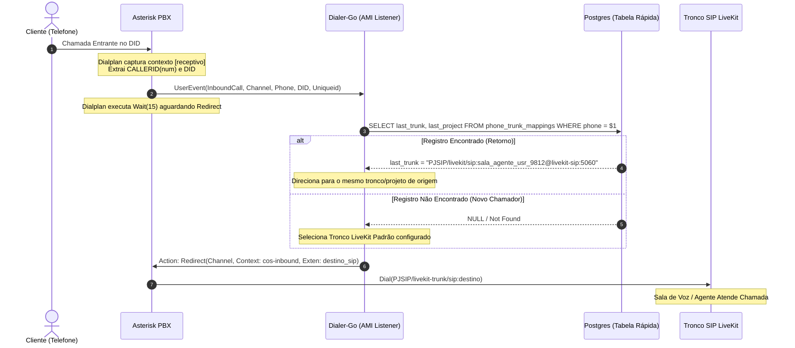

### 2.1. Regra de Negócio e Algoritmo de Roteamento Receptivo
1. **Captura no PBX:** A chamada receptiva ingressa em um tronco PJSIP de entrada no Asterisk. O dialplan identifica o número de origem (`${CALLERID(num)}`) e emite imediatamente o evento nativo:
   ```asterisk
   UserEvent(InboundCall,Channel: ${CHANNEL},Phone: ${CALLERID(num)},DID: ${EXTEN},Uniqueid: ${UNIQUEID})
   ```
2. **Espera Segura:** O dialplan entra em espera passiva (`Wait(15)`) aguardando comutação externa via AMI.
3. **Consulta na Tabela Auxiliar:** O `InboundEngine` do Dialer-Go captura o `UserEvent` em tempo real e dispara uma consulta direta na tabela PostgreSQL:
   ```sql
   SELECT last_trunk, last_project, last_sip_route 
   FROM phone_trunk_mappings 
   WHERE phone = $1 
   LIMIT 1;
   ```
4. **Decisão de Roteamento:**
   - **Cenário A (Cliente com Histórico):** A chamada é redirecionada exatamente para o mesmo tronco LiveKit SIP e contexto pelo qual saiu pela última vez (seja a rota de um agente humano do *OmniChat* ou um agente virtual do *Estúdio IA*).
   - **Cenário B (Cliente Novo / Sem Histórico):** A chamada é redirecionada para o tronco SIP LiveKit padrão configurado no sistema (`default_livekit_trunk`).
5. **Comutação AMI:** O Dialer-Go emite um comando AMI `Redirect`:
   - `Action: Redirect`
   - `Channel: <canal_do_cliente>`
   - `Context: cos-inbound`
   - `Exten: <destino_tronco>`
   - `Priority: 1`
6. **Atualização de Estado:** O mapeamento do telefone é atualizado no banco com o timestamp atualizado da recepção.

### 2.2. DDL da Tabela Standalone de Roteamento Rápido (`phone_trunk_mappings`)
```sql
CREATE TABLE IF NOT EXISTS phone_trunk_mappings (
    phone VARCHAR(32) PRIMARY KEY,
    last_trunk VARCHAR(128) NOT NULL,
    last_project VARCHAR(64) NOT NULL, -- 'estudio_ia', 'omnichat', etc.
    last_sip_route VARCHAR(255),
    tenant_id VARCHAR(64) NOT NULL,
    updated_at TIMESTAMP WITH TIME ZONE DEFAULT CURRENT_TIMESTAMP
);

CREATE INDEX IF NOT EXISTS idx_phone_trunk_updated_at ON phone_trunk_mappings(updated_at);
CREATE INDEX IF NOT EXISTS idx_phone_trunk_tenant ON phone_trunk_mappings(tenant_id);
```

---

## 3. Subsistema Preditivo (Motor de Discagem Preditiva)

O motor preditivo é o núcleo de overdialing de alta capacidade do Dialer-Go, regulado por algoritmos estatísticos e alimentado pelo modelo de **Demanda Ativa via REST**.

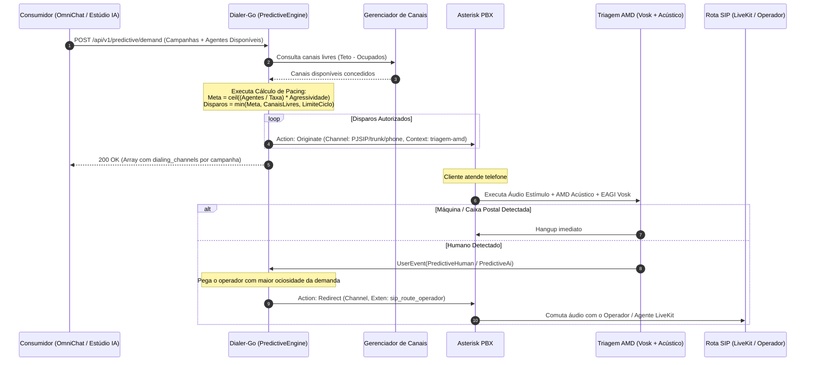

### 3.1. Contrato da Demanda Preditiva (`POST /api/v1/predictive/demand`)
O OmniChat Core ou o Estúdio IA envia a cada intervalo (ex.: 500ms a 2000ms) a relação de campanhas ativas e a lista de operadores livres e prontos para voz:

#### Payload de Entrada:
```json
[
  {
    "campaign_id": "camp_uuid_101",
    "tenant_id": "org_alpha",
    "agents_count": 2,
    "available_agents": [
      {
        "agent_id": "usr_9812",
        "priority_order": 1,
        "sip_route": "PJSIP/livekit/sip:sala_agente_usr_9812@livekit-sip:5060",
        "idle_time_seconds": 320
      },
      {
        "agent_id": "usr_4401",
        "priority_order": 2,
        "sip_route": "PJSIP/livekit/sip:sala_agente_usr_4401@livekit-sip:5060",
        "idle_time_seconds": 85
      }
    ]
  },
  {
    "campaign_id": "camp_uuid_205",
    "tenant_id": "org_alpha",
    "agents_count": 1,
    "available_agents": [
      {
        "agent_id": "usr_7720",
        "priority_order": 1,
        "sip_route": "PJSIP/livekit/sip:sala_agente_usr_7720@livekit-sip:5060",
        "idle_time_seconds": 15
      }
    ]
  }
]
```

#### Payload de Resposta Síncrona:
```json
[
  {
    "campaign_id": "camp_uuid_101",
    "tenant_id": "org_alpha",
    "dialing_channels": 4
  },
  {
    "campaign_id": "camp_uuid_205",
    "tenant_id": "org_alpha",
    "dialing_channels": 2
  }
]
```

### 3.2. Equações Matemáticas de Pacing e Overdialing
O motor calcula o número de chamadas a originar no tick para cada campanha respeitando:
1. **Taxa de Atendimento Histórica ($S$):** Medida nos últimos 5 minutos via histórico de chamadas do `dialer_db`:
   $$S = \frac{\text{Chamadas Atendidas}}{\text{Total de Chamadas Discadas}}$$
   *Clamping regulatório:* $0.05 \le S \le 1.0$.
2. **Meta de Linhas Ativas ($L$):**
   $$L = \left\lceil \left( \frac{A}{S} \right) \times \text{Agressividade} \right\rceil$$
   Onde $A$ é o número de `agents_count` elegíveis e $\text{Agressividade}$ é o multiplicador configurado na campanha (padrão: 1.5).
3. **Disparos no Ciclo ($D$):**
   $$D = \max \left( 0, \min \left( L - C_{\text{em\_curso}}, \text{CanaisDisponiveis}, \text{LimitePorTick} \right) \right)$$

### 3.3. Randomização de CallerID
Para cada chamada originada, o sistema aplica a política de mitigação de bloqueio de chamadas por operadoras (STIR/SHAKEN e listas de SPAM):
- Identifica o prefixo de discagem e o tronco de saída.
- Preserva o DDD e o prefixo da operadora, randomizando matematicamente os últimos 4 dígitos:
  $$\text{CallerID}_{\text{saida}} = \text{Prefixo} + \text{DDD} + \text{PrefixoLocal} + \text{Random}(1000, 9999)$$

### 3.4. Triagem Telefônica e Detecção de Atendimento (AMD Otimizado)
O processo de triagem opera de forma ultrarrápida no Asterisk para eliminar silêncios incômodos que induzem o desligamento pelo cliente (teto máximo de análise entre **1,5s e 2,0s**):
1. **Configuração Canônica no Asterisk:**
   ```asterisk
   [triagem-amd]
   exten => s,1,NoOp(--- INICIANDO TRIAGEM AMD PREDITIVA ---)
    same => n,AMD(1500,1200,500,2000,100,50,3,256)
    same => n,GotoIf($["${AMDSTATUS}" = "HUMAN"]?humano:maquina)
    same => n(humano),UserEvent(PredictiveHuman,Channel: ${CHANNEL},Phone: ${PHONE},LeadId: ${LEAD_ID},CampaignId: ${CAMPAIGN_ID},CallId: ${CALL_ID})
    same => n,Wait(10)
    same => n,Hangup()
    same => n(maquina),GotoIf($["${AMDSTATUS}" = "NOTSURE"]?humano)
    same => n,UserEvent(PredictiveAi,Channel: ${CHANNEL},Phone: ${PHONE},LeadId: ${LEAD_ID},CampaignId: ${CAMPAIGN_ID},CallId: ${CALL_ID})
    same => n,Hangup(16)
   ```
2. **Diretriz de Tolerância Zero ao Silêncio:**
   - Em caso de dúvida (`AMDSTATUS = "NOTSURE"`), o sistema prioriza o atendimento e transfere imediatamente como humano em vez de descartar ou aguardar análises acústicas prolongadas.
   - O áudio de estímulo não introduz delays artificiais; a decisão do AMD ocorre dentro das primeiras palavras do interlocutor (*"Alô"*, *"Pronto"*).

### 3.5. Comutação de Voz para Salas LiveKit (`AGENT_ROOM`)
Ao receber o evento `UserEvent(PredictiveHuman)`:
1. O Dialer-Go consulta a fila FIFO de operadores ociosos no Redis (`GetNextAvailableAgent`), ordenada pelo menor timestamp `available_since`.
2. O nome da sala persistente é composto: `roomName = "sala_agente_" + agent.AgentID`.
3. O Dialer-Go injeta a variável no canal via comando AMI:
   ```text
   Action: Command
   Command: channel set variable <channel> AGENT_ROOM sala_agente_<agent_id>
   ```
4. Executa `Redirect` para o contexto `cos-all-custom` extensão `9999`:
   ```asterisk
   [cos-all-custom]
   exten => 9999,1,NoOp(--- COMUTANDO PARA SALA LIVEKIT: ${AGENT_ROOM} ---)
    same => n,Dial(PJSIP/${AGENT_ROOM}@livekit-sip,,g)
    same => n,Hangup()
   ```

### 3.6. Protocolo de Abandono Regulatório (< 2 Segundos)
Se no momento em que o evento `PredictiveHuman` for processado nenhum operador estiver livre na demanda:
1. O Dialer-Go emite comando `Hangup` imediato no canal via AMI dentro do teto estrito de **2 segundos** desde o atendimento.
2. Grava o registro da chamada com status `"Abandono"`.
3. Aplica no Redis uma chave de penalidade temporária (`dialer:inflated_success_rate = 1.0`, TTL 30s), forçando a taxa de sucesso simulada para 100%, reduzindo imediatamente novos disparos a zero para evitar acúmulo de abandonos.

### 3.7. Reserva Atômica de Leads FILO (`fn_audit_claim_predictive_batch`)
A seleção de leads para discagem obedece ao princípio transacional:
1. **Regra FILO (First-In, Last-Out):** Leads mais recentes inseridos na campanha (`id DESC`) são discados primeiro por apresentarem maior propensão estatística de conversão.
2. **Respeito ao Cooldown de 2 Horas:** Leads que já foram discados (`last_dialed_at`) só podem sofrer nova tentativa após o transcurso da janela mínima de 120 minutos.
3. **Lock Concorrente Anti-Duplicidade:** A Stored Procedure executa `FOR UPDATE SKIP LOCKED`, garantindo que múltiplos workers de discagem nunca disputem ou dupliquem o mesmo lead.
4. **Transição de Estado na Tupla:**
   - `status`: `'NEW'` ou `'QUEUED'` $\rightarrow$ `'DIALING'`
   - `attempts_count`: incrementado em `+1`
   - `dialed_at` e `last_dialed_at`: carimbados com `CURRENT_TIMESTAMP`.

### 3.8. Persistência Pós-Execução ACID (`fn_audit_persist_predictive_result`)
No encerramento da chamada telefônica (evento `Hangup` ou `Cdr`), a Stored Procedure consolida a transação:
1. **Gravação do CDR:** Persiste em `cdrs` as durações de conversação (`billsec_seconds`), ringue (`ring_seconds`) e total (`duration_seconds`), juntamente com o código de término SIP e causa Q.850.
2. **Atualização da Tupla do Lead:**
   - Se `DELIVERED` ou `ANSWERED` ou atingiu `max_attempts` $\rightarrow$ `status = 'COMPLETED'`.
   - Se `VOICEMAIL`, `NO_ANSWER` ou `BUSY` e `< max_attempts` $\rightarrow$ `status = 'QUEUED'` (preserva o lead para reciclagem com cooldown).
3. **Mapeamento Receptivo $O(1)$:** Grava em `phone_trunk_mappings` o `last_trunk`, `last_project` e `last_sip_route`, assegurando que retornos de chamada encontrem o operador ou fila correta.

---

## 4. Subsistema Manual (Outbound Manual)

A chamada manual permite que um operador ou sistema solicite a discagem pontual para um número específico, conectando-o imediatamente à rota SIP correspondente.

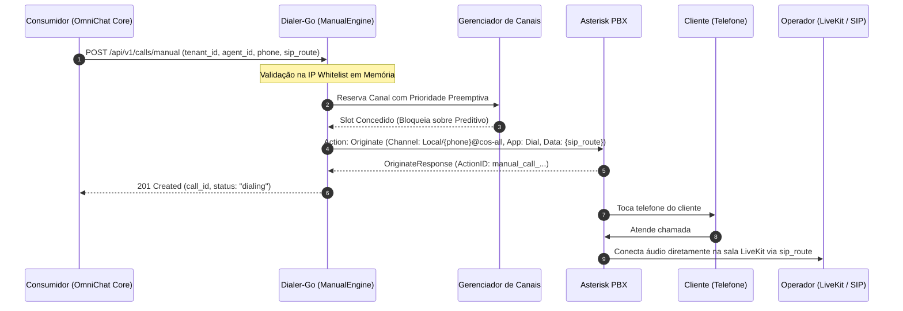

### 4.1. Prioridade Preemptiva no Gerenciador de Canais
A chamada manual tem **prioridade máxima** sobre qualquer chamada preditiva:
- Se a central estiver próxima do teto limite global de canais, o `ChannelManager` bloqueia imediatamente novas discagens dos motores preditivos para garantir a alocação imediata da linha manual.
- O slot de canal permanece travado até a finalização da perna telefônica.

### 4.2. Contrato da Chamada Manual (`POST /api/v1/calls/manual`)
#### Payload de Solicitação:
```json
{
  "tenant_id": "org_alpha",
  "agent_id": "usr_9812",
  "phone": "5511999998888",
  "sip_route": "PJSIP/livekit/sip:sala_agente_usr_9812@livekit-sip:5060"
}
```

#### Resposta de Sucesso (201 Created):
```json
{
  "success": true,
  "data": {
    "call_id": "call_man_88f921ab",
    "tenant_id": "org_alpha",
    "agent_id": "usr_9812",
    "phone": "5511999998888",
    "status": "dialing"
  }
}
```

#### Resposta de Erro (422 ou 503):
```json
{
  "success": false,
  "error": {
    "code": "CANNOT_ORIGINATE",
    "message": "Capacidade máxima de troncos atingida ou número rejeitado pela central."
  }
}
```

---

## 5. Ingestão de Campanhas e Refill de Mailing

O processo de carga de mailing do Dialer-Go foi desenhado para ingestão assíncrona de arquivos volumosos compactados provenientes do MinIO (S3), com validação rigorosa de formato e tolerância a falhas parciais.

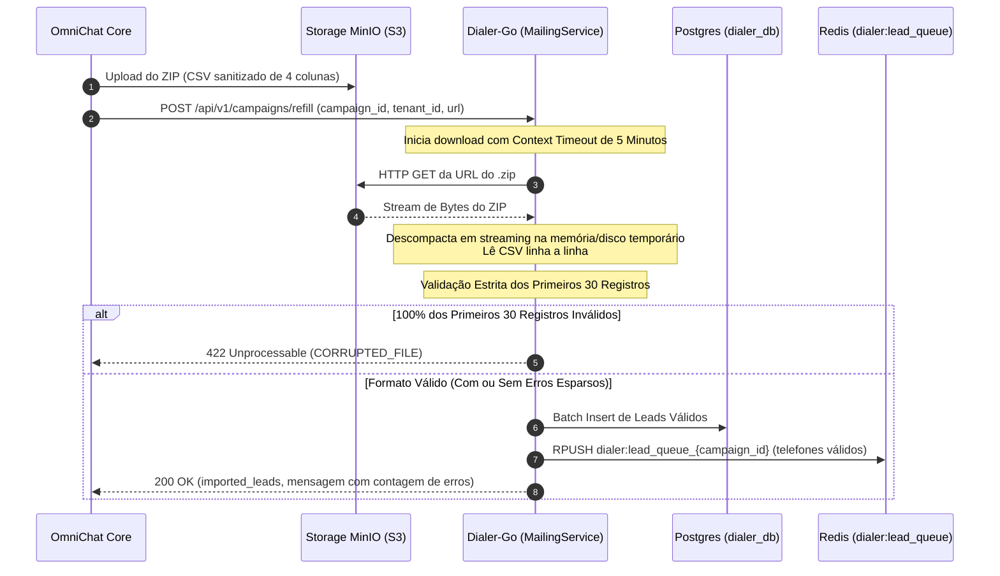

### 5.1. Contrato de Refill (`POST /api/v1/campaigns/refill`)
#### Headers Obrigatórios:
```http
Content-Type: application/json
X-Tenant-Id: org_alpha
```

#### Payload de Requisição:
```json
{
  "campaign_id": "camp_uuid_101",
  "tenant_id": "org_alpha",
  "url": "https://miniom.creditobr.org/omnichat/campaigns/tenant_org_alpha/camp_camp_uuid_101/campaign_camp_uuid_101.zip"
}
```

### 5.2. Regras de Processamento de Arquivo
1. **Formato Canônico Estrito:** O arquivo CSV descompactado deve conter exatamente as 4 colunas:
   ```csv
   cpf,telefone,campanha_id,tenant_id
   12345678901,5511999999999,camp_uuid_101,org_alpha
   ```
2. **Timeout Global de 5 Minutos:** A operação é cancelada e abortada caso a transferência ou o processamento exceda 300 segundos (`context.WithTimeout(ctx, 5*time.Minute)`).
3. **Regra de Bloqueio por Corrupção (Primeiros 30 Registros):**
   - Se os primeiros 30 registros consecutivos falharem 100% na validação de formato (ex.: colunas incorretas, delimitador errado, telefone não numérico), o arquivo é descartado integralmente e retorna erro imediato:
     ```json
     {
       "success": false,
       "error": {
         "code": "CORRUPTED_FILE",
         "message": "O arquivo ZIP está corrompido ou o CSV possui formato inválido."
       }
     }
     ```
4. **Tolerância a Falhas Parciais:**
   - Se houver falhas esparsas de validação após os primeiros 30 registros válidos, o Dialer-Go descarta as linhas defeituosas, importa todas as válidas e retorna sucesso com a contagem das inconsistências:
     ```json
     {
       "success": true,
       "data": {
         "campaign_id": "camp_uuid_101",
         "tenant_id": "org_alpha",
         "imported_leads": 1500,
         "message": "Mailing importado e enfileirado com sucesso. Registros com erro: 12."
       }
     }
     ```

### 5.3. Política de Não Renovação de Mailing e Looping Infinito FILO (First-In-Last-Out)
Quando a fila atômica de leads de uma campanha no Redis (`dialer:lead_queue_{campaign_id}`) é completamente esvaziada e o cliente/consumidor **não enviou um novo lote de mailing (refill)**, a campanha **não é pausada nem interrompida**. Em vez disso, o Dialer-Go ativa automaticamente a rotina de **Reciclagem Contínua em Looping Infinito**:

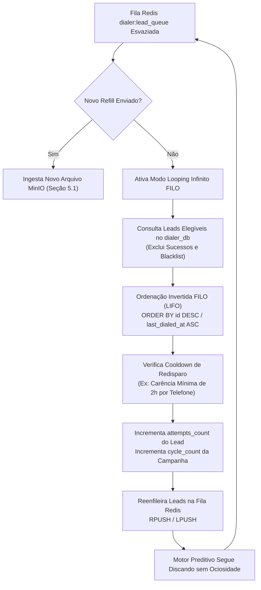

#### Regras Operacionais do Looping Infinito:
1. **Comportamento FILO (First-In-Last-Out / LIFO):**
   - Os leads que entraram primeiro no mailing original (`id` menor / primeira carga) são colocados no final da fila de rediscagem, enquanto os leads inseridos ou trabalhados por último são os primeiros a serem retestados.
   - Isso inverte a pilha de contato a cada ciclo de reciclagem, quebrando a linearidade de chamadas e testando horários e janelas alternativas de contato para os clientes da base.
2. **Exclusões Obrigatórias da Reciclagem:**
   - Leads com status definitivo de conversão positiva (ex.: `"Atendida"`, `"Venda"`, `"Sucesso"`).
   - Telefones cadastrados na blacklist de bloqueio (`dialer:blacklisted_phones` ou PROCON/Não Perturbe).
3. **Janela de Carência / Cooldown de Redisparo:**
   - Cada lead possui o registro `last_dialed_at`. O reciclador respeita um intervalo mínimo de cooldown (padrão: 120 minutos) para impedir que o mesmo contato receba múltiplas chamadas consecutivas no mesmo turno de trabalho.
4. **Rastreabilidade de Ciclos:**
   - A cada volta completa no mailing, o campo `cycle_count` da campanha é incrementado no PostgreSQL e o campo `attempts_count` de cada lead recebe `+1` ao ser redisparado.

---

### 5.4. Contratos da API: Relatório de Nível de Saturação de Campanha

Para garantir visibilidade operacional aos clientes (**OmniChat Core**, **Estúdio IA** e painéis de supervisão), o Dialer-Go disponibiliza contratos formais para consulta individual e em lote do nível de saturação, ciclo de reciclagem FILO e necessidade de renovação de mailing.

---

#### 5.4.1. Endpoint de Saturação Individual (`GET /api/v1/campaigns/{campaign_id}/saturation`)

Consulta o relatório analítico de uma campanha específica.

##### A. Parâmetros da Requisição:
| Parâmetro | Local | Tipo | Obrigatório | Padrão | Descrição |
| :--- | :--- | :--- | :--- | :--- | :--- |
| `campaign_id` | Path | `string (UUID)` | **Sim** | — | Identificador único da campanha. |
| `X-Tenant-Id` | Header | `string` | **Sim** | — | Identificador de tenant para isolamento de dados. |
| `include_distribution` | Query | `boolean` | Não | `true` | Se `true`, inclui a quebra por faixas de tentativas. |

##### B. Contrato de Resposta de Sucesso (`200 OK`):
```json
{
  "success": true,
  "data": {
    "campaign_id": "camp_uuid_101",
    "tenant_id": "org_alpha",
    "mode": "predictive",
    "status": "active",
    "leads_summary": {
      "total_leads": 5000,
      "undialed_leads": 150,
      "dialed_leads": 4850,
      "connected_leads": 1320,
      "abandoned_leads": 42,
      "failed_unanswered_leads": 3488,
      "blacklisted_leads": 0
    },
    "saturation": {
      "cycle_count": 3,
      "loop_mode": "FILO",
      "average_attempts_per_lead": 2.84,
      "saturation_percentage": 97.0,
      "contactability_rate": 0.272,
      "saturation_level": "RECICLADA",
      "needs_refill": true,
      "urgency": "HIGH"
    },
    "distribution_by_attempts": {
      "1_attempt": 1200,
      "2_attempts": 2100,
      "3_attempts": 1350,
      "4_plus_attempts": 200
    },
    "timestamps": {
      "first_dial_at": "2026-09-08T11:00:00Z",
      "last_dial_at": "2026-09-09T06:10:45Z",
      "last_cycle_at": "2026-09-09T05:40:12Z",
      "report_generated_at": "2026-09-09T06:12:51Z"
    },
    "recommendation": {
      "action": "IMMEDIATE_REFILL_REQUIRED",
      "message": "Campanha no ciclo 3 operando em looping infinito FILO. A base de dados atingiu nível de saturação RECICLADA com média de 2.84 tentativas por lead. Recomenda-se ingestão urgente de novo mailing via /refill para manter a taxa de conversão saudável e evitar marcação de SPAM."
    }
  }
}
```

---

#### 5.4.2. Endpoint de Saturação Consolidada em Lote (`GET /api/v1/campaigns/saturation`)

Permite ao sistema supervisor consultar em uma única requisição a saturação de todas as campanhas de seu tenant, priorizando quais necessitam de refill imediato.

##### A. Parâmetros da Requisição:
| Parâmetro | Local | Tipo | Obrigatório | Padrão | Descrição |
| :--- | :--- | :--- | :--- | :--- | :--- |
| `X-Tenant-Id` | Header | `string` | **Sim** | — | Tenant autenticado. |
| `status` | Query | `string` | Não | `active` | Filtro por status (`active`, `paused`, `all`). |
| `only_critical` | Query | `boolean` | Não | `false` | Se `true`, retorna apenas campanhas com `needs_refill = true`. |

##### B. Contrato de Resposta de Sucesso (`200 OK`):
```json
{
  "success": true,
  "data": {
    "tenant_id": "org_alpha",
    "total_campaigns": 2,
    "critical_campaigns_count": 1,
    "campaigns": [
      {
        "campaign_id": "camp_uuid_101",
        "status": "active",
        "cycle_count": 3,
        "saturation_percentage": 97.0,
        "saturation_level": "RECICLADA",
        "average_attempts_per_lead": 2.84,
        "undialed_leads": 150,
        "total_leads": 5000,
        "needs_refill": true,
        "urgency": "HIGH"
      },
      {
        "campaign_id": "camp_uuid_205",
        "status": "active",
        "cycle_count": 1,
        "saturation_percentage": 24.5,
        "saturation_level": "NOVA",
        "average_attempts_per_lead": 0.25,
        "undialed_leads": 7550,
        "total_leads": 10000,
        "needs_refill": false,
        "urgency": "LOW"
      }
    ],
    "generated_at": "2026-09-09T06:12:51Z"
  }
}
```

---

#### 5.4.3. Tabela de Enums e Regras de Negócio de Saturação

| `saturation_level` | `urgency` | Condição de Disparo | Ação Recomendada |
| :--- | :--- | :--- | :--- |
| `NOVA` | `LOW` | `cycle_count == 1` e $\le 30\%$ dos leads já discados | Operação normal com base fresca. |
| `EM_PROGRESSO` | `LOW` | `cycle_count == 1` e $31\%$ a $80\%$ discados | Monitorar ritmo de queima. |
| `ESGOTANDO` | `MEDIUM` | `cycle_count == 1` e $> 80\%$ discados | Planejar novo arquivo de mailing. |
| `RECICLADA` | `HIGH` | `cycle_count >= 2` (looping infinito FILO ativo) | Injetar refill imediatamente para reoxigenar a base. |
| `CRITICA` | `CRITICAL` | Média $\ge 4.0$ tentativas ou contato $< 5\%$ | Risco iminente de denúncia por SPAM nas operadoras. |

---

#### 5.4.4. Contratos de Erros Padronizados (RFC 7807 / RFC 9457)

##### A. Erro 403 Forbidden (IP Não Autorizado):
```json
{
  "success": false,
  "error": {
    "code": "IP_NOT_WHITELAYED",
    "message": "O IP chamador '192.168.1.105' não consta na lista branca autorizada.",
    "status": 403
  }
}
```

##### B. Erro 400 Bad Request (Falta de Tenant):
```json
{
  "success": false,
  "error": {
    "code": "MISSING_TENANT_HEADER",
    "message": "O cabeçalho obrigatório 'X-Tenant-Id' não foi informado.",
    "status": 400
  }
}
```

##### C. Erro 404 Not Found (Campanha Inexistente):
```json
{
  "success": false,
  "error": {
    "code": "CAMPAIGN_NOT_FOUND",
    "message": "A campanha 'camp_uuid_999' não foi encontrada para o tenant 'org_alpha'.",
    "status": 404
  }
}
```

---

#### 5.4.5. Representação dos Contratos em Estruturas GoLang (`internal/domain/saturation.go`)

```go
package domain

import "time"

// SaturationLevel define a classificação qualitativa de desgaste da base
type SaturationLevel string

const (
	SaturationNova         SaturationLevel = "NOVA"
	SaturationEmProgresso  SaturationLevel = "EM_PROGRESSO"
	SaturationEsgotando    SaturationLevel = "ESGOTANDO"
	SaturationReciclada    SaturationLevel = "RECICLADA"
	SaturationCritica      SaturationLevel = "CRITICA"
)

// UrgencyLevel define a urgência de renovação do mailing
type UrgencyLevel string

const (
	UrgencyLow      UrgencyLevel = "LOW"
	UrgencyMedium   UrgencyLevel = "MEDIUM"
	UrgencyHigh     UrgencyLevel = "HIGH"
	UrgencyCritical UrgencyLevel = "CRITICAL"
)

// CampaignSaturationReport DTO de resposta do relatório de saturação individual
type CampaignSaturationReport struct {
	CampaignID             string                       `json:"campaign_id"`
	TenantID               string                       `json:"tenant_id"`
	Mode                   string                       `json:"mode"`
	Status                 string                       `json:"status"`
	LeadsSummary           LeadsSummaryDTO              `json:"leads_summary"`
	Saturation             SaturationMetricsDTO         `json:"saturation"`
	DistributionByAttempts map[string]int64             `json:"distribution_by_attempts"`
	Timestamps             ReportTimestampsDTO          `json:"timestamps"`
	Recommendation         ReportRecommendationDTO      `json:"recommendation"`
}

type LeadsSummaryDTO struct {
	TotalLeads             int64 `json:"total_leads"`
	UndialedLeads          int64 `json:"undialed_leads"`
	DialedLeads            int64 `json:"dialed_leads"`
	ConnectedLeads         int64 `json:"connected_leads"`
	AbandonedLeads         int64 `json:"abandoned_leads"`
	FailedUnansweredLeads  int64 `json:"failed_unanswered_leads"`
	BlacklistedLeads       int64 `json:"blacklisted_leads"`
}

type SaturationMetricsDTO struct {
	CycleCount             int             `json:"cycle_count"`
	LoopMode               string          `json:"loop_mode"` // "FILO"
	AverageAttemptsPerLead float64         `json:"average_attempts_per_lead"`
	SaturationPercentage   float64         `json:"saturation_percentage"`
	ContactabilityRate     float64         `json:"contactability_rate"`
	SaturationLevel        SaturationLevel `json:"saturation_level"`
	NeedsRefill            bool            `json:"needs_refill"`
	Urgency                UrgencyLevel    `json:"urgency"`
}

type ReportTimestampsDTO struct {
	FirstDialAt       *time.Time `json:"first_dial_at,omitempty"`
	LastDialAt        *time.Time `json:"last_dial_at,omitempty"`
	LastCycleAt       *time.Time `json:"last_cycle_at,omitempty"`
	ReportGeneratedAt time.Time  `json:"report_generated_at"`
}

type ReportRecommendationDTO struct {
	Action  string `json:"action"`
	Message string `json:"message"`
}

// CampaignBatchSaturationReport DTO da visão consolidada de múltiplas campanhas
type CampaignBatchSaturationReport struct {
	TenantID               string                        `json:"tenant_id"`
	TotalCampaigns         int                           `json:"total_campaigns"`
	CriticalCampaignsCount int                           `json:"critical_campaigns_count"`
	Campaigns              []CampaignSaturationDigestDTO `json:"campaigns"`
	GeneratedAt            time.Time                     `json:"generated_at"`
}

type CampaignSaturationDigestDTO struct {
	CampaignID             string          `json:"campaign_id"`
	Status                 string          `json:"status"`
	CycleCount             int             `json:"cycle_count"`
	SaturationPercentage   float64         `json:"saturation_percentage"`
	SaturationLevel        SaturationLevel `json:"saturation_level"`
	AverageAttemptsPerLead float64         `json:"average_attempts_per_lead"`
	UndialedLeads          int64           `json:"undialed_leads"`
	TotalLeads             int64           `json:"total_leads"`
	NeedsRefill            bool            `json:"needs_refill"`
	Urgency                UrgencyLevel    `json:"urgency"`
}
```

---

### 5.5. Controle de Ativação e Pausa de Campanha (POST /api/v1/campaigns/toggle)

Ao pausar ou retomar uma campanha na interface do **OmniChat Core** ou do **Estúdio IA**, o sistema consumidor dispara uma requisição HTTP síncrona com controle estrito de timeout.

#### A. Parâmetros e Headers da Requisição:
- **Endpoint:** `POST /api/v1/campaigns/toggle`
- **Timeout da Requisição:** 15 segundos estritos (`timeout: 15000` via AbortController/Axios no consumidor, gerenciado por `context.WithTimeout(ctx, 15*time.Second)` no Dialer-Go).
- **Headers Obrigatórios:**
  ```http
  Content-Type: application/json
  X-Tenant-Id: org_alpha
  ```

#### B. Payload de Entrada:
```json
{
  "campaign_id": "camp_uuid_101",
  "tenant_id": "org_alpha",
  "enable": true
}
```

#### C. Retorno de Sucesso do Discador (`200 OK`):
```json
{
  "success": true,
  "data": {
    "id": "camp_uuid_101",
    "tenant_id": "org_alpha",
    "name": "Campanha de Primavera",
    "status": "active",
    "created_at": "2026-09-08T18:24:30Z"
  }
}
```

#### D. Retorno de Erro do Discador (`404 Not Found`):
```json
{
  "success": false,
  "error": {
    "code": "CAMPAIGN_NOT_FOUND",
    "message": "A campanha solicitada não existe ou foi removida."
  }
}
```

#### E. Mecânica Operacional Interna do Toggle:
1. **Validação de Tenant e Segurança:**
   - O endereço IP chamador é validado contra a IP Whitelist em memória (`sync.Map`).
   - O Dialer-Go valida se a campanha pertence estritamente ao `tenant_id` informado no header e no payload.
2. **Ativação (`enable: true`):**
   - Atualiza `status = 'active'` no PostgreSQL standalone `dialer_db`.
   - Remove a chave de bloqueio em memória no Redis (`dialer:campaign_paused:{campaign_id}`).
   - O loop do `PredictiveEngine` volta a alocar canais e consumir a fila de leads no tick imediato subsequente (500ms).
3. **Desativação / Pausa (`enable: false`):**
   - Atualiza `status = 'paused'` no PostgreSQL standalone `dialer_db`.
   - Grava no Redis a flag `dialer:campaign_paused:{campaign_id} = "1"`.
   - O motor preditivo cessa imediatamente novas origens de chamadas para essa campanha.
   - Chamadas já em curso (linhas tocando ou ativas no Asterisk) completam seu ciclo natural de vida sem desconexão abrupta.

---

### 5.6. Endpoint de Estatísticas Operacionais de Chamadas e Buffer de Cache de 15 Minutos

Para monitoramento analítico de desempenho, produtividade de operadores, taxa de contato, descarte de caixas-postais, detecção de números inválidos e falhas de operadora, o Dialer-Go disponibiliza o endpoint consolidado `GET /api/v1/reports/calls-summary` protegido por uma camada de **Buffer de Cache em Memória com Validade de 15 Minutos**.

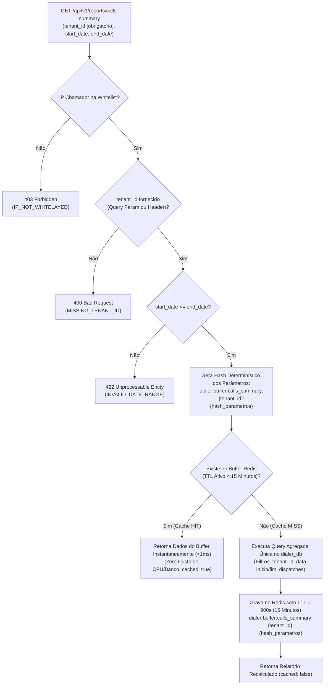

---

#### A. Parâmetros e Headers da Requisição:
- **Endpoint:** `GET /api/v1/reports/calls-summary`
- **Validação de Tenant Obrigatória:** O identificador do tenant pode ser enviado via **Query Parameter** (`?tenant_id=...`) ou via **Header HTTP** (`X-Tenant-Id: ...`). Caso nenhum seja informado, a requisição é rejeitada imediatamente com `400 Bad Request`.
- **Query Parameters:**

| Parâmetro | Local | Tipo | Obrigatório | Padrão | Descrição |
| :--- | :--- | :--- | :--- | :--- | :--- |
| `tenant_id` | Query / Header | `string (VARCHAR)` | **Sim** | — | Identificador do tenant requisitante. Aceito via `?tenant_id=org_alpha` ou header `X-Tenant-Id`. |
| `start_date` | Query | `string (ISO 8601)` | Não | Início do dia atual `00:00:00 UTC` | Data e hora inicial da janela de apuração analítica. |
| `end_date` | Query | `string (ISO 8601)` | Não | Instante atual (`now()`) | Data e hora final da janela de apuração analítica. |
| `campaign_id` | Query | `string (UUID)` | Não | Todas as campanhas | Filtro opcional para extrair métricas de uma campanha específica. |

---

#### B. Política de Buffer de 15 Minutos (Mitigação de Sobrecarga e Controle de Custo):
1. **Motivação de Engenharia:** Consultas analíticas de histórico sobre milhões de linhas de chamadas telefônicas (`COUNT(*)`, `SUM`, cálculos de TMA, agregação de causas SIP e taxas de contato) demandam alto custo computacional de CPU e I/O de disco.
2. **Janela Rígida de Modificação:**
   - **Garantia de Negócio:** Os dados deste endpoint só sofrem modificação a cada **15 minutos** (900 segundos).
   - Requisições subsequentes do mesmo tenant durante o intervalo de 15 minutos recebem exatamente o mesmo resultado consolidado, servido em memória com latência inferior a **1 milissegundo**.
3. **Formação da Chave de Buffer no Redis:**
   $$\text{Chave} = \text{"dialer:buffer:calls\_summary:"} + \text{tenant\_id} + \text{":"} + \text{SHA256}(\text{start\_date} + "|" + \text{end\_date} + "|" + \text{campaign\_id})$$
   - **Tempo de Vida (TTL):** 900 segundos estritos.
4. **Metadados de Transparência do Buffer (`cache_meta`):**
   O payload retornado inclui sempre indicadores explícitos do estado do buffer:
   - `cached`: booleano (`true` quando entregue da memória, `false` na primeira execução pós-expiração).
   - `cached_at`: timestamp UTC do momento da geração do snapshot.
   - `cache_expires_at`: timestamp UTC de quando o buffer expirará e novos dados serão recalculados.
   - `ttl_remaining_seconds`: contagem regressiva em segundos até a expiração.
   - `buffer_duration_seconds`: tempo padrão da janela (900s).

---

#### C. Catálogo Completo de Métricas e Resultados de Chamada:

O relatório segrega exaustivamente todas as transições de estado telefônico e causas de encerramento:

1. **Chamadas Entregues (`delivered_calls`):**
   - Chamadas que completaram o ciclo completo de discagem, passaram com sucesso pela triagem acústica/AMD (humano atendendo) e foram efetivamente **conectadas e transferidas a um atendente humano ou agente de IA**.
2. **Atendimento Humano (`answered_calls`):**
   - Total de chamadas onde houve voz humana receptiva do lead/cliente (inclui as entregues e as eventuais chamadas atendidas que foram abandonadas por indisponibilidade momentânea de operador).
3. **Caixa-Postal / Secretária Eletrônica (`answering_machine_calls`):**
   - Chamadas atendidas onde os motores de AMD (estímulo "Alô?", Asterisk AMD e Vosk EAGI) identificaram mensagens automáticas de operadora, bips de gravação ou secretárias eletrônicas, encerrando o canal antes da entrega ao operador.
4. **Números Inválidos (`invalid_number_calls`):**
   - Disparos que resultaram em números inexistentes, desligados, suspensos pela operadora ou com formato incompleto. Mapeados a partir de sinalizações SIP e causas ISDN:
     - `unallocated_number_calls`: Número inexistente / não atribuído (`SIP 404 Not Found`, `ISDN Cause 1`).
     - `incomplete_number_calls`: Número incompleto ou dígitos a menos (`SIP 484 Address Incomplete`, `ISDN Cause 28`).
     - `unassigned_service_calls`: Serviço inacessível / bloqueio de rota (`SIP 403 Forbidden`, `ISDN Cause 21`).
5. **Falhas Técnicas e de Operadora (`failed_calls`):**
   - Ligações que não puderam ser completadas devido a gargalos de telecomunicação, problemas de sinalização ou capacidade:
     - `congestion_calls`: Congestionamento de rota ou operadora sem circuitos livres (`SIP 503 Service Unavailable`, `ISDN Cause 34`).
     - `timeout_calls`: Tentativa de chamada sem resposta de sinalização da rede de telecom (`SIP 408 Request Timeout`, `ISDN Cause 18`).
     - `carrier_error_calls`: Falha interna de roteamento no gateway da operadora (`SIP 500 Internal Server Error`, `SIP 502 Bad Gateway`).
     - `trunk_limit_exhausted_calls`: Descarte local por saturação da cota máxima simultânea de canais do tronco (`TRUNK_CHANNELS_EXHAUSTED`).
6. **Outros Desfechos Telefônicos Operacionais:**
   - `busy_calls`: Destinatário ocupado (`SIP 486 Busy Here`, `ISDN Cause 17`).
   - `unanswered_calls`: Número tocou até o tempo limite de ring (ex: 25 segundos) sem atendimento (`SIP 480 Temporarily Unavailable`, `ISDN Cause 19`).
   - `abandoned_calls`: Atendimento humano confirmado, porém sem agente disponível no pool para transferência em tempo hábil (< 2 segundos).
   - `cancelled_calls`: Chamadas abortadas pelo sistema ou operador antes do início do ring.
7. **Taxas Percentuais Operacionais:**
   - Taxa de Entrega (`delivery_rate_percentage`): $(delivered\_calls / total\_dialed) \times 100$.
   - Taxa de Atendimento (`answer_rate_percentage`): $(answered\_calls / total\_dialed) \times 100$.
   - Taxa de Caixa-Postal (`amd_discard_percentage`): $(answering\_machine\_calls / total\_dialed) \times 100$.
   - Taxa de Números Inválidos (`invalid_number_rate_percentage`): $(invalid\_number\_calls / total\_dialed) \times 100$.
   - Taxa de Falhas Técnicas (`failure_rate_percentage`): $(failed\_calls / total\_dialed) \times 100$.
   - Taxa de Ocupado (`busy_rate_percentage`): $(busy\_calls / total\_dialed) \times 100$.
   - Taxa de Não Atendimento (`no_answer_rate_percentage`): $(unanswered\_calls / total\_dialed) \times 100$.
   - Taxa de Abandono (`abandonment_rate_percentage`): $(abandoned\_calls / answered\_calls) \times 100$.
8. **Tempos e Durações de Atendimento (`durations`):**
   - `total_talk_time_seconds`: Soma acumulada dos segundos de conversa real entre operadores e clientes.
   - `average_talk_time_seconds`: Tempo Médio de Atendimento (TMA) por chamada conectada.
   - `total_ring_time_seconds`: Soma dos segundos em que as chamadas permaneceram tocando.
   - `average_ring_time_seconds`: Tempo Médio de Ring (TMR) até desfecho.

---

#### D. Contrato de Resposta de Sucesso (`200 OK`):
```json
{
  "success": true,
  "data": {
    "tenant_id": "org_alpha",
    "period": {
      "start_date": "2026-09-09T00:00:00Z",
      "end_date": "2026-09-09T06:30:00Z"
    },
    "metrics": {
      "total_dialed": 15000,
      "delivered_calls": 3750,
      "answered_calls": 3820,
      "answering_machine_calls": 6450,
      "invalid_number_calls": 1200,
      "failed_calls": 480,
      "busy_calls": 1650,
      "unanswered_calls": 1530,
      "abandoned_calls": 70,
      "cancelled_calls": 100,
      "invalid_number_breakdown": {
        "unallocated_number_calls": 820,
        "incomplete_number_calls": 260,
        "unassigned_service_calls": 120
      },
      "failure_breakdown": {
        "congestion_calls": 210,
        "timeout_calls": 130,
        "carrier_error_calls": 95,
        "trunk_limit_exhausted_calls": 45
      },
      "percentages": {
        "delivery_rate_percentage": 25.0,
        "answer_rate_percentage": 25.47,
        "amd_discard_percentage": 43.0,
        "invalid_number_rate_percentage": 8.0,
        "failure_rate_percentage": 3.2,
        "busy_rate_percentage": 11.0,
        "no_answer_rate_percentage": 10.2,
        "abandonment_rate_percentage": 1.83
      }
    },
    "durations": {
      "total_talk_time_seconds": 780000,
      "average_talk_time_seconds": 208,
      "total_ring_time_seconds": 270000,
      "average_ring_time_seconds": 18
    },
    "cache_meta": {
      "cached": true,
      "cached_at": "2026-09-09T06:20:00Z",
      "cache_expires_at": "2026-09-09T06:35:00Z",
      "ttl_remaining_seconds": 540,
      "buffer_duration_seconds": 900,
      "refresh_interval_minutes": 15,
      "last_refresh_reason": "BUFFER_HIT"
    }
  }
}
```

---

#### E. Contratos Padronizados de Erro (RFC 7807):

##### 1. Tenant Obrigatório Ausente (`400 Bad Request`):
```json
{
  "type": "https://api.ominichat.com/errors/missing-tenant-id",
  "title": "Bad Request",
  "status": 400,
  "detail": "O parâmetro obrigatório 'tenant_id' não foi informado via query parameter (?tenant_id=...) nem via header HTTP (X-Tenant-Id).",
  "code": "MISSING_TENANT_ID"
}
```

##### 2. IP Não Autorizado (`403 Forbidden`):
```json
{
  "type": "https://api.ominichat.com/errors/forbidden",
  "title": "Forbidden",
  "status": 403,
  "detail": "O endereço IP de origem '192.168.10.88' não consta na lista branca em memória autorizada a consultar o discador.",
  "code": "IP_NOT_WHITELISTED"
}
```

##### 3. Janela de Datas Inválida (`422 Unprocessable Entity`):
```json
{
  "type": "https://api.ominichat.com/errors/invalid-date-range",
  "title": "Unprocessable Entity",
  "status": 422,
  "detail": "A data inicial 'start_date' (2026-09-09T18:00:00Z) não pode ser posterior à data final 'end_date' (2026-09-09T06:00:00Z).",
  "code": "INVALID_DATE_RANGE"
}
```

---

#### F. Implementação Otimizada no Banco de Dados (`dialer_db`):

Quando ocorre um **Cache MISS** (a cada 15 minutos), o Dialer-Go executa uma consulta analítica única e de alta performance no PostgreSQL, sem varredura completa da tabela (*Full Table Scan*):

##### 1. Índice Composto Cobridor no PostgreSQL:
```sql
CREATE INDEX IF NOT EXISTS idx_cdrs_tenant_dates_disposition 
ON cdrs (tenant_id, created_at, disposition, sip_status, hangup_cause);
```

##### 2. Query de Agregação em Passada Única:
```sql
SELECT 
    COUNT(*) AS total_dialed,
    COUNT(*) FILTER (WHERE disposition = 'DELIVERED') AS delivered_calls,
    COUNT(*) FILTER (WHERE disposition IN ('ANSWERED', 'DELIVERED')) AS answered_calls,
    COUNT(*) FILTER (WHERE disposition IN ('VOICEMAIL', 'AMD_MACHINE')) AS answering_machine_calls,
    COUNT(*) FILTER (WHERE disposition = 'INVALID_NUMBER' OR sip_status IN (404, 484) OR hangup_cause IN (1, 28)) AS invalid_number_calls,
    COUNT(*) FILTER (WHERE disposition IN ('FAILED', 'CONGESTION') OR sip_status >= 500 OR hangup_cause = 34) AS failed_calls,
    COUNT(*) FILTER (WHERE disposition = 'BUSY' OR sip_status = 486 OR hangup_cause = 17) AS busy_calls,
    COUNT(*) FILTER (WHERE disposition = 'NO_ANSWER' OR hangup_cause = 19) AS unanswered_calls,
    COUNT(*) FILTER (WHERE disposition = 'ABANDONED') AS abandoned_calls,
    COUNT(*) FILTER (WHERE disposition = 'CANCELLED') AS cancelled_calls,
    
    -- Sub-detalhamento de números inválidos
    COUNT(*) FILTER (WHERE sip_status = 404 OR hangup_cause = 1) AS unallocated_number_calls,
    COUNT(*) FILTER (WHERE sip_status = 484 OR hangup_cause = 28) AS incomplete_number_calls,
    COUNT(*) FILTER (WHERE sip_status = 403 OR hangup_cause = 21) AS unassigned_service_calls,
    
    -- Sub-detalhamento de falhas
    COUNT(*) FILTER (WHERE sip_status = 503 OR hangup_cause = 34) AS congestion_calls,
    COUNT(*) FILTER (WHERE sip_status = 408 OR hangup_cause = 18) AS timeout_calls,
    COUNT(*) FILTER (WHERE sip_status IN (500, 502)) AS carrier_error_calls,
    COUNT(*) FILTER (WHERE disposition = 'TRUNK_CAPACITY') AS trunk_limit_exhausted_calls,
    
    -- Tempos
    COALESCE(SUM(billsec_seconds), 0) AS total_talk_time_seconds,
    COALESCE(ROUND(AVG(billsec_seconds) FILTER (WHERE disposition IN ('ANSWERED', 'DELIVERED'))), 0) AS average_talk_time_seconds,
    COALESCE(SUM(ring_seconds), 0) AS total_ring_time_seconds,
    COALESCE(ROUND(AVG(ring_seconds)), 0) AS average_ring_time_seconds
FROM cdrs
WHERE tenant_id = $1 
  AND created_at >= $2 
  AND created_at <= $3
  AND ($4::varchar IS NULL OR campaign_id = $4);
```

---

#### G. Contratos de Domínio e DTOs em GoLang:

```go
// internal/domain/report.go
package domain

import "time"

// CallsSummaryRequest encapsula os filtros validados
type CallsSummaryRequest struct {
	TenantID   string     `json:"tenant_id"`
	StartDate  time.Time  `json:"start_date"`
	EndDate    time.Time  `json:"end_date"`
	CampaignID *string    `json:"campaign_id,omitempty"`
}

// CallsSummaryResponse payload de saída do relatório
type CallsSummaryResponse struct {
	TenantID  string          `json:"tenant_id"`
	Period    PeriodDTO       `json:"period"`
	Metrics   CallMetricsDTO  `json:"metrics"`
	Durations DurationsDTO    `json:"durations"`
	CacheMeta CacheMetaDTO    `json:"cache_meta"`
}

type PeriodDTO struct {
	StartDate string `json:"start_date"`
	EndDate   string `json:"end_date"`
}

type CallMetricsDTO struct {
	TotalDialed            int64                   `json:"total_dialed"`
	DeliveredCalls         int64                   `json:"delivered_calls"`
	AnsweredCalls          int64                   `json:"answered_calls"`
	AnsweringMachineCalls  int64                   `json:"answering_machine_calls"`
	InvalidNumberCalls     int64                   `json:"invalid_number_calls"`
	FailedCalls            int64                   `json:"failed_calls"`
	BusyCalls              int64                   `json:"busy_calls"`
	UnansweredCalls        int64                   `json:"unanswered_calls"`
	AbandonedCalls         int64                   `json:"abandoned_calls"`
	CancelledCalls         int64                   `json:"cancelled_calls"`
	InvalidNumberBreakdown InvalidNumberBreakdown  `json:"invalid_number_breakdown"`
	FailureBreakdown       FailureBreakdown        `json:"failure_breakdown"`
	Percentages            PercentagesDTO          `json:"percentages"`
}

type InvalidNumberBreakdown struct {
	UnallocatedNumberCalls int64 `json:"unallocated_number_calls"`
	IncompleteNumberCalls  int64 `json:"incomplete_number_calls"`
	UnassignedServiceCalls int64 `json:"unassigned_service_calls"`
}

type FailureBreakdown struct {
	CongestionCalls           int64 `json:"congestion_calls"`
	TimeoutCalls              int64 `json:"timeout_calls"`
	CarrierErrorCalls         int64 `json:"carrier_error_calls"`
	TrunkLimitExhaustedCalls  int64 `json:"trunk_limit_exhausted_calls"`
}

type PercentagesDTO struct {
	DeliveryRatePercentage      float64 `json:"delivery_rate_percentage"`
	AnswerRatePercentage        float64 `json:"answer_rate_percentage"`
	AMDDiscardPercentage        float64 `json:"amd_discard_percentage"`
	InvalidNumberRatePercentage float64 `json:"invalid_number_rate_percentage"`
	FailureRatePercentage       float64 `json:"failure_rate_percentage"`
	BusyRatePercentage          float64 `json:"busy_rate_percentage"`
	NoAnswerRatePercentage      float64 `json:"no_answer_rate_percentage"`
	AbandonmentRatePercentage   float64 `json:"abandonment_rate_percentage"`
}

type DurationsDTO struct {
	TotalTalkTimeSeconds   int64 `json:"total_talk_time_seconds"`
	AverageTalkTimeSeconds int64 `json:"average_talk_time_seconds"`
	TotalRingTimeSeconds   int64 `json:"total_ring_time_seconds"`
	AverageRingTimeSeconds int64 `json:"average_ring_time_seconds"`
}

type CacheMetaDTO struct {
	Cached                 bool   `json:"cached"`
	CachedAt               string `json:"cached_at"`
	CacheExpiresAt         string `json:"cache_expires_at"`
	TTLRemainingSeconds    int64  `json:"ttl_remaining_seconds"`
	BufferDurationSeconds  int    `json:"buffer_duration_seconds"`
	RefreshIntervalMinutes int    `json:"refresh_interval_minutes"`
	LastRefreshReason      string `json:"last_refresh_reason"`
}
```

---

## 6. Subsistema de Cadastro, Configuração e Monitoramento de Troncos SIP/PJSIP

O Dialer-Go gerencia o ciclo de vida completo, a persistência relacional e a telemetria em tempo real dos troncos de telefonia utilizados para originação e recepção de tráfego de voz, suportando tanto modelos de **Registro SIP (Auth/Register)** quanto conexões diretas **Ponto a Ponto sem Registro (IP-based Authentication)**.

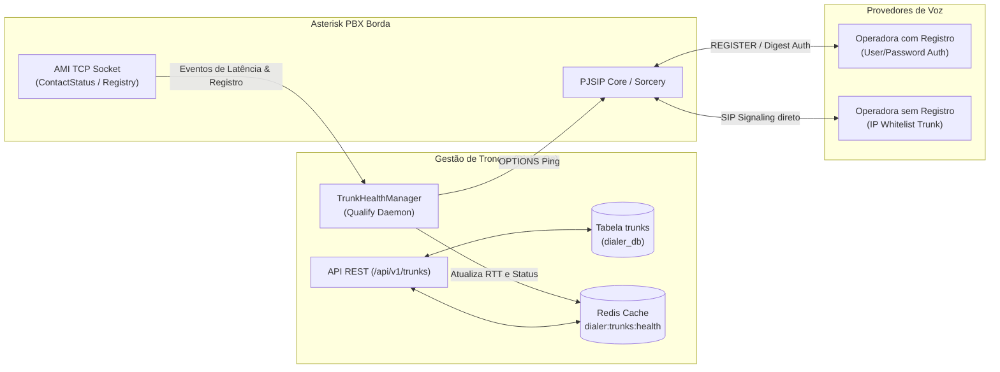

---

### 6.1. Persistência Relacional de Troncos (Tabela `trunks`)

A tabela `trunks` reside exclusivamente no banco PostgreSQL standalone (`dialer_db`), eliminando dependências externas e armazenando todos os parâmetros avançados de sinalização e mídia.

#### DDL PostgreSQL:
```sql
CREATE TYPE trunk_registration_mode AS ENUM ('REGISTER', 'IP_BASED');
CREATE TYPE trunk_transport AS ENUM ('UDP', 'TCP', 'TLS');
CREATE TYPE trunk_direction AS ENUM ('INBOUND', 'OUTBOUND', 'BIDIRECTIONAL');
CREATE TYPE trunk_dtmf_mode AS ENUM ('RFC4733', 'RFC2833', 'INBAND', 'INFO', 'AUTO');
CREATE TYPE trunk_nat_mode AS ENUM ('FORCE_RPORT', 'YES', 'NO', 'COMEDIA');

CREATE TABLE IF NOT EXISTS trunks (
    id VARCHAR(64) PRIMARY KEY, -- ex: 'trunk_vivo_01', 'trunk_shampa_ponto'
    tenant_id VARCHAR(64) NOT NULL,
    name VARCHAR(128) NOT NULL,
    direction trunk_direction NOT NULL DEFAULT 'BIDIRECTIONAL',
    registration_mode trunk_registration_mode NOT NULL DEFAULT 'IP_BASED',
    
    -- Endereçamento e Conexão
    host VARCHAR(255) NOT NULL,
    port INTEGER NOT NULL DEFAULT 5060,
    outbound_proxy VARCHAR(255),
    tech_prefix VARCHAR(32), -- Prefixo técnico de rota prepended ao número (ex: '55001', '0021', '777#')
    
    -- Autenticação (obrigatórios se registration_mode = 'REGISTER')
    auth_username VARCHAR(128),
    auth_password VARCHAR(255),
    auth_realm VARCHAR(128),
    from_user VARCHAR(128),
    from_domain VARCHAR(255),
    user_agent VARCHAR(255), -- Header SIP User-Agent customizado por tronco (ex: 'Grandstream GRP2602W 1.0.5.55')
    
    -- Camada de Transporte e Rede
    transport trunk_transport NOT NULL DEFAULT 'UDP',
    nat_mode trunk_nat_mode NOT NULL DEFAULT 'FORCE_RPORT',
    direct_media BOOLEAN NOT NULL DEFAULT FALSE,
    
    -- Mídia e Codecs
    codecs JSONB NOT NULL DEFAULT '["alaw", "ulaw"]'::jsonb,
    dtmf_mode trunk_dtmf_mode NOT NULL DEFAULT 'RFC4733',
    rtp_timeout INTEGER NOT NULL DEFAULT 30,
    
    -- Capacidade e Monitoramento
    qualify_frequency INTEGER NOT NULL DEFAULT 30, -- Segundos entre pings OPTIONS
    qualify_timeout NUMERIC(4,2) NOT NULL DEFAULT 3.00, -- Timeout em segundos
    max_channels INTEGER NOT NULL DEFAULT 30,
    is_enabled BOOLEAN NOT NULL DEFAULT TRUE,
    
    created_at TIMESTAMP WITH TIME ZONE DEFAULT CURRENT_TIMESTAMP,
    updated_at TIMESTAMP WITH TIME ZONE DEFAULT CURRENT_TIMESTAMP
);

CREATE INDEX IF NOT EXISTS idx_trunks_tenant ON trunks(tenant_id);
CREATE INDEX IF NOT EXISTS idx_trunks_enabled ON trunks(is_enabled);
```

##### Regra de Operação do Prefixo Técnico (`tech_prefix`):
Muitas operadoras VoIP de atacado e gateways IP exigem um **Tech Prefix** (ex.: `55001`, `0021`, `777#`) prepended ao número telefônico de destino para identificar a conta do cliente ou selecionar a rota/perfil tarifário (CLI aberto, rota local, longa distância):
- **Se `tech_prefix` estiver preenchido:** O comando de discagem Asterisk (`Originate` / `Dial`) monta o canal como:
  $$\text{Canal SIP} = \text{"PJSIP/"} + \text{tech\_prefix} + \text{phone} + \text{"@"} + \text{trunk\_id}$$
  *(Exemplo: `PJSIP/5500111999998888@trunk_vivo_e1`)*
- **Se `tech_prefix` for nulo ou vazio:** A discagem é emitida diretamente com o número canônico:
  $$\text{Canal SIP} = \text{"PJSIP/"} + \text{phone} + \text{"@"} + \text{trunk\_id}$$
  *(Exemplo: `PJSIP/11999998888@trunk_vivo_e1`)*

---

### 6.2. Contratos da API de Troncos

#### 6.2.1. Listagem de Troncos com Status e Saúde em Tempo Real (`GET /api/v1/trunks`)

Retorna todos os troncos cadastrados, enriquecidos dinamicamente com as métricas de latência e saúde extraídas do cache volátil do Asterisk.

##### A. Headers:
```http
X-Tenant-Id: org_alpha
```

##### B. Resposta de Sucesso (`200 OK`):
```json
{
  "success": true,
  "data": {
    "tenant_id": "org_alpha",
    "total_trunks": 2,
    "trunks": [
      {
        "id": "trunk_vivo_e1",
        "name": "Vivo E1 SIP Principal",
        "direction": "BIDIRECTIONAL",
        "registration_mode": "IP_BASED",
        "host": "10.200.5.10",
        "port": 5060,
        "tech_prefix": "55001",
        "user_agent": "Grandstream GRP2602W 1.0.5.55",
        "transport": "UDP",
        "codecs": ["alaw", "ulaw"],
        "max_channels": 30,
        "is_enabled": true,
        "health": {
          "status": "ONLINE",
          "latency_ms": 14.2,
          "active_channels": 8,
          "utilization_percentage": 26.6,
          "last_qualify_at": "2026-09-09T06:24:10Z",
          "error_message": null
        },
        "created_at": "2026-09-01T10:00:00Z"
      },
      {
        "id": "trunk_cloud_auth",
        "name": "Operadora Nuvem com Registro",
        "direction": "OUTBOUND",
        "registration_mode": "REGISTER",
        "host": "sip.operadoracloud.com.br",
        "port": 5060,
        "tech_prefix": null,
        "auth_username": "org_alpha_piloto",
        "user_agent": "MicroSIP/3.21.3",
        "transport": "TCP",
        "codecs": ["g729", "alaw"],
        "max_channels": 15,
        "is_enabled": true,
        "health": {
          "status": "REGISTERED",
          "latency_ms": 28.7,
          "active_channels": 0,
          "utilization_percentage": 0.0,
          "last_qualify_at": "2026-09-09T06:24:12Z",
          "error_message": null
        },
        "created_at": "2026-09-05T14:30:00Z"
      }
    ]
  }
}
```

---

#### 6.2.2. Cadastro de Novo Tronco (`POST /api/v1/trunks`)

##### A. Payload de Requisição (Exemplo: Tronco com Registro e Tech Prefix):
```json
{
  "id": "trunk_cloud_auth",
  "tenant_id": "org_alpha",
  "name": "Operadora Nuvem com Registro",
  "direction": "OUTBOUND",
  "registration_mode": "REGISTER",
  "host": "sip.operadoracloud.com.br",
  "port": 5060,
  "outbound_proxy": "sip:proxy.operadoracloud.com.br:5060;lr",
  "tech_prefix": "0021",
  "auth_username": "org_alpha_piloto",
  "auth_password": "SuperSecretSipPassword123!",
  "auth_realm": "operadoracloud.com.br",
  "from_user": "11999998888",
  "from_domain": "operadoracloud.com.br",
  "user_agent": "Grandstream GRP2602W 1.0.5.55",
  "transport": "TCP",
  "nat_mode": "FORCE_RPORT",
  "codecs": ["g729", "alaw"],
  "dtmf_mode": "RFC4733",
  "qualify_frequency": 30,
  "qualify_timeout": 3.0,
  "max_channels": 15,
  "is_enabled": true
}
```

##### B. Resposta de Sucesso (`201 Created`):
```json
{
  "success": true,
  "data": {
    "id": "trunk_cloud_auth",
    "name": "Operadora Nuvem com Registro",
    "status": "created",
    "message": "Tronco cadastrado e sincronizado com o PBX com sucesso."
  }
}
```

---

---

#### 6.2.3. Atualização de Tronco (`PUT /api/v1/trunks/{trunk_id}`)

Permite atualizar parâmetros operacionais, credenciais, codecs, limites de canais ou status administrativo (`is_enabled`) de um tronco existente com aplicação e sincronização a quente no PBX Asterisk.

##### A. Parâmetros e Headers da Requisição:
| Parâmetro | Local | Tipo | Obrigatório | Descrição |
| :--- | :--- | :--- | :--- | :--- |
| `trunk_id` | Path | `string` | **Sim** | Identificador do tronco a ser atualizado. |
| `X-Tenant-Id` | Header | `string` | **Sim** | Identificador de tenant para isolamento. |
| `Content-Type` | Header | `string` | **Sim** | `application/json` |

##### B. Payload de Requisição (Exemplo de Atualização de Codecs, Capacidade e Rota):
```json
{
  "name": "Vivo E1 SIP Principal (Alta Capacidade)",
  "direction": "BIDIRECTIONAL",
  "registration_mode": "IP_BASED",
  "host": "10.200.5.10",
  "port": 5060,
  "tech_prefix": "55001",
  "user_agent": "Cisco-CP7960G/8.0",
  "transport": "UDP",
  "nat_mode": "FORCE_RPORT",
  "codecs": ["alaw", "ulaw", "g729"],
  "dtmf_mode": "RFC4733",
  "qualify_frequency": 20,
  "qualify_timeout": 2.5,
  "max_channels": 45,
  "is_enabled": true
}
```

##### C. Resposta de Sucesso (`200 OK`):
```json
{
  "success": true,
  "data": {
    "id": "trunk_vivo_e1",
    "tenant_id": "org_alpha",
    "name": "Vivo E1 SIP Principal (Alta Capacidade)",
    "direction": "BIDIRECTIONAL",
    "registration_mode": "IP_BASED",
    "host": "10.200.5.10",
    "port": 5060,
    "tech_prefix": "55001",
    "transport": "UDP",
    "codecs": ["alaw", "ulaw", "g729"],
    "max_channels": 45,
    "is_enabled": true,
    "updated_at": "2026-09-09T06:27:00Z",
    "pbx_sync": {
      "status": "APPLIED_HOT",
      "message": "Configuração PJSIP recarregada dinamicamente sem interrupção de canais em curso."
    }
  }
}
```

##### D. Resposta de Erro (`404 Not Found`):
```json
{
  "success": false,
  "error": {
    "code": "TRUNK_NOT_FOUND",
    "message": "O tronco 'trunk_vivo_e1' não foi localizado para o tenant 'org_alpha'."
  }
}
```

##### E. Resposta de Erro de Validação (`422 Unprocessable Entity`):
```json
{
  "success": false,
  "error": {
    "code": "INVALID_TRUNK_CONFIG",
    "message": "O modo de registro 'REGISTER' exige o preenchimento de auth_username e auth_password."
  }
}
```

##### F. Mecânica de Aplicação a Quente (Hot Reload no Asterisk):
1. **Transação Atômica no Banco:** O Dialer-Go valida e atualiza os dados na tabela `trunks` do PostgreSQL `dialer_db`.
2. **Sincronização Dinâmica via AMI:** O Dialer-Go despacha o comando de recarga pontual de endpoints no PJSIP:
   ```asterisk
   Action: Command
   Command: pjsip reload
   ```
   *(ou atualização de objetos em memória via Sorcery).*
3. **Não Interrupção de Chamadas Ativas:** O reload dinâmico do Asterisk preserva os canais SIP já estabelecidos, aplicando as novas configurações (como novos codecs ou credenciais) estritamente às novas pernas originadas/recebidas a partir do momento do update.

---

#### 6.2.4. Exclusão de Tronco (`DELETE /api/v1/trunks/{trunk_id}`)

Permite remover fisicamente um tronco telefônico do banco de dados e descarregar suas configurações de memória no Asterisk PBX, com suporte a modo gracioso (*drain*) ou terminação forçada.

##### A. Parâmetros e Headers da Requisição:
| Parâmetro | Local | Tipo | Obrigatório | Padrão | Descrição |
| :--- | :--- | :--- | :--- | :--- | :--- |
| `trunk_id` | Path | `string` | **Sim** | — | Identificador do tronco a ser removido. |
| `X-Tenant-Id` | Header | `string` | **Sim** | — | Identificador de tenant para isolamento. |
| `force` | Query | `boolean` | Não | `false` | Se `true`, derruba forçadamente via AMI Hangup todas as chamadas em andamento antes de deletar. Se `false`, bloqueia a deleção se houver chamadas ativas. |

##### B. Resposta de Sucesso (`200 OK`):
```json
{
  "success": true,
  "data": {
    "id": "trunk_cloud_auth",
    "tenant_id": "org_alpha",
    "status": "deleted",
    "active_channels_terminated": 0,
    "deleted_at": "2026-09-09T06:27:30Z",
    "message": "Tronco removido com sucesso do banco de dados e descarregado do PBX."
  }
}
```

##### C. Resposta de Conflito — Chamadas Ativas em Andamento (`409 Conflict`):
Retornado quando a requisição é disparada com `force=false` (ou omitido) e o tronco ainda possui circuitos de voz ativos no Asterisk:
```json
{
  "success": false,
  "error": {
    "code": "ACTIVE_CHANNELS_IN_PROGRESS",
    "message": "O tronco possui 4 chamadas ativas em andamento. Altere is_enabled para false via PUT para drenagem natural dos canais ou envie ?force=true para encerramento forçado imediato.",
    "status": 409,
    "active_channels_count": 4
  }
}
```

##### D. Resposta de Erro (`404 Not Found`):
```json
{
  "success": false,
  "error": {
    "code": "TRUNK_NOT_FOUND",
    "message": "O tronco 'trunk_cloud_auth' não existe ou já foi excluído para o tenant 'org_alpha'.",
    "status": 404
  }
}
```

##### E. Mecânica Operacional Interna da Deleção:
1. **Verificação de Canais Ativos:** O Dialer-Go consulta o `ChannelManager` e o Redis para contabilizar os canais alocados no `trunk_id`.
2. **Tratamento do Parâmetro `force`:**
   - **Caso `force == false` e `active_channels > 0`:** A transação é abortada imediatamente retornando `409 Conflict`.
   - **Caso `force == true` e `active_channels > 0`:** O Dialer-Go itera sobre todos os canais vinculados ao tronco e dispara comandos de derrubada imediata via AMI:
     ```asterisk
     Action: Hangup
     Channel: <nome_do_canal>
     Cause: 16
     ```
3. **Exclusão Relacional no Postgres:** O registro é deletado fisicamente da tabela `trunks` no `dialer_db`.
4. **Limpeza em Memória / Redis:** Remove as chaves de monitoramento de saúde `dialer:trunks:health:{trunk_id}`.
5. **Descarregamento no Asterisk Borda:** O Dialer-Go emite comando de recarga do PJSIP para desalocar os endpoints, aor e identificadores de registro da memória da central:
   ```asterisk
   Action: Command
   Command: pjsip reload
   ```

---

#### 6.2.5. Enumerations de Configurações Suportadas (`GET /api/v1/trunks/enumerations`)

Fornece aos clientes frontend (OmniChat Admin) e sistemas consumidores a lista canônica e tipada de todos os parâmetros avançados aceitos pelo Dialer-Go.

##### Resposta (`200 OK`):
```json
{
  "success": true,
  "data": {
    "registration_modes": [
      { "value": "REGISTER", "label": "Com Registro (User/Senha)" },
      { "value": "IP_BASED", "label": "Sem Registro (Autenticação por IP)" }
    ],
    "transports": [
      { "value": "UDP", "label": "UDP (Padrão de Baixa Latência)" },
      { "value": "TCP", "label": "TCP (Confiável para Pacotes Longos)" },
      { "value": "TLS", "label": "TLS (Sinalização Encriptada)" }
    ],
    "directions": [
      { "value": "BIDIRECTIONAL", "label": "Bidirecional (Entrada e Saída)" },
      { "value": "OUTBOUND", "label": "Somente Saída (Discador Preditivo/Manual)" },
      { "value": "INBOUND", "label": "Somente Entrada (DIDs Receptivos)" }
    ],
    "supported_codecs": [
      { "value": "alaw", "label": "G.711 A-law (PCMA - Padrão Brasil)" },
      { "value": "ulaw", "label": "G.711 u-law (PCMU - Padrão Internacional)" },
      { "value": "g729", "label": "G.729 (Baixo Consumo de Banda)" },
      { "value": "opus", "label": "Opus (HD Audio WebRTC/LiveKit)" },
      { "value": "gsm", "label": "GSM 06.10" }
    ],
    "dtmf_modes": [
      { "value": "RFC4733", "label": "RFC 4733 / RFC 2833 (Recomendado)" },
      { "value": "INBAND", "label": "In-Band (Tons no Áudio)" },
      { "value": "INFO", "label": "SIP INFO" },
      { "value": "AUTO", "label": "Detecção Automática" }
    ],
    "nat_modes": [
      { "value": "FORCE_RPORT", "label": "Force rport (Simétrico / NAT Severo)" },
      { "value": "YES", "label": "Yes (Habilitado)" },
      { "value": "NO", "label": "No (IP Público Direto)" },
      { "value": "COMEDIA", "label": "Comedia" }
    ]
  }
}
```

---

### 6.3. Monitoramento em Tempo Real e Coleta AMI (Telemetria 100% Real, Zero Mocks)

1. **Ping Periódico (SIP OPTIONS):** O Asterisk envia pacotes OPTIONS na frequência definida por `qualify_frequency` apenas para troncos ativos, evitando saturação de rede.
2. **Escuta de Eventos AMI de Contato e Registro:** O `TrunkManager` no Dialer-Go escuta e normaliza os eventos assíncronos do socket TCP:
   - `ContactStatus`: Notifica `Reachable` (calculando RTT em microssegundos para ms) ou `Unreachable`.
   - `Registry`: Notifica mudanças de estado de registro SIP com a operadora (`Registered`, `Rejected`, `Unregistered`).
3. **Normalização Rigorosa de Identificadores (Sanitização PJSIP):** O despachante do Dialer-Go remove prefixos `sip:`, domínios (`@...`) e sufixos internos do Asterisk (`-reg`, `-aor`), mapeando o evento com exatidão para o `trunk_id` correspondente do banco relacional.
4. **Cache de Alta Performance no Redis (`dialer:trunks:health:{trunk_id}`):**
   - Estado armazenado com TTL de 60s contendo: `status` (`REGISTERED`, `ONLINE`, `REJECTED`, `OFFLINE`), `latency_ms`, `active_channels`, `last_qualify_at` e `error_message`.
   - Em caso de ausência no cache (*cache miss*), o sistema reporta com integridade `OFFLINE` com `latency_ms = 0.0` e mensagem `"Sem telemetria recente"`, eliminando qualquer dado simulado ou mockado.

---

## 7. Gerenciamento de Canais e Arbitragem Concorrente

O módulo `ChannelManager` é o regulador thread-safe em memória responsável por arbitrar o uso da infraestrutura física e digital de troncos, operando com **validação hierárquica em dois níveis**: o **Teto Global do PBX** e o **Limite Granular de Canais por Tronco**.

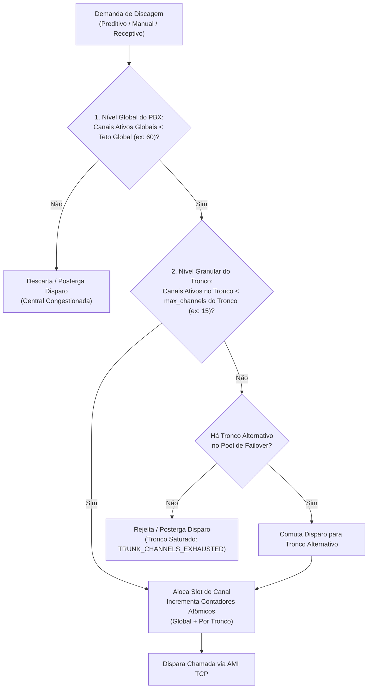

### 7.1. Regras de Arbitragem Global
1. **Limite Global (`max_channels`):** Teto máximo absoluto de canais simultâneos autorizados no Asterisk (ex.: 60 linhas).
2. **Cota Reservada Humana (`human_reserved_channels`):** Quantidade mínima intangível de canais garantidos para a operação humana (ex.: 10 linhas). O motor virtual/IA nunca pode consumir slots dessa cota, mesmo que haja leads de IA represados.
3. **Preempção Manual:** As solicitações manuais de discagem sempre obtêm permissão imediata, desde que o teto global não seja violado, suspendendo temporariamente novos disparos preditivos no tick subsequente.

---

### 7.2. Controle de Limites de Canais por Tronco (Capacidade Simultânea Granular)
Cada tronco telefônico cadastrado na tabela `trunks` possui sua própria cota máxima de ligações simultâneas (`max_channels`), contratada junto à operadora ou definida pelo dimensionamento de banda da conexão:

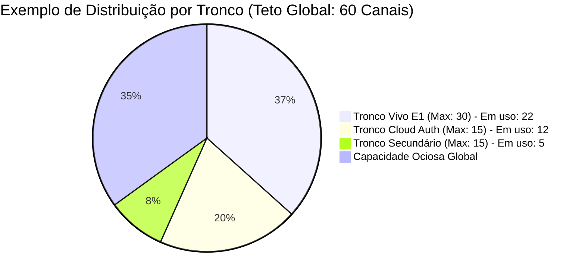

#### Regras Operacionais do Limite por Tronco:
1. **Rastreamento em Memória de Alta Concorrência:**
   - O `ChannelManager` mantém contadores atômicos em memória (`map[string]*atomic.Int32` sincronizado por `sync.RWMutex`) e conjuntos no Redis (`dialer:active_channels_by_trunk:{trunk_id}`).
   - Quando um canal entra em estado de discagem ou conversação (`DialBegin` / `Newchannel`), o contador do tronco é incrementado atomicamente.
   - Quando o evento de encerramento (`Hangup`) é emitido pelo Asterisk, o slot é liberado imediatamente na mesma fração de milissegundo.
2. **Saturação de Tronco e Ações Operacionais:**
   - **No Motor Preditivo:** O cálculo de pacing avalia a capacidade disponível em cada tronco vinculado à campanha. Se o tronco atingir 100% de ocupação (`active_channels >= max_channels`), o motor suspende novos disparos para aquele tronco específico até a liberação de slots, evitando erros de rejeição SIP (`503 Service Unavailable` ou `486 Busy Here` da operadora).
   - **Na Chamada Manual:** Se o operador solicitar uma discagem através de um tronco saturado e não houver tronco alternativo configurado, a API retorna imediatamente erro estruturado:
     ```json
     {
       "success": false,
       "error": {
         "code": "TRUNK_CHANNELS_EXHAUSTED",
         "message": "O tronco 'trunk_cloud_auth' atingiu o limite máximo de 15 chamadas simultâneas. Tente novamente em instantes.",
         "status": 429,
         "trunk_id": "trunk_cloud_auth",
         "active_channels": 15,
         "max_channels": 15
       }
     }
     ```
   - **No Roteamento Receptivo:** Se o cliente retornar uma ligação para um tronco que esteja temporariamente com todos os canais ocupados, o `InboundEngine` comuta a chamada imediatamente para o tronco secundário de transbordo (failover trunk) ou tronco padrão configurado, impedindo que o chamador receba tom de ocupado.
3. **Telemetria de Saturação por Tronco:**
   - Exposta em tempo real via endpoint `GET /api/v1/trunks` nos campos:
     - `max_channels`: capacidade total contratada.
     - `active_channels`: chamadas ativas no instante.
     - `available_channels`: slots livres (`max_channels - active_channels`).
     - `utilization_percentage`: percentual de uso instantâneo.
     - `is_saturated`: booleano (`active_channels >= max_channels`).

---

## 8. Estruturas de Dados e Topologia de Persistência

### 8.1. Banco Relacional Standalone (`dialer_db`)
O PostgreSQL exclusivo do Dialer-Go abriga as tabelas necessárias para seu funcionamento soberano:

```mermaid
erDiagram
    phone_trunk_mappings {
        varchar phone PK
        varchar last_trunk
        varchar last_project
        varchar last_sip_route
        varchar tenant_id
        timestamptz updated_at
    }

    trunks {
        varchar id PK
        varchar tenant_id
        varchar name
        varchar direction
        varchar registration_mode
        varchar host
        integer port
        varchar outbound_proxy
        varchar tech_prefix
        varchar auth_username
        varchar auth_password
        varchar auth_realm
        varchar from_user
        varchar from_domain
        varchar transport
        varchar nat_mode
        jsonb codecs
        varchar dtmf_mode
        integer qualify_frequency
        float qualify_timeout
        integer max_channels
        boolean is_enabled
        timestamptz created_at
        timestamptz updated_at
    }

    campaigns {
        varchar id PK
        varchar tenant_id
        varchar name NULL
        varchar mode
        varchar status
        float aggressiveness
        varchar trunk_name
        integer cycle_count
        varchar saturation_level
        timestamptz last_cycle_at
        timestamptz created_at
    }

    leads {
        bigserial id PK
        varchar campaign_id FK
        varchar tenant_id
        varchar cpf
        varchar phone
        varchar status
        integer attempts_count
        timestamptz last_dialed_at
        timestamptz dialed_at
        timestamptz created_at
    }

    cdrs {
        varchar id PK
        varchar tenant_id
        varchar campaign_id
        varchar phone
        varchar agent_id
        varchar call_type
        varchar disposition
        integer sip_status
        integer hangup_cause
        integer duration_seconds
        integer billsec_seconds
        integer ring_seconds
        varchar trunk_used
        timestamptz created_at
        timestamptz initiated_at
        timestamptz answered_at
        timestamptz ended_at
    }

    execution_traces {
        bigserial id PK
        varchar correlation_id
        varchar tenant_id
        varchar campaign_id
        bigint lead_id
        varchar phone
        varchar agent_id
        varchar step
        varchar status
        text message
        jsonb metadata
        timestamptz created_at
    }

    campaigns ||--o{ leads : contains
    trunks ||--o{ cdrs : processed_by
    leads ||--o{ execution_traces : tracked_by
```

#### DDL da Tabela de Rastreamento de Processos (`execution_traces`):
```sql
CREATE TABLE IF NOT EXISTS execution_traces (
    id BIGSERIAL PRIMARY KEY,
    correlation_id VARCHAR(64) NOT NULL,
    tenant_id VARCHAR(64) NOT NULL DEFAULT 'default',
    campaign_id VARCHAR(64),
    lead_id BIGINT,
    phone VARCHAR(32),
    agent_id VARCHAR(64),
    step VARCHAR(64) NOT NULL,
    status VARCHAR(32) NOT NULL DEFAULT 'SUCCESS',
    message TEXT NOT NULL,
    metadata JSONB NOT NULL DEFAULT '{}'::jsonb,
    created_at TIMESTAMP WITH TIME ZONE DEFAULT CURRENT_TIMESTAMP
);

CREATE INDEX IF NOT EXISTS idx_traces_correlation ON execution_traces(correlation_id);
CREATE INDEX IF NOT EXISTS idx_traces_campaign ON execution_traces(campaign_id, created_at DESC);
CREATE INDEX IF NOT EXISTS idx_traces_lead ON execution_traces(lead_id);
```

#### Catálogo Canônico de Stored Procedures de Inteligência Preditiva (ACID):
1. **`fn_audit_claim_predictive_batch(p_campaign_id, p_tenant_id, p_limit, p_cooldown_hours)`:**
   - Reserva atômica de lote FILO (`id DESC`) respeitando cooldown (default 2h).
   - Bloqueio concorrente via `FOR UPDATE SKIP LOCKED`.
   - Transiciona leads selecionados para `status = 'DIALING'`, incrementa `attempts_count` e carimba `dialed_at = NOW()`.
2. **`fn_audit_persist_predictive_result(p_cdr_id, p_tenant_id, p_campaign_id, p_phone, p_lead_id, p_agent_id, p_disposition, ...)`:**
   - Persistência transacional do desfecho telefônico.
   - Escreve em `cdrs`, transiciona tupla de `leads` para `COMPLETED` (sucesso/limite) ou `QUEUED` (falha temporária para cooldown) e grava rota receptiva inteligente em `phone_trunk_mappings`.
3. **`fn_audit_recycle_campaign_leads(p_campaign_id, p_tenant_id)`:**
   - Reabre leads não finalizados (`status != 'COMPLETED'`) para `'QUEUED'`, incrementa o `cycle_count` da campanha e define `saturation_level = 'RECICLADA'`.
4. **`fn_audit_log_trace(p_correlation_id, p_step, p_status, p_message, ...)`:**
   - Grava passos estruturados da jornada na visão do usuário e telemetria técnica na tabela `execution_traces`.

### 8.2. Dicionário de Estruturas em Memória Rápida (Redis)
| Chave Redis | Tipo | Finalidade / Dinâmica de Execução |
| :--- | :--- | :--- |
| `dialer:whitelist_ips` | SET | Conjunto de IPs autorizados sincronizado com a memória do Go. |
| `dialer:trunks:health:{trunk_id}` | HASH | Telemetria real PJSIP: status (`REGISTERED`/`ONLINE`/`REJECTED`/`OFFLINE`), RTT em ms, canais ativos, último qualify. |
| `dialer:campaign_available_agents:{campaign_id}` | LIST | Fila FIFO (JSON) de operadores ociosos disponíveis para receber chamadas, ordenada por tempo ocioso (TTL 30s). |
| `dialer:campaign_dialing_channels:{campaign_id}` | STRING | Total instantâneo de canais da campanha em estado de discagem/chamando (TTL 60s). |
| `dialer:buffer:calls_summary:{tenant_id}:{hash}` | STRING | Buffer em cache (JSON, TTL 900s / 15 min) do relatório analítico consolidado por tenant. |
| `dialer:active_channels` | HASH | Mapeamento ativo de `{channel_id: {phone, campaign_id, type, start_time}}`. |
| `dialer:active_channels_by_trunk:{trunk_id}` | SET | Conjunto de identificadores de canais em conversação/discagem dedicados a este tronco. |
| `dialer:lead_queue:{campaign_id}` | LIST | Fila atômica FIFO/FILO de leads para contingência em memória. |
| `dialer:campaign_paused:{campaign_id}` | STRING | Trava individual (flag "1") indicando pausa síncrona da campanha via /toggle. |
| `dialer:inflated_success_rate` | STRING | Flag temporária (TTL 30s) criada pós-abandono regulatório para desacelerar o pacing forçando taxa 1.0. |
| `dialer:engine_paused` | STRING | Trava mestre de emergência para suspender discagens globalmente. |
| `dialer:recent_dials` | ZSET | Janela deslizante de disparos por minuto para cálculo de CPM e ritmo. |

---

## 9. Arquitetura Interna do Código em GoLang (Clean Architecture)

A estrutura do projeto `dialer-go` segue rigorosamente a **Clean Architecture** (Arquitetura Hexagonal), garantindo desacoplamento completo das bibliotecas de infraestrutura e satisfazendo o limite obrigatório de **500 linhas por arquivo**:

```text
dialer-go/
├── cmd/
│   └── dialer/
│       └── main.go                 # Ponto de entrada, injeção de dependências e graceful shutdown
├── internal/
│   ├── core/                       # Núcleo de Regras de Negócio e Casos de Uso
│   │   ├── channel_manager.go      # Arbitrador de canais e semáforo de concorrência
│   │   ├── predictive_engine.go    # Loop de pacing e cálculo de overdialing
│   │   ├── inbound_engine.go       # Roteamento de chamadas entrantes
│   │   ├── manual_engine.go        # Orquestrador de chamadas manuais prioritárias
│   │   ├── mailing_processor.go    # Descompactação, validação e streaming de mailing
│   │   ├── saturation_service.go   # Cálculo estatístico e métricas de saturação
│   │   ├── report_service.go       # Agregação estatística de chamadas com buffer de 15 min
│   │   └── trunk_manager.go        # Gerenciamento de troncos e daemon de saúde
│   ├── domain/                     # Entidades de Domínio e Contratos
│   │   ├── call.go                 # Entidades de Chamada e Sessão
│   │   ├── campaign.go             # Entidades de Campanha e Configuração
│   │   ├── lead.go                 # Estruturas e validações de Leads
│   │   ├── trunk.go                # Entidades, Enums e DTOs de Troncos
│   │   ├── report.go               # DTOs de Relatórios e Metadados de Cache
│   │   └── errors.go               # Erros canônicos de domínio
│   ├── ports/                      # Interfaces e Contratos Abstratos
│   │   ├── ami_port.go             # Interface do adaptador AMI Asterisk
│   │   ├── repository_port.go      # Interface de acesso a dados (Postgres)
│   │   ├── cache_port.go           # Interface de controle volátil (Redis)
│   │   └── storage_port.go         # Interface de download de mailing (MinIO/S3)
│   └── adapters/                   # Implementações Concretas de Infraestrutura
│       ├── ami/
│       │   ├── client.go           # Conexão TCP socket e loop de leitura
│       │   ├── parser.go           # Parser de pacotes e eventos AMI
│       │   └── dispatcher.go       # Envio thread-safe de Actions (Originate, Redirect)
│       ├── postgres/
│       │   ├── db.go               # Pool de conexões pgx/v5
│       │   ├── routing_repo.go     # Operações na tabela phone_trunk_mappings
│       │   ├── trunk_repo.go       # Persistência e consultas da tabela trunks
│       │   ├── report_repo.go      # Queries analíticas agregadas de CDR/histórico
│       │   └── lead_repo.go        # Inserção, leitura em lote e reciclagem FILO
│       ├── redis/
│       │   └── client.go           # Cliente go-redis/v9 e operações de filas
│       └── http/
│           ├── server.go           # Servidor HTTP net/http com chi router
│           ├── ip_whitelist.go     # Middleware de verificação de IP em memória
│           ├── predictive_handler.go# Handler para POST /api/v1/predictive/demand
│           ├── manual_handler.go   # Handler para POST /api/v1/calls/manual
│           ├── refill_handler.go   # Handler para POST /api/v1/campaigns/refill
│           ├── toggle_handler.go   # Handler síncrono para POST /api/v1/campaigns/toggle (timeout 15s)
│           ├── saturation_handler.go# Handler para GET /api/v1/campaigns/{id}/saturation
│           ├── report_handler.go   # Handler para GET /api/v1/reports/calls-summary (buffer 15 min)
│           ├── trunk_handler.go    # Handlers REST CRUD e telemetria para /api/v1/trunks
│           └── health_handler.go   # Handlers de diagnóstico e métricas
├── config/
│   └── config.go                   # Carregamento de variáveis de ambiente com validação
├── Dockerfile                      # Build multistage estático em Scratch/Alpine
├── docker-compose.yml              # Ambiente de desenvolvimento com Postgres e Redis
├── go.mod                          # Módulo Go
└── go.sum                          # Checksums de dependências
```

### 9.1. Padrões de Concorrência em Go
- **Goroutines de Ciclo Contínuo:** Os loops dos motores operam com `time.NewTicker`, consumindo contextos (`context.Context`) canceláveis para garantir encerramento gracioso (*Graceful Shutdown*).
- **Semáforos e Mutexes Atômicos:** O `ChannelManager` utiliza `sync.RWMutex` e contadores atômicos (`sync/atomic`) para garantir alocação livre de race conditions em frações de microssegundo.
- **Buffers e Channels Sem Bloqueio:** Os eventos recebidos do socket AMI são entregues em channels Go desacoplados com buffer dimensionado, impedindo que lentidões em banco afetem a leitura do stream TCP do Asterisk.

---

## 10. Matriz de Endpoints da API REST

Todas as requisições exigem que o IP de origem conste na lista branca em memória.

| Método | Endpoint | Papel Operacional |
| :--- | :--- | :--- |
| `POST` | `/api/v1/predictive/demand` | Recebe a demanda de campanhas/agentes e retorna os canais disparados. |
| `POST` | `/api/v1/calls/manual` | Dispara chamada manual prioritária conectando o cliente ao `sip_route`. |
| `POST` | `/api/v1/campaigns/refill` | Descarrega ZIP do MinIO, valida e enfileira leads no banco e Redis. |
| `POST` | `/api/v1/campaigns/toggle` | Ativa ou pausa uma campanha de forma síncrona com timeout estrito de 15 segundos. |
| `GET` | `/api/v1/campaigns/{campaign_id}/saturation` | Retorna métricas analíticas de saturação individual, ciclo FILO e urgência de refill. |
| `GET` | `/api/v1/campaigns/saturation` | Retorna visão consolidada da saturação de todas as campanhas ativas do tenant. |
| `GET` | `/api/v1/reports/calls-summary` | Retorna estatísticas analíticas de chamadas (entregues, caixa-postal, atendimento, falhas, inválidos) com buffer de 15 min. |
| `GET` | `/api/v1/trunks` | Lista todos os troncos com status de registro, latência RTT em ms e canais ativos. |
| `POST` | `/api/v1/trunks` | Cadastra novo tronco (com ou sem registro) e sincroniza com o PBX. |
| `PUT` | `/api/v1/trunks/{trunk_id}` | Atualiza parâmetros operacionais, codecs, capacidade ou credenciais do tronco. |
| `DELETE` | `/api/v1/trunks/{trunk_id}` | Remove ou inativa o tronco telefônico. |
| `GET` | `/api/v1/trunks/enumerations` | Retorna opções válidas de codecs, transportes, modos de registro e DTMF. |
| `POST` | `/api/v1/system/whitelist` | Atualiza a lista branca de IPs em memória em tempo de execução. |
| `GET` | `/api/v1/system/channels` | Retorna o estado instantâneo do Gerenciador de Canais (alocados, livres). |
| `GET` | `/health` | Checagem de integridade (AMI Conectado, Postgres OK, Redis OK). |

---

## 11. Matriz Comparativa: Dialer Legado (Node.js) vs. Dialer-Go

| Dimensão Técnica | Versão Anterior (Node.js) | Dialer-Go (100% GoLang) |
| :--- | :--- | :--- |
| **Linguagem / Runtime** | Node.js (JavaScript Assíncrono) | GoLang Nativo Compilado |
| **Consumo de Memória** | ~250MB a 450MB em repouso/carga | ~15MB a 35MB sob alta concorrência |
| **Latência AMI Socket** | Event Loop com overhead de microtarefas | Leitura direta de Socket TCP com Goroutines dedicadas |
| **Segurança e Acesso** | JWT ou autenticação heterogênea | IP Whitelist em memória (`sync.Map`) sub-microssegundo |
| **Gestão de Troncos** | Arquivos estáticos de texto desacoplados | CRUD dinâmico via API com monitoramento de RTT em tempo real |
| **Roteamento Receptivo** | Tratamento misto ou ausente | Tabela auxiliar O(1) B-Tree com retorno ao mesmo tronco SIP |
| **Mailing / Carga** | Processamento síncrono frágil a payloads | Download streaming com ZIP 4 colunas e timeout de 5 min |
| **Isolamento de Dados** | Compartilhado com base CRM | Postgres Standalone Exclusivo (`dialer_db`) |
| `Manutenibilidade` | Arquivos monolíticos com > 1.000 linhas | Módulos segregados com limite estrito de 500 linhas |

---

## 12. Subsistema de Auditoria Ponta a Ponta, Tracing e Análise Forense de Quebra de Processo

A garantia de completude, rastreabilidade e integridade das jornadas de discagem preditiva apoia-se em uma arquitetura de **Tracing Distribuído via CorrelationID**, respaldada por Stored Procedures transacionais (ACID) e uma tabela soberana de registros históricos (`execution_traces`).

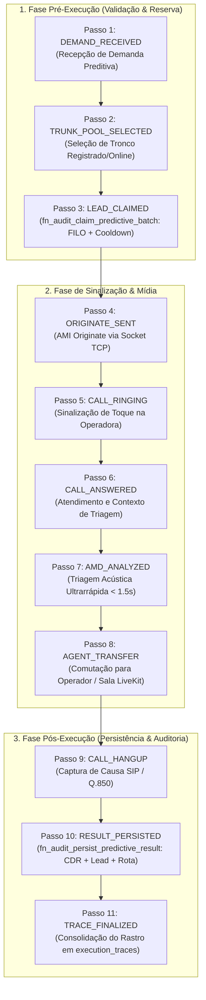

### 12.1. O Ciclo de Vida Canônico do Processo Telefônico (Os 11 Passos Canônicos)

Cada tentativa telefônica preditiva gerada pelo Dialer-Go transita obrigatoriamente por 11 etapas discretas, registradas com mensagens de fácil interpretação para o usuário e metadados técnicos estruturados em JSONB:

| Passo Canônico | Nome do Passo (`step`) | Status Esperado | Visão do Usuário (`message`) | Metadados JSONB (`metadata`) |
| :--- | :--- | :--- | :--- | :--- |
| **01** | `DEMAND_RECEIVED` | `SUCCESS` | Demanda de discagem recebida para a campanha | `agents_count`, `aggressiveness`, `loop_mode` |
| **02** | `TRUNK_POOL_SELECTED` | `SUCCESS` | Tronco de telefonia verificado e alocado | `trunk_id`, `status` (ex: `REGISTERED`), `rtt_ms` |
| **03** | `LEAD_CLAIMED` | `SUCCESS` | Contato reservado pelo motor preditivo | `lead_id`, `phone`, `attempts_count`, `cooldown_ok` |
| **04** | `ORIGINATE_SENT` | `SUCCESS` | Disparo de chamada enviado para a central | `call_id`, `action_id`, `caller_id`, `channel_string` |
| **05** | `CALL_RINGING` | `IN_PROGRESS`| Linha chamando no destino | `ring_start_at`, `sip_code` (180/183) |
| **06** | `CALL_ANSWERED` | `IN_PROGRESS`| Chamada atendida pelo destinatário | `answer_at`, `duration_ring_sec` |
| **07** | `AMD_ANALYZED` | `SUCCESS` | Triagem de atendimento concluída | `amd_status` (`HUMAN`/`MACHINE`), `time_ms` |
| **08** | `AGENT_TRANSFER` | `SUCCESS` | Ligação transferida para o operador | `agent_id`, `room_name`, `transfer_latency_ms` |
| **09** | `CALL_HANGUP` | `SUCCESS` | Chamada finalizada | `hangup_cause`, `sip_status`, `billsec_seconds` |
| **10** | `RESULT_PERSISTED` | `SUCCESS` | Resultado consolidado no banco de dados | `cdr_id`, `lead_status` (`COMPLETED`/`QUEUED`), `route_saved` |
| **11** | `TRACE_FINALIZED` | `SUCCESS` | Ciclo de auditoria concluído com sucesso | `total_duration_ms`, `correlation_id` |

---

### 12.2. O Modelo de Dados de Rastreabilidade (`execution_traces`)

A tabela `execution_traces` é o repositório centralizado e cronológico de cada passo da jornada, indexada para recuperação instantânea por `correlation_id`, `campaign_id` ou `lead_id`.

#### Regras de Gravação e Conformidade de Dados:
1. **Linguagem Amigável:** O campo `message` é estritamente formatado na perspectiva da ação do negócio, livre de menções a bibliotecas internas ou nomes de tecnologia da construção da plataforma.
2. **Correlação Universal (`correlation_id`):** Formato `corr-<campaign_id>-<timestamp>-<hash>`, gerado no recebimento da demanda e propagado até a gravação final do CDR.
3. **Imutabilidade Auditável:** Registros gravados em `execution_traces` são apenas de inserção (*append-only*), viabilizando auditorias regulatórias e reconstituições forenses de incidentes.

---

### 12.3. As Stored Procedures Canônicas de Inteligência Preditiva (ACID)

Para mitigar inconsistências em cenários de alta concorrência e evitar lógica fragmentada entre o binário Go e o banco relacional, o Dialer-Go delega as transações críticas a Stored Procedures nativas no PostgreSQL (`dialer_db`):

#### 1. `fn_audit_claim_predictive_batch`
- **Assinatura:** `fn_audit_claim_predictive_batch(p_campaign_id, p_tenant_id, p_limit, p_cooldown_hours)`
- **Comportamento Transacional:**
  - Seleciona leads candidatos com `status IN ('NEW', 'QUEUED')`.
  - Filtra por tempo decorrido: `last_dialed_at IS NULL OR last_dialed_at < NOW() - (p_cooldown_hours || ' hours')::interval`.
  - Aplica ordenação FILO estrita: `ORDER BY id DESC LIMIT p_limit`.
  - Conquista lock seguro via `FOR UPDATE SKIP LOCKED`.
  - Atualiza atômica e imediatamente `status = 'DIALING'`, `attempts_count = attempts_count + 1`, `dialed_at = NOW()`, `last_dialed_at = NOW()`.
  - Retorna o conjunto completo dos leads reservados para que o discador inicie os disparos.

#### 2. `fn_audit_persist_predictive_result`
- **Assinatura:** `fn_audit_persist_predictive_result(p_cdr_id, p_tenant_id, p_campaign_id, p_phone, p_lead_id, p_agent_id, p_disposition, p_sip_status, p_hangup_cause, p_duration_seconds, p_billsec_seconds, p_ring_seconds, p_trunk_used, p_last_sip_route, p_max_attempts)`
- **Comportamento Transacional:**
  - **Inserção no CDR:** Insere ou atualiza o registro em `cdrs` com carimbos precisos de `initiated_at`, `answered_at` e `ended_at`.
  - **Atualização do Lead:**
    - Se a chamada foi entregue (`DELIVERED`), atendida com sucesso (`ANSWERED`) ou atingiu a contagem máxima de tentativas (`attempts_count >= p_max_attempts`), transiciona para `status = 'COMPLETED'`.
    - Se o desfecho foi temporário (`NO_ANSWER`, `BUSY`, `VOICEMAIL`, `CONGESTION`), transiciona para `status = 'QUEUED'`, tornando-o elegível para nova tentativa após o transcurso do cooldown de 2 horas.
  - **Mapeamento Receptivo $O(1)$:** Atualiza ou insere o registro em `phone_trunk_mappings` (`phone`, `last_trunk`, `last_project`, `last_sip_route`, `updated_at`), garantindo que o retorno receptivo do cliente caia exatamente no mesmo operador ou sala.

#### 3. `fn_audit_recycle_campaign_leads`
- **Assinatura:** `fn_audit_recycle_campaign_leads(p_campaign_id, p_tenant_id)`
- **Comportamento Transacional:**
  - Identifica todos os leads da campanha cujo `status != 'COMPLETED'`.
  - Redefine seus estados para `status = 'QUEUED'`.
  - Incrementa o contador de ciclos da campanha: `cycle_count = cycle_count + 1`, `saturation_level = 'RECICLADA'`, `last_cycle_at = NOW()`.
  - Retorna o total de leads reciclados e o novo número do ciclo.

#### 4. `fn_audit_log_trace`
- **Assinatura:** `fn_audit_log_trace(p_correlation_id, p_tenant_id, p_campaign_id, p_lead_id, p_phone, p_agent_id, p_step, p_status, p_message, p_metadata)`
- **Comportamento Transacional:**
  - Insere o registro de rastreabilidade de forma autônoma na tabela `execution_traces`, persistindo os passos da jornada com índice de busca imediata.

---

### 12.4. Diagnóstico Forense de Engenharia Reversa: Quebras de Processo Mapeadas no Código Go

A auditoria minuciosa da base de código do `dialer-go` revelou 6 pontos críticos de quebra potencial de processo (*Breakpoints*), documentados a seguir com sua causa-raiz técnica no código e a solução arquitetural definitiva:

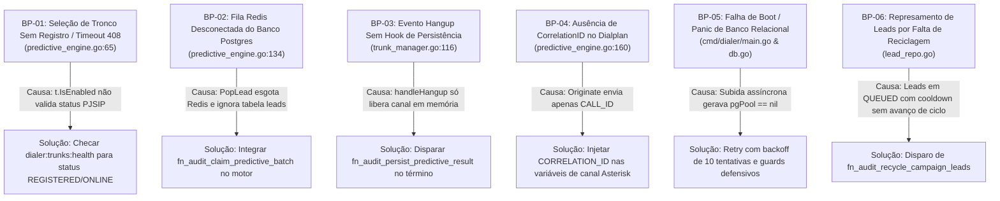

#### Detalhamento Forense dos Breakpoints:

#### BP-01: Seleção de Tronco Não Registrado ou Indisponível
- **Localização no Código:** [predictive_engine.go](file:///home/marcio/ominichat/dialer-go/internal/core/predictive_engine.go#L58-L76)
- **Diagnóstico Forense:** A função `ProcessDemand` filtrava os troncos aptos verificando apenas `if t.IsEnabled`. No entanto, troncos com credenciais incorretas, fora de operação ou em timeout de registro (como o tronco Vivo gerando erro `SIP 408 Request Timeout`) mantinham `IsEnabled = true` no banco relacional, levando o discador a tentar originar chamadas por rotas inoperantes.
- **Resolução Arquitetural:** O pool de troncos deve consultar a chave de saúde em tempo real no Redis (`dialer:trunks:health:{trunk_id}`) e selecionar apenas troncos com `status IN ('REGISTERED', 'ONLINE')`.

#### BP-02: Fila Redis Desconectada da Base Postgres
- **Localização no Código:** [predictive_engine.go](file:///home/marcio/ominichat/dialer-go/internal/core/predictive_engine.go#L134-L137)
- **Diagnóstico Forense:** O loop de discagem dependia exclusivamente de `pe.cache.PopLead(ctx, req.CampaignID)`. Quando a lista volátil do Redis esvaziava, o motor interrompia a rotina com `break // Fila esgotada`, mesmo havendo dezenas de leads cadastrados com status `NEW` ou `QUEUED` na tabela `leads` do PostgreSQL.
- **Resolução Arquitetural:** Integrar `fn_audit_claim_predictive_batch` diretamente ao `PredictiveEngine`. Caso a fila do Redis esteja vazia, o motor consulta e reserva atômica e diretamente um lote de leads do PostgreSQL via FILO com bloqueio `SKIP LOCKED`.

#### BP-03: Evento Hangup Sem Hook de Persistência de Resultados
- **Localização no Código:** [trunk_manager.go](file:///home/marcio/ominichat/dialer-go/internal/core/trunk_manager.go#L116-L120)
- **Diagnóstico Forense:** A função `handleHangup` escutava o evento `Hangup` do Asterisk e apenas executava `tm.channels.ReleaseByAsterisk(ctx, astChannel, uniqueID)`, liberando a linha na memória. Nenhuma escrita em `cdrs` era disparada, o lead permanecia indefinidamente em `DIALING`, e os métodos de `SaveCDR` existentes em `report_repo.go` nunca eram invocados.
- **Resolução Arquitetural:** O despachante do evento de encerramento (`Hangup` ou `Cdr`) deve invocar a Stored Procedure `fn_audit_persist_predictive_result`, garantindo gravação do CDR, atualização do lead para `COMPLETED` ou `QUEUED` e registro da rota receptiva em `phone_trunk_mappings`.

#### BP-04: Ausência de Propagação do CorrelationID no Dialplan
- **Localização no Código:** [predictive_engine.go](file:///home/marcio/ominichat/dialer-go/internal/core/predictive_engine.go#L160-L172)
- **Diagnóstico Forense:** O mapa de variáveis injetado na ação `Originate` continha apenas `CALL_ID`, `TENANT_ID`, `CAMPAIGN_ID` e `PHONE`, sem transmitir um identificador de correlação único (`CORRELATION_ID`). Isso impedia a correlação entre eventos de sinalização no Asterisk e as etapas registradas na auditoria.
- **Resolução Arquitetural:** Gerar o `correlation_id` no início de `ProcessDemand` e injetá-lo explicitamente no mapa de variáveis do canal Asterisk, recuperando-o nos eventos subsequentes de AMD e Hangup.

#### BP-05: Risco de Panic por Ponteiro Nulo de Conexão no Boot
- **Localização no Código:** [main.go](file:///home/marcio/ominichat/dialer-go/cmd/dialer/main.go) e [db.go](file:///home/marcio/ominichat/dialer-go/internal/adapters/postgres/db.go)
- **Diagnóstico Forense:** Durante a inicialização conjunta de containers Docker, o PostgreSQL levava de 2 a 4 segundos para ficar pronto para conexões. Se a primeira tentativa de conexão falhasse, o discador subia com `pgPool == nil`, disparando `panic: runtime error: invalid memory address or nil pointer dereference` na primeira requisição HTTP recebida.
- **Resolução Arquitetural:** Implementação de loop de retry com backoff exponencial no `db.go` (10 tentativas com timeout progressivo), inclusão de guards defensivos `if r.pool == nil` em todos os repositórios, configuração de `condition: service_healthy` no Docker Compose e reconexão contínua em segundo plano no cliente AMI.

#### BP-06: Represamento de Leads por Ausência de Reciclagem Automática
- **Localização no Código:** [lead_repo.go](file:///home/marcio/ominichat/dialer-go/internal/adapters/postgres/lead_repo.go)
- **Diagnóstico Forense:** Leads discados que não atenderam ou deram ocupado eram atualizados com carimbo de tentativa, mas permaneciam com seu ciclo de vida estagnado caso a campanha não sofresse novo refill via ZIP.
- **Resolução Arquitetural:** Execução periódica ou sob demanda da Stored Procedure `fn_audit_recycle_campaign_leads`, reabrindo contatos incompletos para `QUEUED`, avançando o contador de ciclos (`cycle_count`) e classificando a saturação como `RECICLADA`.

---

### 12.5. Consultas SQL de Auditoria e Cruzamento de Dados para Validação

Para validação analítica e cruzamento de dados pré, durante e pós-execução, disponibiliza-se a seguinte suíte canônica de consultas de auditoria:

#### 1. Verificação Pré-Execução (Elegibilidade de Leads e Estado de Campanha):
```sql
-- Conferir saúde dos leads antes do disparo preditivo
SELECT 
    c.id AS campaign_id,
    c.status AS campaign_status,
    c.cycle_count,
    COUNT(l.id) AS total_leads,
    COUNT(l.id) FILTER (WHERE l.status = 'NEW') AS leads_novos,
    COUNT(l.id) FILTER (WHERE l.status = 'QUEUED') AS leads_na_fila,
    COUNT(l.id) FILTER (WHERE l.status = 'DIALING') AS leads_discando_travados,
    COUNT(l.id) FILTER (WHERE l.status = 'COMPLETED') AS leads_finalizados,
    COUNT(l.id) FILTER (WHERE l.last_dialed_at > NOW() - INTERVAL '2 hours') AS em_cooldown_2h
FROM campaigns c
LEFT JOIN leads l ON l.campaign_id = c.id
WHERE c.tenant_id = 'default'
GROUP BY c.id, c.status, c.cycle_count;
```

#### 2. Cruzamento Transacional Pós-Execução (CDR vs. Lead vs. Rota Receptiva):
```sql
-- Validar a integridade de tupla pós-atendimento
SELECT 
    c.id AS cdr_id,
    c.phone,
    c.disposition,
    c.billsec_seconds,
    c.ring_seconds,
    c.trunk_used,
    l.id AS lead_id,
    l.status AS lead_status,
    l.attempts_count,
    l.last_dialed_at,
    m.last_trunk,
    m.last_sip_route,
    m.updated_at AS route_updated_at
FROM cdrs c
JOIN leads l ON l.phone = c.phone AND l.campaign_id = c.campaign_id
LEFT JOIN phone_trunk_mappings m ON m.phone = c.phone
ORDER BY c.created_at DESC
LIMIT 10;
```

#### 3. Rastreamento Sequencial de Etapas pelo CorrelationID:
```sql
-- Linha do tempo completa da jornada telefônica na visão do usuário e técnica
SELECT 
    id,
    correlation_id,
    step,
    status,
    message,
    metadata,
    created_at,
    ROUND(EXTRACT(EPOCH FROM (created_at - LAG(created_at) OVER (PARTITION BY correlation_id ORDER BY id))) * 1000) AS step_delta_ms
FROM execution_traces
WHERE correlation_id = 'corr_pred_test_001'
ORDER BY id ASC;
```

#### 4. Detecção de Anomalias e Quebras de Processo:
```sql
-- Identificar leads que ficaram travados em 'DIALING' sem CDR correspondente (Breakpoint BP-03)
SELECT 
    l.id,
    l.campaign_id,
    l.phone,
    l.status,
    l.attempts_count,
    l.dialed_at,
    NOW() - l.dialed_at AS tempo_travado
FROM leads l
LEFT JOIN cdrs c ON c.phone = l.phone AND c.campaign_id = l.campaign_id AND c.created_at >= l.dialed_at - INTERVAL '1 minute'
WHERE l.status = 'DIALING'
  AND l.dialed_at < NOW() - INTERVAL '5 minutes'
  AND c.id IS NULL;
```
