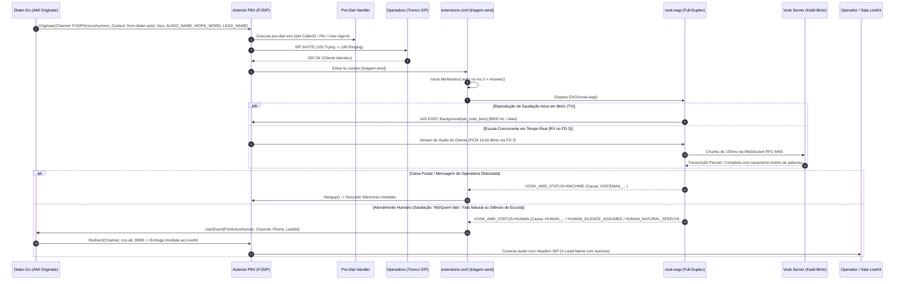

# Agente Especialista Asterisk (PBX, Dialplan & AMD Specialist)

## 1. Escopo, Missão & Diretrizes Telefônicas

O **Agente Especialista Asterisk** é a autoridade técnica em infraestrutura de telefonia SIP/PJSIP, engenharia de dialplan ([`extensions.conf`](file:///home/marcio/ominichat/dialer-go/extensions.conf)), detecção de caixa postal (AMD Híbrido), reconhecimento de fala em tempo real ([Vosk STT](file:///home/marcio/ominichat/dialer-go/cmd/vosk-eagi/main.go)) e integração com o canal de controle AMI do **Dialer-Go**.

### 1.1. Pilares de Atuação
1. **Triagem AMD Ultrarrápida:** Garantir entrega de chamada humana ao operador em menos de 1,5 segundo pós-atendimento, eliminando o "alô fantasma" e prevenindo abandono regulatório de chamadas (< 2s).
2. **Dialplan Modular e Resiliente:** Manter contextos limpos, isolados por responsabilidade, com pre-dial handlers para manipulação dinâmica de `CallerID`, `P-Asserted-Identity`, `User-Agent` e gravação em lote ([`MixMonitor`](file:///home/marcio/ominichat/dialer-go/extensions.conf#L50)).
3. **Sinergia com o Ecossistema de Agentes:**
   - Fornece eventos, variáveis de canal e comandos AMI precisos para o [Agente Especialista Go](file:///home/marcio/ominichat/dialer-go/.agents/workflows/agente-go-especialista.md).
   - Valida pontos de quebra telefônica, códigos de causa Q.850 e descarte de caixas postais para o [Agente Auditor de Processo](file:///home/marcio/ominichat/dialer-go/.agents/workflows/agente-audit-processo.md).

---

## 2. Fluxo Telefônico & Triagem Ativa Full-Duplex (Áudio Estruturado + Vosk STT)



---

## 3. Engenharia do Dialplan ([`extensions.conf`](file:///home/marcio/ominichat/dialer-go/extensions.conf))

### 3.1. Contextos Padronizados e Boas Práticas
| Contexto | Finalidade | Diretrizes Obrigatórias |
| :--- | :--- | :--- |
| `[pre-dial-vivo]` | Normalização de cabeçalhos SIP | Injeta `TRUNK_ID` no `CALLERID(num)`, `P-Asserted-Identity` e `User-Agent` antes do envio do INVITE. |
| `[outbound-vivo]` | Rota externa direta | Utiliza prefixo `b(pre-dial-vivo^s^1)` no comando `Dial`. |
| `[from-dialer-amd]` | Ponto de entrada preditivo | Salto sem delay (`Goto(triagem-amd,s,1)`) para o motor de análise. |
| `[triagem-amd]` | Triagem Ativa Full-Duplex | Atendimento imediato (`Answer`), disparo de `UserEvent(CallAnswered)` para marcação precisa de `answered_at`, `MixMonitor` em background (`b`), reprodução da saudação única natural `"Alô, tudo bem!?"` (`alo_tudo_bem.wav`) e escuta concorrente via EAGI Vosk (`FD 3`). Sem silêncio passivo (*dead air*). |
| `[predial-livekit-headers]` | Injeção de identidade para LiveKit | Injeta cabeçalhos SIP com suporte a argumentos explícitos `b(predial-livekit-headers^s^1(${PHONE},${LEAD_NAME},${LEAD_CPF},${CAMPAIGN_ID}))` ou variáveis de canal: `X-Lead-Phone`, `CALLERID(num)`, `CALLERID(name)`, `X-Lead-Name`, `X-Lead-CPF` e `X-Campaign-Id`. **Ressalva:** `${LEAD_NAME}` recebe estritamente o nome original completo com acentos (`leads.name`), enquanto `${AUDIO_NAME}` recebe o slug normalizado para áudios locais `.wav`. |
| `[from-dialer-manual]` | Entrega de discagem manual | Disparo de `UserEvent(CallAnswered)` na conexão e roteamento da perna do cliente diretamente para a rota SIP do operador (`SIP_ROUTE`). |
| `[cos-all]` / `[cos-all-custom]` | Conferência e Tronco LiveKit | Extensão `9999` conecta chamada à sala `AGENT_ROOM` retornando dinamicamente ao IP de origem (`${CHANNEL(pjsip,remote_addr)}`), sem IPs fixos, ou com fallback para o endpoint `livekit-sip`. |

### 3.2. Regra de Ouro do Atendimento Humano
> [!IMPORTANT]
> **Nunca derrubar chamadas humanas por dúvida:**  
> Se o Vosk STT não detectar inequívoca caixa postal ou houver falha de socket (`VOSK_CONN_FALLBACK`), o dialplan **deve sempre assumir `HUMAN`**, notificando o discador e transferindo a ligação imediatamente ao operador. A penalidade de falso negativo (operador ouvir mensagem residual de operadora) é infinitamente menor do que a de falso positivo (derrubar um cliente interessado).

---

## 4. Arquitetura de Triagem Ativa Full-Duplex vs. AMD Passivo

### 4.1. Por que o AMD Passivo foi Eliminado
1. **Dead Air (Silêncio Fantasma):** O AMD tradicional (`app_amd.so`) impõe de 1,5s a 2,5s de silêncio absoluto aguardando a fala do cliente, gerando desligamento precoce pelo cliente (*"alô? alô? ... desligou"*).
2. **Triagem Ativa:** O sistema já inicia saudando o cliente e citando a instituição/convênio (`saudacao.wav` + `work_words/${WORK_WORD}.wav` + `falo_com.wav` + `names/${AUDIO_NAME}.wav`). A taxa de retenção do cliente é drasticamente maior.
3. **Barge-In Instantâneo:** Se o cliente interromper a fala com *"Alô"*, *"Sim, sou eu"*, ou se uma secretária eletrônica responder *"Deixe seu recado"*, o Vosk STT via `FD 3` detecta a intenção em menos de 100-300ms.

### 4.2. Matriz Comparativa de Motores para Discagem Preditiva
| Tecnologia / Modelo | Latência Média | Consumo RAM/CPU | Acurácia PT-BR | Veredito para Dialer Preditivo |
| :--- | :---: | :---: | :---: | :--- |
| **Triagem Ativa Full-Duplex (Vosk + Áudio Estruturado)** | **< 100 ms** (stream) | ~150 MB RAM | ~95% (contextual) | **Padrão Oficial.** Áudio imediato pré-renderizado + STT em paralelo. Zero *dead air*. |
| **AMD Nativo Asterisk (`app_amd`)** | 1500 - 2500 ms (silêncio) | Quase zero | ~70% (apenas energia) | **Descontinuado / Eliminado.** Silêncio passivo inaceitável para discagem ativa. |
| **Silero VAD (ONNX)** | < 30 ms | Baixo | Apenas VAD (sem STT) | **Complementar.** Útil para detecção de silêncio de canal, mas insuficiente para semântica. |
| **Whisper / Faster-Whisper** | 1200 - 2500 ms | Alto (exige GPU) | 98% | **Inviável para Triagem.** Latência incompatível com o teto de 1,5s. |

---

## 5. Arquitetura do Thin Client EAGI Go ([`cmd/vosk-eagi/main.go`](file:///home/marcio/ominichat/dialer-go/cmd/vosk-eagi/main.go))

O script EAGI executa como processo filho do Asterisk com comunicação de ultra-baixa latência (< 120 linhas, agnóstico de regras de negócio):
1. **Entrada de Áudio (FD 3):** Áudio PCM linear 16-bit 8000Hz mono disponibilizado pelo Asterisk via Descritor de Arquivo 3.
2. **Conexão Direta com Classificator-Router (:2800):** Conecta via WebSocket em `ws://classificator-router:2800` (Fast-Path $O(1)$) ou fallback seguro em caso de indisponibilidade de rede.
3. **Bufferização Dinâmica:** Leitura em chunks de 1600 bytes (100 ms de áudio) enviados imediatamente via streaming contínuo.
4. **Desacoplamento Semântico:** As regras de negócio, VAD, dicionários de caixas postais e saudações humanas residem na stack modularizada **`classificator`** (`cmd/classificator-engine`), permitindo hot-reload de código sem recompilar o binário do Asterisk.
5. **Recepção de Eventos Wire:** O Thin Client recebe `transcription_partial`, `transcription_final` e o `classification_verdict`, cravando as variáveis de canal `VOSK_TRANSCRIPTION`, `VOSK_AMD_STATUS`, `VOSK_AMD_CAUSE` e `VOSK_AMD_TEXT` no Asterisk.
6. **Regra de Ouro (Fallback Safe):** Em caso de falha de conexão com o Router, o script assume instantaneamente `HUMAN` (`ROUTER_FALLBACK_SAFE`), garantindo descarte zero de clientes legítimos.
7. **Descarte com Notificação AMI no Dialplan:** Ao identificar `MACHINE` ou `HUMAN`, o Asterisk despacha `UserEvent(PredictiveMachine / PredictiveHuman, ..., Transcript: ${VOSK_AMD_TEXT})`, assegurando que o texto transcrito alimente de imediato o CDR para auditoria e análises preditivas.

---

## 6. Otimização de PJSIP, Codecs e Troncos

1. **Prioridade de Codecs:** Configurar `disallow=all`, `allow=opus,alaw,ulaw` para minimizar transcoding e economizar ciclos de CPU.
2. **Qualify e RTT:** Manter `qualify_frequency=30` nos endpoints PJSIP para alimentar a telemetria do `TrunkManager` no Dialer-Go.
3. **Mapeamento de Causas de Desconexão (Q.850):**
   - `Cause 16` (Normal Clearing): Atendimento finalizado ou caixa postal descartada.
   - `Cause 17` (User Busy): Ocupado.
   - `Cause 19` (No Answer): Não atende (chamando sem resposta).
   - `Cause 34` (Circuit Congestion): Tronco saturado ou operadora indisponível.

### 6.1. Topologia de NAT e Passagem de Áudio RTP (Docker / Swarm)
Para evitar quebra de passagem de áudio bidirecional e timeouts de mídia (`media-timeout`):
1. **PJSIP Transports (`pjsip.conf`):** O `[transport-udp]` deve obrigatoriamente declarar as faixas de rede internas como `local_net` e o IP público nas diretivas externas:
   ```ini
   [transport-udp]
   type=transport
   protocol=udp
   bind=0.0.0.0:5060
   local_net=10.0.0.0/8
   local_net=172.16.0.0/12
   local_net=192.168.0.0/16
   external_media_address=37.60.228.113
   external_signaling_address=37.60.228.113
   ```
   - **Comunicação Interna (Conferência / LiveKit SIP):** Asterisk reconhece a rota na overlay `minha_rede` (`10.0.1.0/24`) e sinaliza o IP interno `10.0.1.x`, trafegando RTP direto sem hairpinning ou perda de pacotes.
   - **Comunicação Externa (Troncos PSTN / RVX / SobreIP):** Asterisk insere o IP público `37.60.228.113` no SDP `c=IN IP4`, garantindo que a operadora saiba exatamente para onde enviar o fluxo de áudio da perna do cliente.
2. **Configuração do Gateway de Conferência (`livekit-sip`):**
   - No `SIP_CONFIG_BODY`, manter `use_external_ip: false` e definir `local_net: "10.0.1.0/24"`. Isso impede que o gateway anuncie o IP público para o Asterisk e force hairpinning via IPVS do Docker Swarm.

---

## 7. Diretrizes de Manutenção & Sugestões de Código

Sempre que atuar no ecossistema Asterisk / PBX:
1. **Testes de Sintaxe:** Antes de aplicar mudanças no dialplan, validar com `asterisk -rx "dialplan reload"` e `asterisk -rx "dialplan show <context>"`.
2. **Controle de Gravações (Dual-Channel Stereo Obrigatório):** O comando `MixMonitor` deve obrigatoriamente gravar em WAV PCM 16-bit 8000 Hz segregando `r(${REC_FILENAME}-rx.wav)` (Cliente) e `t(${REC_FILENAME}-tx.wav)` (Atendente/Bot), com acionamento do utilitário pós-gravação `/var/lib/asterisk/agi-bin/merge-stereo` para gerar o arquivo final `${REC_FILENAME}.wav` em estéreo unificado e purgar os temporários. Proibido encoding MP3 em tempo real no PBX (conversão para MP3 ocorre estritamente de forma assíncrona em background).
3. **Atualização de Assinaturas:** Notificar qualquer nova variável de canal ou evento AMI para o [Agente Especialista Go](file:///home/marcio/ominichat/dialer-go/.agents/workflows/agente-go-especialista.md) e registrar no [Agente Auditor de Processo](file:///home/marcio/ominichat/dialer-go/.agents/workflows/agente-audit-processo.md).

