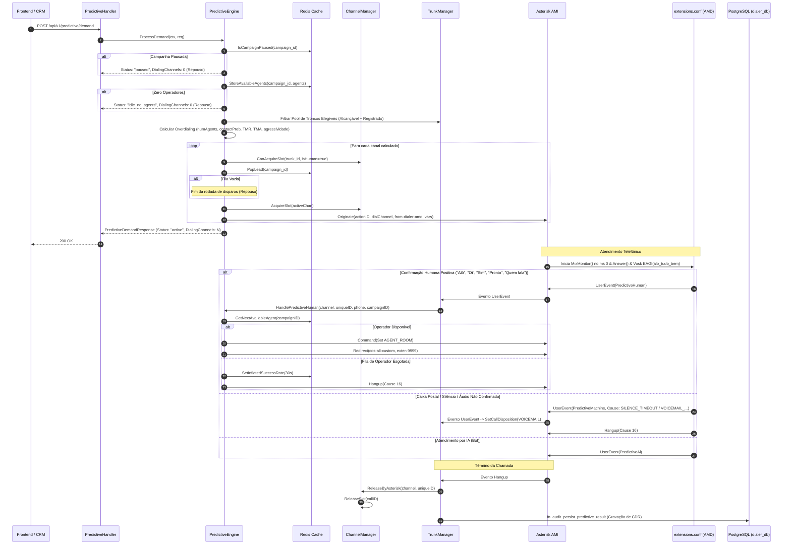

# Agente de Teste & Auditoria de Processo (Quality Assurance & Breakpoint Controller)

## 1. Escopo, Missão & Governança de Rastreamento (Trace)

O **Agente de Teste & Auditoria** é responsável por assegurar a integridade, resiliência operacional e conciliação transacional de todo o ciclo telefônico do **Dialer-Go** ([Preditivo](file:///home/marcio/ominichat/dialer-go/internal/core/predictive_engine.go), [Manual](file:///home/marcio/ominichat/dialer-go/internal/core/manual_engine.go), [Receptivo](file:///home/marcio/ominichat/dialer-go/internal/core/inbound_engine.go) e [Troncos SIP](file:///home/marcio/ominichat/dialer-go/internal/core/trunk_manager.go)).

### 1.1. Controle Dinâmico de Tracing (Ativável / Desativável)
O sistema possui a tabela de auditoria `execution_traces` e a stored procedure `fn_audit_log_trace` vinculadas ao identificador único `correlation_id` (formato `pred-corr-<uuid>` ou `man-corr-<uuid>`).

> [!IMPORTANT]
> **Política de Eficiência e Economia de Processamento:**  
> O mecanismo de trace pode ser ligado ou desligado dinamicamente via configuração de runtime (`ENABLE_EXECUTION_TRACE=true|false` ou chave de cache Redis `dialer:config:trace_enabled`).  
> - **Trace Ativado (`true`):** Utilizado em homologação, testes de carga e diagnóstico de incidentes, registrando cada transição na tabela `execution_traces`.
> - **Trace Desativado (`false`):** Em rotinas estáveis em produção, executa bypass das gravações de log em banco para evitar overhead de I/O, locks e CPU.

### 1.2. Interação com o Agente Especialista Go
Para definições canônicas de tipos, structs de domínio, DTOs de I/O, interfaces de portas (`internal/ports/`) e padrões de concorrência com `atomic.Int32` e `sync.RWMutex`, este workflow atua em conjunto com o:
👉 [`.agents/workflows/agente-go-especialista.md`](file:///home/marcio/ominichat/dialer-go/.agents/workflows/agente-go-especialista.md)

### 1.3. Interação com o Agente Especialista Asterisk
Para regras de dialplan, triagem ultrarrápida de atendimento (< 1,5s), parâmetros de AMD nativo, reconhecimento de voz Vosk STT via EAGI e roteamento PJSIP, este workflow atua em conjunto com o:
👉 [`.agents/workflows/agente-asterisk-especialista.md`](file:///home/marcio/ominichat/dialer-go/.agents/workflows/agente-asterisk-especialista.md)

### 1.4. Interação com o Agente Tester Dialer
Para matriz de testes de telefonia multiformato (`10`, `11`, `12`, `13`, `14` dígitos), garantia de Zero Normalização no discador e validação de trânsito SIP, este workflow atua em conjunto com o:
👉 [`.agents/workflows/agente-tester-dialer.md`](file:///home/marcio/ominichat/dialer-go/.agents/workflows/agente-tester-dialer.md)

---

## 2. Mapeamento do Discador Preditivo (Jornada Ponta a Ponta)



### 2.1. Gatilho e Notificação Inicial
- **Método Notificador:** [`PredictiveHandler.Demand`](file:///home/marcio/ominichat/dialer-go/internal/adapters/http/predictive_handler.go#L19) (`POST /api/v1/predictive/demand`)
- **Contrato de Entrada (`PredictiveDemandRequest`):** `tenant_id` (string), `campaign_id` (string), `aggressiveness` (*float64, opcional), `min_channels_per_agent` (*int, opcional - default 7), `available_agents` (`[]AgentDemandDTO`).
- **Contrato de Saída (`PredictiveDemandResponse`):** `campaign_id` (string), `dialing_channels` (int), `status` (string).
- **Status de Trace:** Suportado via CorrelationID (`pred-corr-<uuid>`); toggleable.
- **Gravação de CDR:** Não.

### 2.2. Início de Discagem & Pacing
- **Método Executor:** [`PredictiveEngine.ProcessDemand`](file:///home/marcio/ominichat/dialer-go/internal/core/predictive_engine.go#L35)
- **Gatilhos de Repouso (Idle / Pausa):**
  1. **Campanha Pausada:** [`cache.IsCampaignPaused`](file:///home/marcio/ominichat/dialer-go/internal/ports/cache_port.go#L25) -> retorna `paused` e `dialing_channels = 0`.
  2. **Falta de Operadores:** `len(req.AvailableAgents) == 0` -> retorna `idle_no_agents` e `dialing_channels = 0`.
  3. **Esgotamento da Fila de Leads:** [`cache.PopLead`](file:///home/marcio/ominichat/dialer-go/internal/ports/cache_port.go#L20) vazio -> cessa novos disparos.
  4. **Saturação de Troncos:** Todos os troncos elegíveis atingem `active >= max_channels` ou PBX atinge teto global.
- **Gatilho de Início:** Demanda recebida com operadores ociosos (`available_agents > 0`) e fila de leads abastecida.
- **Cálculo de Overdialing com Piso Mínimo:** $\text{Demand} = \max\left(\text{numAgents} \times \text{minRatio}, \left\lceil \frac{\text{numAgents}}{\text{contactProb}} \times \left(1.0 + \frac{\text{ringTime}}{\text{talkTime}}\right) \times \text{aggressiveness}\right\rceil\right)$, garantindo no mínimo 7 canais por operador disponível.
- **CallerID:** [`randomizeCallerID`](file:///home/marcio/ominichat/dialer-go/internal/core/predictive_engine.go#L190) preserva DDD e varia os 4 dígitos finais.
- **Injeção de Identidade e Áudio:**
  - `LEAD_NAME`: Nome original completo com acentos (`leads.name`, ex.: `"MARCIO NASCIMENTO"`), injetado no Asterisk e repassado aos headers SIP do LiveKit (`X-Lead-Name`), CRM e tela do operador.
  - `AUDIO_NAME`: Primeiro nome normalizado (`leads.first_name`, ex.: `"marcio"`), armazenado como slug no banco e indexado em memória para playback local O(1).
  - `WORK_WORD`: Convênio ou órgão normalizado (`leads.work_word`, ex.: `"governo_sp"`), pré-sintetizado ou renderizado em cache O(1) para composição imediata de áudio na triagem ativa.

### 2.3. Arbitragem de Capacidade ([`ChannelManager`](file:///home/marcio/ominichat/dialer-go/internal/core/channel_manager.go))
- [`CanAcquireSlot`](file:///home/marcio/ominichat/dialer-go/internal/core/channel_manager.go#L62): Valida Teto Global do PBX, proteção de `humanReserveQuota` e limite granular do tronco.
- [`AcquireSlot`](file:///home/marcio/ominichat/dialer-go/internal/core/channel_manager.go#L94): Incrementa atomicamente contadores e registra canal ativo.
- [`ReleaseSlot`](file:///home/marcio/ominichat/dialer-go/internal/core/channel_manager.go#L156) & [`ReleaseByAsterisk`](file:///home/marcio/ominichat/dialer-go/internal/core/channel_manager.go#L139): Desaloca canal de forma atômica no Hangup.

- **PBX:** `[triagem-amd]` em [`extensions.conf`](file:///home/marcio/ominichat/dialer-go/extensions.conf): Triagem Ativa Full-Duplex via [`EAGI`](file:///home/marcio/ominichat/dialer-go/cmd/vosk-eagi/main.go) com reprodução imediata de saudação única natural (`alo_tudo_bem`), disparo de `UserEvent(CallAnswered)` para registro determinístico de `answered_at`, e transcrição paralela no `FD 3` via Vosk STT (zero *dead air*, eliminação do AMD passivo).
- **Humano:** [`PredictiveEngine.HandlePredictiveHuman`](file:///home/marcio/ominichat/dialer-go/internal/core/predictive_engine.go#L318) e `RouteHandler.HandleHumanDetected`. Busca atômica de operador ocioso com **Distributed Lock** (`AcquireRoomLock lock:room:<room_name> 1 EX 10`). Com operador/lock obtido: define `AGENT_ROOM` e [`ami.Redirect`](file:///home/marcio/ominichat/dialer-go/internal/adapters/ami/client.go#L273) para `cos-all-custom` exten `9999` (onde o Asterisk também valida `GROUP_COUNT(${AGENT_ROOM}@livekit_rooms) <= 1`). Sem operador/lock (ou sala ocupada): `SetInflatedSuccessRate(30s)` e `ami.Hangup(Cause 16/17)`.
- **Caixa Postal / Operadora:** Ao detectar mensagem de operadora com termos inequívocos (`VOICEMAIL_*`), o Asterisk emite `UserEvent(PredictiveMachine)` e desliga (`Hangup 16`). O `TrunkManager` define `disposition = VOICEMAIL` em memória, assegurando persistência fidedigna no CDR e requebramento do lead para retentativa. Silêncio ou saudações humanas são comutados como `HUMAN` por segurança.
- **Gravação de CDR e Armazenamento de Áudio:** No encerramento da chamada via `SaveCDR`, persistindo `initiated_at`, `answered_at`, `ended_at`, `duration_seconds`, `billsec_seconds`, `ring_seconds`, `recording_file`, `recording_url` e `transcription` (transcrição do áudio em tempo real via Vosk STT com busca textual). O volume do Asterisk (`/opt/ominichat/asterisk/monitor`) é montado em modo leitura (`/var/spool/asterisk/monitor:ro`) no contêiner `dialer-go`, permitindo streaming com suporte a HTTP 206 Range e CORS via `GET /api/v1/recordings/*`.

---

## 3. Mapeamento da Ligação Manual (Click-to-Call)

### 3.1. Gatilho e Notificação Manual
- **Método Notificador:** [`ManualHandler.DialManual`](file:///home/marcio/ominichat/dialer-go/internal/adapters/http/manual_handler.go#L19) (`POST /api/v1/calls/manual`)
- **Contrato de Entrada (`ManualCallRequest`):** `tenant_id`, `agent_id`, `phone`, `sip_route`, `trunk_id` (opcional), `lead_name` (opcional), `lead_cpf` (opcional).
- **Contrato de Saída (`ManualCallResponse`):** `call_id` (formato `manual-<uuid>`), `status` ("dialing"), `trunk_used`.
- **Status de Trace:** Suportado via CorrelationID (`man-corr-<uuid>`); toggleable.

### 3.2. Execução da Chamada Manual
- **Método Executor:** [`ManualEngine.DialManual`](file:///home/marcio/ominichat/dialer-go/internal/core/manual_engine.go#L29)
- **Preempção Operacional:** Aloca slot com `isHuman = true`, respeitando `humanReserveQuota`.
- **Disparo no PBX:** [`ami.Originate`](file:///home/marcio/ominichat/dialer-go/internal/adapters/ami/client.go#L231) apontando para contexto `from-dialer-manual` conectando diretamente ao `sip_route` do operador.
- **Topologia RTP:** A perna do tronco externo recebe o IP público do transporte PJSIP (`37.60.228.113`) e a perna da sala do operador conecta via overlay interna (`10.0.1.0/24`), garantindo áudio bidirecional sem timeout de mídia.

### 3.3. Notificação Assíncrona de Desfecho (Webhook OmniChat)
- **Despachador:** [`CallNotifier.DispatchManualHangup`](file:///home/marcio/ominichat/dialer-go/internal/core/call_notifier.go#L68)
- **Gatilho de Disparo:** Evento AMI `Hangup` interceptado por `TrunkManager.handleHangup` para canais com `CallType = MANUAL`.
- **Cenários Cobertos:**
  - **Falha de Atendimento (`!is_answered`):** Dispara evento `telephony.manual_call_failed` com razão amigável (`Número Ocupado`, `Não Atende`, `Circuito Congestionado`, `Número Inexistente`, etc.).
  - **Término Normal (`is_answered`):** Dispara evento `telephony.manual_call_ended` com duração e bilhetagem.
- **Payload (`CallEndedWebhookPayload`):** `event`, `call_id`, `call_type`, `tenant_id`, `agent_id`, `phone`, `trunk_used`, `disposition`, `hangup_cause`, `hangup_reason`, `is_answered`, `duration_seconds`, `billsec_seconds`, `ring_seconds`, `started_at`, `ended_at`, `timestamp`.

---

## 4. Mapeamento de Relatórios & Gravação de CDR

### 4.1. Consulta Analítica com Buffer de 15 Minutos
- **Método HTTP:** [`ReportHandler.GetCallsSummary`](file:///home/marcio/ominichat/dialer-go/internal/adapters/http/report_handler.go#L28) (`GET /api/v1/reports/calls-summary`)
- **Buffer Redis:** [`cache.GetCallsSummaryBuffer`](file:///home/marcio/ominichat/dialer-go/internal/ports/cache_port.go#L37) com chave SHA-256 dos parâmetros e TTL de 15 min (900s).
- **Contrato de Saída (`CallsSummaryResponse`):** Métricas agregadas de ligações, falhas, percentuais, durações e metadados de cache.

### 4.2. Auditoria da Gravação de CDR por Método

| Método / Rotina | Arquivo / Origem | Entrada | Saída | Grava CDR? |
| :--- | :--- | :--- | :--- | :---: |
| [`ReportRepo.SaveCDR`](file:///home/marcio/ominichat/dialer-go/internal/adapters/postgres/report_repo.go#L24) | `report_repo.go` | `ctx, *domain.CDR` | `error` | **SIM** |
| [`ReportRepo.UpdateCDRTranscription`](file:///home/marcio/ominichat/dialer-go/internal/adapters/postgres/report_repo.go#L60) | `report_repo.go` | `ctx, cdrID, text` | `error` | **SIM (Atualiza Transcrição)** |
| `fn_audit_persist_predictive_result` | [`schema.sql`](file:///home/marcio/ominichat/dialer-go/database/schema.sql#L161) | `(p_cdr_id, p_tenant_id, p_campaign_id, ...)` | `JSONB` | **SIM** |
| [`PredictiveEngine.ProcessDemand`](file:///home/marcio/ominichat/dialer-go/internal/core/predictive_engine.go#L35) | `predictive_engine.go` | `ctx, *PredictiveDemandRequest` | `*PredictiveDemandResponse, error` | Não |
| [`ManualEngine.DialManual`](file:///home/marcio/ominichat/dialer-go/internal/core/manual_engine.go#L29) | `manual_engine.go` | `ctx, *ManualCallRequest` | `*ManualCallResponse, error` | Não |
| [`TrunkManager.handleHangup`](file:///home/marcio/ominichat/dialer-go/internal/core/trunk_manager.go#L116) | `trunk_manager.go` | `ctx, attrs map[string]string` | `void` | **SIM (CDR, Receptivo O(1) & Webhook CallNotifier)** |

---

## 5. CRUD de Troncos SIP & Gestão de Telemetria

### 5.1. Endpoints HTTP ([`TrunkHandler`](file:///home/marcio/ominichat/dialer-go/internal/adapters/http/trunk_handler.go))

| Ação / Endpoint | Método | Entrada | Saída | Trace | Grava CDR? |
| :--- | :--- | :--- | :--- | :---: | :---: |
| **Listar Troncos** `/api/v1/trunks/` | `GET` | Header `X-Tenant-Id` | `200 OK` com `[]TrunkWithHealth` | Sim (Toggle) | Não |
| **Criar Tronco** `/api/v1/trunks/` | `POST` | [`CreateTrunkDTO`](file:///home/marcio/ominichat/dialer-go/internal/domain/trunk.go#L108) | `201 Created` com confirmação | Sim (Toggle) | Não |
| **Atualizar Tronco** `/api/v1/trunks/{id}` | `PUT` | `trunk_id`, `UpdateTrunkDTO` | `200 OK` com status `APPLIED_HOT` | Sim (Toggle) | Não |
| **Excluir Tronco** `/api/v1/trunks/{id}` | `DELETE` | `trunk_id`, `?force=true\|false` | `200 OK` (`409` se chamadas ativas) | Sim (Toggle) | Não |
| **Enumeradores** `/api/v1/trunks/enumerations` | `GET` | Nenhum | `200 OK` com `TrunkEnumerationsDTO` | Não | Não |
| **Recarregar PBX** `/api/v1/trunks/reload` | `POST` | Nenhum | `200 OK` (`pjsip/dialplan reload`) | Sim (Toggle) | Não |

### 5.2. Telemetria e Determinação de Estado ([`TrunkManager`](file:///home/marcio/ominichat/dialer-go/internal/core/trunk_manager.go))
1. **Alcançável (`ONLINE`):** Capturado via [`handleContactStatus`](file:///home/marcio/ominichat/dialer-go/internal/core/trunk_manager.go#L138) (evento AMI `ContactStatus`). Mede RTT e grava latência em cache.
2. **Registrado (`REGISTERED`):** Capturado via [`handleRegistry`](file:///home/marcio/ominichat/dialer-go/internal/core/trunk_manager.go#L170) (evento AMI `Registry`).
3. **Qualify Loop & PBX Reload:** [`qualifyLoop`](file:///home/marcio/ominichat/dialer-go/internal/core/trunk_manager.go#L227) (ticker 30s) e [`ReloadPBXTrunks`](file:///home/marcio/ominichat/dialer-go/internal/core/trunk_manager.go#L263).

---

## 6. Fluxo de Utilização dos Troncos: Round-Robin & Critério de Alcançabilidade

### 6.1. Critério Rigoroso de Elegibilidade
O tronco **NÃO** é elegível apenas por `is_enabled = true`. Deve cumprir:
1. `is_enabled == true`, `direction != INBOUND` e não ser canal interno (`livekit`).
2. Se `REGISTER`: telemetria em cache estritamente `REGISTERED`.
3. Se `IP_BASED`: telemetria de qualify `ONLINE` / `Reachable` com latência RTT válida.
4. Canais ativos abaixo do limite (`active_channels < max_channels`).

### 6.2. Algoritmo Round-Robin
A seleção rotaciona ciclicamente entre todos os troncos elegíveis ($(\text{index} + 1) \pmod{\text{totalElegiveis}}$), evitando concentração e balanceando o tráfego entre operadoras.

---

## 7. Protocolo de Auditoria na Camada de Dados via Funções SQL (`fn_audit_*`)

O Agente Auditor utiliza as funções e stored procedures do PostgreSQL ([`database/schema.sql`](file:///home/marcio/ominichat/dialer-go/database/schema.sql)) para validar a camada de dados contra o fluxo de métodos Go:

### 7.1. Auditoria de Entrada: Reserva Atômica de Lote FILO
- **Função:** `fn_audit_claim_predictive_batch(p_campaign_id, p_tenant_id, p_limit, p_cooldown_hours)`
- **Auditoria de Entrada:** Valida se leads estão `NEW` ou `QUEUED`, com respeito à ordenação FILO (`ORDER BY id DESC`), janela de cooldown (default 2h) e concorrência segura (`FOR UPDATE SKIP LOCKED`).
- **Validação de Efetividade:**
  ```sql
  SELECT * FROM fn_audit_claim_predictive_batch('3', 'default', 10, 2);
  ```
  - *Efetividade nos Dados:* Garante transição imediata para `DIALING`, incremento de `attempts_count` e timestamp `dialed_at`, impedindo que múltiplos motores de discagem peguem o mesmo lead.

### 7.2. Auditoria de Desfecho: Persistência ACID, CDR e Receptivo O(1)
- **Função:** `fn_audit_persist_predictive_result(p_cdr_id, p_tenant_id, p_campaign_id, p_phone, p_lead_id, p_agent_id, p_disposition, p_sip_status, p_hangup_cause, p_duration_seconds, p_billsec_seconds, p_ring_seconds, p_trunk_used, p_sip_route, p_max_attempts, p_recording_file, p_recording_url, p_transcription)`
- **Auditoria de Resultados:**
  1. **Escrita do CDR:** Grava em `cdrs` todos os tempos de tarifação, desfecho SIP/Q.850, transcrição de fala (`transcription`) e os caminhos/URLs de áudio gravado (`recording_file`, `recording_url`).
  2. **Transição de Lead:** Sucesso (`DELIVERED`, `ANSWERED`, `INVALID_NUMBER`) ou limite de tentativas -> `COMPLETED`. Falha temporária (`VOICEMAIL`, `AMD_MACHINE`, `NO_ANSWER`, `BUSY`) -> `QUEUED`.
  3. **Receptivo O(1):** UPSERT na tabela `phone_trunk_mappings` (`last_trunk`, `last_project`, `last_sip_route`).
- **Validação de Efetividade:**
  ```sql
  SELECT fn_audit_persist_predictive_result(
      'cdr-' || gen_random_uuid(), 'default', '3', '5511999998888', 101, 'agent-1',
      'DELIVERED', 200, 16, 45, 30, 15, 'trunk-vivo', 'sala_agente_1', 5,
      '/var/spool/asterisk/monitor/2026/09/14/063000-PRED-5511999998888-1.wav',
      'https://api-omnichat.creditobr.org/dialer-go/api/v1/recordings/2026/09/14/063000-PRED-5511999998888-1.wav',
      'alo tudo bem gostaria de falar com marcio'
  );
  ```
  - *Efetividade nos Dados:* Cobre 100% dos efeitos colaterais da finalização de chamadas preditivas em uma transação única. Para chamadas manuais, a auditoria valida a escrita direta em `cdrs` com `call_type = 'MANUAL'` e metadados de gravação.

### 7.3. Auditoria de Trilha de Execução (Trace via CorrelationID)
- **Função:** `fn_audit_log_trace(p_correlation_id, p_step, p_status, p_message, p_tenant_id, p_campaign_id, ...)`
- **Auditoria de Trilha:**
  ```sql
  SELECT fn_audit_log_trace('pred-corr-test', 'LEAD_CLAIMED', 'SUCCESS', '10 leads reservados');
  SELECT * FROM execution_traces WHERE correlation_id = 'pred-corr-test' ORDER BY id ASC;
  ```
  - *Efetividade nos Dados:* Permite diagnosticar exatamente o ponto de ruptura do fluxo caso o discador pare entre o recebimento de demanda e o disparo AMI.

### 7.4. Auditoria de Saturação e Reciclagem de Campanha
- **Função:** `fn_audit_recycle_campaign_leads(p_campaign_id, p_tenant_id)`
- **Auditoria de Reciclagem:**
  ```sql
  SELECT fn_audit_recycle_campaign_leads('3', 'default');
  ```
  - *Efetividade nos Dados:* Reabre leads não completados para `QUEUED`, incrementa `cycle_count` e atualiza `saturation_level = 'RECICLADA'`.

---

## 8. Matriz de Cobertura de Funções SQL vs Métodos Go

| Etapa do Fluxo | Método Go Correspondente | Função / Query de Auditoria SQL | Validação de Entrada | Efetividade na Camada de Dados |
| :--- | :--- | :--- | :--- | :--- |
| **Reserva de Leads** | `PredictiveEngine.ProcessDemand` | `fn_audit_claim_predictive_batch` | `campaign_id`, `limit`, `cooldown` | **Total:** Aplica FILO, lock SKIP LOCKED e status `DIALING`. |
| **Disparo PBX** | `AMIClient.Originate` | `fn_audit_log_trace` | `correlation_id`, step `PBX_ORIGINATE_SENT` | **Total:** Rastreabilidade cronológica com metadados. |
| **Triagem AMD** | `PredictiveEngine.HandlePredictiveHuman` | `fn_audit_log_trace` | `correlation_id`, step `AMD_HUMAN_DETECTED` | **Total:** Registra confirmação humana e descarte de robôs. |
| **Hangup / Persistência**| `TrunkManager.handleHangup` | `fn_audit_persist_predictive_result` | `cdr_id`, `disposition`, tempos, `trunk` | **Total:** Persistência ACID em `cdrs`, `leads` e `phone_trunk_mappings`. |
| **Chamada Manual** | `ManualEngine.DialManual` | `ReportRepo.SaveCDR` / Query `cdrs` | `call_type = 'MANUAL'`, `agent_id`, `phone` | **Total:** Garante histórico tarifário de discagens de operador. |
| **Relatório Analítico** | `ReportHandler.GetCallsSummary` | Query agregada `cdrs` | `tenant_id`, `start_date`, `end_date` | **Total:** Compara métricas do PostgreSQL com buffer do Redis. |
| **Saturação / Reciclo** | `SaturationService.RecycleCampaign` | `fn_audit_recycle_campaign_leads` | `campaign_id`, `tenant_id` | **Total:** Reabre leads `!= COMPLETED` e incrementa `cycle_count`. |

---

## 9. Matriz Canônica de Assinaturas, Contratos e Rastreabilidade

| Módulo / Camada | Método / Função | Contrato de Entrada (Parâmetros / DTO) | Contrato de Saída (Retorno / Erro) | Trace (Toggle) | Gravação de CDR |
| :--- | :--- | :--- | :--- | :---: | :---: |
| **Health HTTP** | `HealthCheck` | `(w http.ResponseWriter, r *http.Request)` | `void` (JSON `HealthResponse`) | Não | Não |
| **HTTP Middleware** | `IPWhitelistMiddleware` | `(next http.Handler) http.Handler` | `http.Handler` (Validação CIDR / IP / Wildcard) | Não | Não |
| **Predictive HTTP** | `Demand` | `(w http.ResponseWriter, r *http.Request)` | `void` (JSON `PredictiveDemandResponse`) | Sim (Toggle) | Não |
| **Predictive Core** | `ProcessDemand` | `(ctx context.Context, req *domain.PredictiveDemandRequest)` | `(*domain.PredictiveDemandResponse, error)` | Sim (Toggle) | Não |
| **Predictive Core** | `randomizeCallerID` | `(destPhone string)` | `string` | Não | Não |
| **Predictive Core** | `HandlePredictiveHuman` | `(ctx context.Context, channel, uniqueID, phone, campaignID, leadID string)` | `error` | Sim (Toggle) | Não |
| **Predictive Core** | `HandlePredictiveAi` | `(ctx context.Context, channel, uniqueID, phone, campaignID, leadID string)` | `error` | Sim (Toggle) | Não |
| **Manual HTTP** | `DialManual` | `(w http.ResponseWriter, r *http.Request)` | `void` (JSON `ManualCallResponse`) | Sim (Toggle) | Não |
| **Manual Core** | `DialManual` | `(ctx context.Context, req *domain.ManualCallRequest)` | `(*domain.ManualCallResponse, error)` | Sim (Toggle) | Não |
| **Channel Core** | `CanAcquireSlot` | `(trunkID string, isHuman bool)` | `(bool, string)` | Não | Não |
| **Channel Core** | `AcquireSlot` | `(ctx context.Context, channel *domain.ActiveChannel, isHuman bool)` | `error` | Não | Não |
| **Channel Core** | `LinkAsteriskChannel` | `(callID, astChannel, uniqueID string)` | `void` | Não | Não |
| **Channel Core** | `ReleaseSlot` | `(ctx context.Context, channelID string)` | `*domain.ActiveChannel` | Não | Não |
| **Channel Core** | `ReleaseByAsterisk` | `(ctx context.Context, astChannel, uniqueID string)` | `*domain.ActiveChannel` | Não | Não |
| **Channel Core** | `AssignAgent` | `(callID, agentID string)` | `void` | Não | Não |
| **Channel Core** | `SetCallDisposition` | `(callID string, disp domain.CallDisposition)` | `void` | Não | Não |
| **Channel Core** | `ReconcileCounters` | `(ctx context.Context)` | `void` | Não | Não |
| **Trunk Manager** | `handleContactStatus` | `(ctx context.Context, attrs map[string]string)` | `void` | Não | Não |
| **Trunk Manager** | `handleRegistry` | `(ctx context.Context, attrs map[string]string)` | `void` | Não | Não |
| **Trunk Manager** | `handleOriginateResponse` | `(ctx context.Context, attrs map[string]string)` | `void` | Sim (Toggle) | Não |
| **Trunk Manager** | `handleHangup` | `(ctx context.Context, attrs map[string]string)` | `void` | Sim (Toggle) | **SIM (Grava CDR & Receptivo O(1))** |
| **Trunk Manager** | `ReloadPBXTrunks` | `(ctx context.Context)` | `error` | Sim (Toggle) | Não |
| **Trunk HTTP** | `List` | `(w http.ResponseWriter, r *http.Request)` | `void` (JSON `[]TrunkWithHealth`) | Sim (Toggle) | Não |
| **Trunk HTTP** | `Create` | `(w http.ResponseWriter, r *http.Request)` | `void` (JSON `CreateTrunkDTO`) | Sim (Toggle) | Não |
| **Trunk HTTP** | `Update` | `(w http.ResponseWriter, r *http.Request)` | `void` (JSON `UpdateTrunkDTO`) | Sim (Toggle) | Não |
| **Trunk HTTP** | `Delete` | `(w http.ResponseWriter, r *http.Request)` | `void` | Sim (Toggle) | Não |
| **Trunk HTTP** | `Reload` | `(w http.ResponseWriter, r *http.Request)` | `void` | Sim (Toggle) | Não |
| **Trunk Repo** | `Create` | `(ctx context.Context, t *domain.Trunk)` | `error` | Não | Não |
| **Trunk Repo** | `GetByID` | `(ctx context.Context, tenantID, trunkID string)` | `(*domain.Trunk, error)` | Não | Não |
| **Trunk Repo** | `ListByTenant` | `(ctx context.Context, tenantID string)` | `([]*domain.Trunk, error)` | Não | Não |
| **Trunk Repo** | `Update` | `(ctx context.Context, t *domain.Trunk)` | `error` | Não | Não |
| **Trunk Repo** | `Delete` | `(ctx context.Context, tenantID, trunkID string)` | `error` | Não | Não |
| **Trunk Repo** | `ListAllEnabled` | `(ctx context.Context)` | `([]*domain.Trunk, error)` | Não | Não |
| **AMI Port** | `Originate` | `(ctx context.Context, actionID, channel, context, exten string, priority, timeout int, callerID, account string, variables map[string]string)` | `error` | Sim (Toggle) | Não |
| **AMI Port** | `Redirect` | `(ctx context.Context, actionID, channel, extraChannel, context, exten string, priority int)` | `error` | Sim (Toggle) | Não |
| **AMI Port** | `Hangup` | `(ctx context.Context, actionID, channel string, cause int)` | `error` | Sim (Toggle) | Não |
| **Report HTTP** | `GetCallsSummary` | `(w http.ResponseWriter, r *http.Request)` | `void` (JSON `CallsSummaryResponse`) | Sim (Toggle) | Não |
| **Report HTTP** | `ListCDRs` | `(w http.ResponseWriter, r *http.Request)` | `void` (JSON `CDRListResponse`) | Sim (Toggle) | Não |
| **Report HTTP** | `GetCDR` | `(w http.ResponseWriter, r *http.Request)` | `void` (JSON `CDR`) | Sim (Toggle) | Não |
| **Report Repo** | `GetCallsSummary` | `(ctx context.Context, tenantID string, startDate, endDate time.Time, campaignID *string)` | `(*domain.CallsSummaryResponse, error)` | Não | Não |
| **Report Repo** | `ListCDRs` | `(ctx context.Context, filter domain.CDRFilter)` | `(*domain.CDRListResponse, error)` | Não | Não |
| **Report Repo** | `GetCDRByID` | `(ctx context.Context, tenantID, cdrID string)` | `(*domain.CDR, error)` | Não | Não |
| **Report Repo** | `SaveCDR` | `(ctx context.Context, c *domain.CDR)` | `error` | Sim (Toggle) | **SIM** |
| **Report Repo** | `UpdateCDRTranscription` | `(ctx context.Context, cdrID string, transcription string)` | `error` | Sim (Toggle) | **SIM (Transcrição)** |
| **DB Stored Proc** | `fn_audit_persist_predictive_result` | `(p_cdr_id, p_tenant_id, p_campaign_id, p_phone, p_lead_id, p_agent_id, ...)` | `JSONB` | Sim (Toggle) | **SIM** |
| **DB Stored Proc** | `fn_audit_claim_predictive_batch` | `(p_campaign_id, p_tenant_id, p_limit, p_cooldown_hours)` | `TABLE (lead_id, campaign_id, ...)` | Sim (Toggle) | Não |
| **DB Stored Proc** | `fn_audit_recycle_campaign_leads` | `(p_campaign_id, p_tenant_id)` | `JSONB` | Sim (Toggle) | Não |
| **DB Stored Proc** | `fn_audit_log_trace` | `(p_correlation_id, p_step, p_status, p_message, ...)` | `BIGINT` (trace_id) | Próprio Trace | Não |
