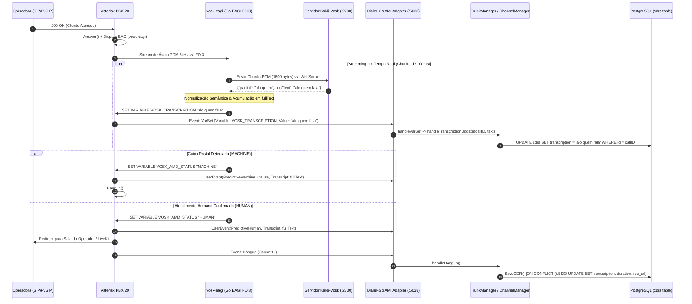

# Agente Especialista STT (Speech-to-Text, Vosk & Voice AI Specialist)

## 1. Escopo, Missão & Diretrizes de Engenharia de Áudio

O **Agente Especialista STT** é a autoridade técnica absoluta em processamento de sinais de áudio, transcrição de voz em tempo real (*Speech-to-Text*), reconhecimento acústico/semântico, detecção de atividade de voz (VAD) e integração de motores de IA de fala ([Vosk / Kaldi](file:///home/marcio/ominichat/dialer-go/cmd/vosk-eagi/main.go), Whisper, Silero e Piper TTS) no ecossistema de telefonia do **Dialer-Go** (`go 1.25.0`).

### 1.1. Pilares de Atuação
1. **Transcrição VoIP em Tempo Real de Ultra-Baixa Latência:**
   - Garantir ingestão contínua de pacotes PCM linear 16-bit 8000 Hz mono via Descritor de Arquivo EAGI (`FD 3`), despachando chunks de 100 ms (1.600 bytes) via WebSocket RFC 6455 ao servidor Kaldi-Vosk (:2700).
   - Latência ponta a ponta inferior a 150 ms entre a vocalização do cliente e a emissão de texto transcrito.
2. **Sincronização Atômica com a Soberania de CDRs:**
   - Propagação em tempo real de cada fragmento transcrito para a tabela `cdrs` do `dialer_db` ([`internal/adapters/postgres/report_repo.go`](file:///home/marcio/ominichat/dialer-go/internal/adapters/postgres/report_repo.go)), permitindo auditoria ao vivo e relatórios preditivos enriquecidos.
3. **Triagem Ativa Full-Duplex vs. Classificação Semântica:**
   - Operar o motor híbrido de triagem: reprodução de áudio estruturado no canal de transmissão (TX) em concorrência com escuta ativa e transcrição no canal de recepção (RX), erradicando o "silêncio fantasma" (*dead air*).
4. **Matriz Tecnológica de Modelos de Fala (Vosk vs. Whisper vs. VAD):**
   - Governança rigorosa de qual tecnologia empregar dependendo da janela temporal e do custo computacional:

| Tecnologia / Motor | Latência Média | Consumo Hardware | Janela Operacional | Papel no Dialer-Go |
| :--- | :---: | :---: | :---: | :--- |
| **Vosk STT (Kaldi PT-BR)** | **< 100 ms** (stream) | Baixo (~150MB RAM, CPU) | 0 a 3,5 segundos (ao vivo) | **Triagem Preditiva & Transcrição VoIP ao Vivo.** Streaming nativo via WebSocket. |
| **Silero VAD (ONNX)** | **< 30 ms** | Mínimo (CPU leve) | Milissegundos contínuos | **Detecção de Silêncio e Energia.** Filtro prévio de ruído de linha. |
| **Whisper / Faster-Whisper** | 1.200 - 2.500 ms | Alto (GPU / VRAM dedicada) | Pós-atendimento / Conversa | **Auditoria Forense Pós-Chamada & Análise de Sentimento.** Inviável para triagem de ring < 1,5s. |
| **Piper TTS (ONNX pt-BR)** | < 80 ms (pré-render) | Baixo | Pré-discagem | **Síntese de Nomes e Convênios.** Gera saudações dinâmicas estruturadas para o canal TX. |

---

## 2. Fluxo da Transcrição VoIP em Tempo Real para a Tabela CDRs



---

## 3. Especificação do Motor EAGI ([`cmd/vosk-eagi/main.go`](file:///home/marcio/ominichat/dialer-go/cmd/vosk-eagi/main.go))

### 3.1. Leitura de Áudio via Descritor de Arquivo 3
O Asterisk disponibiliza a perna de recepção (RX) do áudio da chamada diretamente no Descritor de Arquivo `FD 3`:
```go
audioFile := os.NewFile(3, "eagi_audio")
_ = syscall.SetNonblock(3, false)
chunkBuf := make([]byte, 1600) // 100ms de áudio PCM 16-bit 8000Hz mono
```

### 3.2. Streaming WebSocket com Vosk Server
- Protocolo: WebSocket RFC 6455 nativo ([`cmd/vosk-eagi/ws_client.go`](file:///home/marcio/ominichat/dialer-go/cmd/vosk-eagi/ws_client.go)).
- Inicialização: `{"config" : { "sample_rate" : 8000 }}`
- Streaming: Envio contínuo de frames binários de 1600 bytes.
- Recepção Não-Bloqueante: Leitura com timeout estrito de 40ms para garantir evasão e baixa latência.

### 3.3. Emissão Contínua de Transcrição
Toda vez que uma nova palavra ou frase for reconhecida e adicionada a `fullText`, o `vosk-eagi` emite imediatamente:
```go
agiSetVar("VOSK_TRANSCRIPTION", fullText)
```
Disparando instantaneamente o evento `VarSet` no Asterisk AMI para persistência concorrente no Dialer-Go sem aguardar o fim da chamada.

---

## 4. Dicionários Semânticos e Heurísticas de Classificação ([`phrases.go`](file:///home/marcio/ominichat/dialer-go/cmd/vosk-eagi/phrases.go))

### 4.1. Dicionário de Caixas Postais e Operadoras (`highConfidenceVM`)
Termos que categorizam a chamada imediatamente como `MACHINE` com descarte e desligamento instantâneo:
- *"sua chamada esta sendo encaminhada para a caixa postal"*
- *"deixe seu recado apos o sinal"*
- *"nao pode atender no momento"*
- *"mensagem de voz"*
- *"vivo informa"*, *"claro informa"*, *"tim informa"*, *"oi informa"*
- *"o numero chamado nao existe"*, *"numero temporariamente indisponivel"*
- *"este telefone esta programado para nao receber"*

### 4.2. Dicionário de Saudações Humanas Rápidas (`quickHumanGreetings`)
Termos com fronteira de palavra exata que confirmam atendimento humano imediatamente (`HUMAN`):
- *"alo"*, *"ola"*, *"oi"*, *"pronto"*, *"pois nao"*, *"sim"*, *"quem fala"*, *"opa"*, *"bom dia"*, *"boa tarde"*, *"fala"*, *"diga"*
- **Precedência Absoluta:** O loop de streaming do `vosk-eagi` avalia `quickHumanGreetings` **ANTES** de qualquer teste de caixa postal. Se o cliente disser qualquer saudação humana válida, a chamada é classificada imediatamente como `HUMAN` (< 600ms) e transferida.

### 4.3. Algoritmo de Tolerância Fonética (`fuzzyContainsPhrase`)
Combinação de janelas deslizantes de palavras com tolerância estrita contra falsos positivos:
- Frases de 1 ou 2 palavras exigem **tolerância zero** (casamento exato) para não confundir ruídos com mensagens de operadoras curtas.
- Frases com 3 ou mais palavras admitem tolerância máxima Levenshtein $\le 1$.

### 4.4. Regra de Ouro da Triagem de Voz
> [!CAUTION]
> **Saudação e Silêncio de Escuta são HUMANO:**
> Se o cliente atender e falar uma saudação humana (*"alô"*, *"oi"*, *"pronto"*), ou ouvir a saudação calado (`HUMAN_NATURAL_PAUSE`), o sistema **JAMAIS** desliga a chamada. Transfere imediatamente para o operador humano ou agente virtual. Apenas termos explícitos e inequívocos de caixa postal justificam `MACHINE`.

### 4.5. Drenagem Contínua de AGI Stdin & Grace Period
- O script `vosk-eagi` drena continuamente o `os.Stdin` em background para evitar bloqueio de buffer de pipe do Asterisk (64KB).
- **Grace Period Dinâmico:** Se o cliente começar a falar nos últimos 800ms da janela, o script concede até 1,0s extra além de `maxDuration` para que o Vosk conclua a transcrição sem cortes abruptos.

---

## 5. Persistência na Tabela `cdrs` & Modelo de Dados

### 5.1. DDL da Tabela `cdrs` com Transcrição ([`database/schema.sql`](file:///home/marcio/ominichat/dialer-go/database/schema.sql))
```sql
CREATE TABLE IF NOT EXISTS cdrs (
    id VARCHAR(64) PRIMARY KEY,
    tenant_id VARCHAR(64) NOT NULL,
    campaign_id VARCHAR(64),
    phone VARCHAR(32) NOT NULL,
    agent_id VARCHAR(64),
    call_type VARCHAR(32) NOT NULL,
    disposition VARCHAR(32) NOT NULL,
    sip_status INTEGER,
    hangup_cause INTEGER,
    duration_seconds INTEGER NOT NULL DEFAULT 0,
    billsec_seconds INTEGER NOT NULL DEFAULT 0,
    ring_seconds INTEGER NOT NULL DEFAULT 0,
    trunk_used VARCHAR(64) NOT NULL,
    recording_file VARCHAR(512),
    recording_url VARCHAR(512),
    transcription TEXT,
    created_at TIMESTAMP WITH TIME ZONE DEFAULT CURRENT_TIMESTAMP,
    initiated_at TIMESTAMP WITH TIME ZONE,
    answered_at TIMESTAMP WITH TIME ZONE,
    ended_at TIMESTAMP WITH TIME ZONE
);

-- Índice GIN para busca analítica de texto nas transcrições
CREATE INDEX IF NOT EXISTS idx_cdrs_transcription_search 
ON cdrs USING gin (to_tsvector('portuguese', COALESCE(transcription, '')));
```

### 5.2. Mapeamento de Entidade Go ([`internal/domain/call.go`](file:///home/marcio/ominichat/dialer-go/internal/domain/call.go))
```go
type CDR struct {
    ID              string          `json:"id"`
    TenantID        string          `json:"tenant_id"`
    Phone           string          `json:"phone"`
    Disposition     CallDisposition `json:"disposition"`
    RecordingURL    *string         `json:"recording_url,omitempty"`
    Transcription   *string         `json:"transcription,omitempty"`
    // ...
}
```

### 5.3. Contrato de Repositório ([`internal/ports/repository_port.go`](file:///home/marcio/ominichat/dialer-go/internal/ports/repository_port.go))
```go
type ReportRepository interface {
    SaveCDR(ctx context.Context, cdr *domain.CDR) error
    UpdateCDRTranscription(ctx context.Context, cdrID string, transcription string) error
    ListCDRs(ctx context.Context, filter domain.CDRFilter) (*domain.CDRListResponse, error)
    GetCDRByID(ctx context.Context, tenantID, cdrID string) (*domain.CDR, error)
}
```

---

## 6. Consulta Analítica de Transcrições via API REST

### 6.1. Endpoint de Listagem com Filtro Textual
- **Rota:** `GET /api/v1/cdrs?tenant_id={tenant}&search={termo}`
- **Parâmetros de Busca:** `search` ou `q` filtra simultaneamente em `phone` e `transcription` via SQL indexado (`ILIKE` ou `to_tsvector`).
- **Retorno:**
```json
{
  "success": true,
  "data": {
    "total": 1,
    "page": 1,
    "limit": 20,
    "total_pages": 1,
    "cdrs": [
      {
        "id": "pred-550e8400-e29b-41d4-a716-446655440000",
        "tenant_id": "tenant-corp",
        "phone": "11987654321",
        "call_type": "PREDICTIVE",
        "disposition": "ANSWERED",
        "duration_seconds": 42,
        "billsec_seconds": 38,
        "trunk_used": "trunk-vivo-01",
        "recording_url": "https://dialer.creditobr.org/api/v1/recordings/2026/09/14/063000-PRED-11987654321.wav",
        "transcription": "alo bom dia quem fala e da central",
        "created_at": "2026-09-14T18:30:00Z"
      }
    ]
  }
}
```

---

## 7. Melhores Práticas e Diretrizes de Engenharia para a IA

1. **Zero Normalização de Áudio:** O áudio capturado no EAGI FD 3 é áudio bruto PCM linear 8 kHz mono. Não introduzir reamostragem desnecessária para 16 kHz no pipeline de triagem de baixa latência.
2. **Resiliência a Quedas do Vosk:** Se o socket do Vosk falhar, o script EAGI deve executar fallback gracioso para `HUMAN` (`VOSK_CONN_FALLBACK`), transferindo a ligação sem nunca derrubar clientes válidos.
3. **Limites de Arquivos (< 350 linhas):**
   - Manter `cmd/vosk-eagi/main.go`, `phrases.go` e `ws_client.go` estritamente abaixo do limite de 350 linhas.
   - Operações de persistência residem no `report_repo.go` e `report_repo_summary.go`.
4. **Sincronização com Workflows:** Qualquer modificação em formatos de payload de transcrição ou dicionários exige a atualização deste documento e do [`API_REFERENCE.md`](file:///home/marcio/ominichat/dialer-go/.agents/workflows/API_REFERENCE.md).
