# Agente Especialista Go (Go 1.25.0 Architecture & Language Specialist)

## 1. Escopo, Missão & Interação com o Agente Auditor

O **Agente Especialista Go** é a autoridade técnica em padrões de código, concorrência, estruturas de dados, tipagem estrita e arquitetura hexagonal do **Dialer-Go** (`go 1.25.0`).

### 1.1. Missão Central
1. **Governança de Tipos e Idioms:** Assegurar código Go idiomático, thread-safe, com alocação otimizada e zero-allocations em loops críticos de telefonia.
2. **Defesa dos Contratos Canônicos (`ports`):** Garantir que interfaces desacoplem integralmente a regra de negócio (`internal/core/`) de drivers externos (`internal/adapters/`).
3. **Provimento de Especificações para o Agente Auditor:** Fornecer as assinaturas exatas, contratos de entrada/saída e validações para que o [Agente Auditor de Processo](file:///home/marcio/ominichat/dialer-go/.agents/workflows/agente-audit-processo.md) execute a conciliação transacional e a prevenção de quebras de fluxo.

---

## 2. Padrões Idiomáticos do Go 1.25 no Dialer-Go

```mermaid
graph TD
    subgraph Dominio["1. Domain Layer (Sem Dependências)"]
        Entidades["Entidades: CDR, ActiveChannel, Trunk, Campaign, Lead"]
        DTOs["DTOs de I/O & RFC 7807 (ProblemDetails)"]
        Enums["Enums Fortemente Tipados (CallType, Disposition, etc.)"]
    end

    subgraph Portas["2. Ports Layer (Interfaces Puras)"]
        AMIPort["ports.AMIPort"]
        CachePort["ports.CachePort"]
        RepoPort["ports.Trunk/Lead/Campaign/Report/RoutingRepository"]
        StoragePort["ports.StoragePort"]
    end

    subgraph Core["3. Core Domain Layer (Regras de Negócio)"]
        ChannelMgr["core.ChannelManager (sync/atomic + sync.RWMutex)"]
        PredEngine["core.PredictiveEngine"]
        ManEngine["core.ManualEngine"]
        InbEngine["core.InboundEngine"]
        TrunkMgr["core.TrunkManager"]
        MailProc["core.MailingProcessor"]
        SatServ["core.SaturationService"]
    end

    subgraph Adaptadores["4. Adapters Layer (Implementações Concretas)"]
        HTTPAdp["adapters/http (Chi v5)"]
        PostgresAdp["adapters/postgres (pgx/v5 pool)"]
        RedisAdp["adapters/redis (go-redis/v9)"]
        AMIAdp["adapters/ami (TCP Socket puro)"]
        StorageAdp["adapters/storage (MinIO S3 Client)"]
    end

    Core --> Portas
    Core --> Dominio
    Adaptadores --> Portas
    Adaptadores --> Dominio
```

### 2.1. Diretrizes Técnicas Mandatórias
1. **Concorrência Hierárquica:**
   - Contadores globais e por tronco operam exclusivamente com `sync/atomic.Int32` (`Add(1)`, `Load()`, `CompareAndSwap(old, old-1)`), garantindo lock-free counters.
   - Mapas dinâmicos de canais e troncos usam `sync.RWMutex` segregados (`trunkMu`, `chanMu`) com deferência estrita de lock.
2. **Contexto Mandatório:** Toda chamada com efeitos colaterais de I/O (banco, cache, socket ou HTTP) recebe `ctx context.Context` como 1º argumento.
3. **Tratamento de Erros via RFC 7807 / RFC 9457:** Nenhum erro genérico ou string sem contexto é exposto. Utiliza-se `*domain.ProblemDetails` com código semântico (`code`), status HTTP e `invalid_params`.
4. **Sem Tipos Primitivos Frouxos:** Status de discagem, modalidades e codecs são tipos nomeados baseados em `string` (`CallType`, `CallDisposition`, `LeadStatus`, `TrunkHealth`).

---

## 3. Catálogo de Entidades e DTOs (`internal/domain/`)

### 3.1. Chamadas e Telefonia ([`call.go`](file:///home/marcio/ominichat/dialer-go/internal/domain/call.go))
- `CDR`: Histórico de tarifação persistido em PostgreSQL.
  - Campos: `ID` (string), `TenantID` (string), `CampaignID` (*string), `Phone` (string), `AgentID` (*string), `CallType` (`CallType`), `Disposition` (`CallDisposition`), `SIPStatus` (*int), `HangupCause` (*int), `DurationSeconds` (int), `BillsecSeconds` (int), `RingSeconds` (int), `TrunkUsed` (string), `CreatedAt`, `InitiatedAt`, `AnsweredAt`, `EndedAt` (*time.Time).
- `ActiveChannel`: Estado volátil de chamada em conversação ou discagem.
  - Campos: `ChannelID`, `TrunkID`, `TenantID`, `CampaignID`, `Phone`, `CallType`, `AgentID`, `SIPRoute`, `StartedAt`, `IsAnswered`.
- `PhoneTrunkMapping`: Vínculo O(1) de último tronco/projeto para roteamento receptivo.
- `ManualCallRequest` / `ManualCallResponse`: DTOs para originação manual de chamada.
- `PredictiveDemandRequest` / `PredictiveDemandResponse`: DTOs para recebimento e despacho de rodadas preditivas.

### 3.2. Campanhas e Saturação ([`campaign.go`](file:///home/marcio/ominichat/dialer-go/internal/domain/campaign.go))
- `Campaign`: Configuração operacional da campanha (`ID`, `TenantID`, `Mode`, `Status`, `Aggressiveness`, `TrunkName`, `CycleCount`, `SaturationLevel`).
- `ToggleCampaignRequest` / `ToggleCampaignResponse`: Controle dinâmico ativa/pausa.
- `CampaignSaturationData`: Métricas de queima de mailing (`BurnRatePercentage`, `RefillUrgency`, `EstimatedExhaustionH`).

### 3.3. Leads e Refill ([`lead.go`](file:///home/marcio/ominichat/dialer-go/internal/domain/lead.go))
- `Lead`: Registro telefônico individual (`ID`, `CampaignID`, `TenantID`, `CPF`, `Phone`, `Status`, `AttemptsCount`, `LastDialedAt`).
- `RefillRequest` / `RefillResponse`: Ingestão atômica de arquivos compactados ZIP com CSV canônico.

### 3.4. Troncos SIP ([`trunk.go`](file:///home/marcio/ominichat/dialer-go/internal/domain/trunk.go))
- `Trunk`: Entidade relacional de rota SIP (`ID`, `TenantID`, `Direction`, `RegistrationMode`, `Host`, `Port`, `MaxChannels`, etc.).
  - Método: `DialString(destinationPhone string) string` -> compõe formato PJSIP com ou sem `TechPrefix`.
- `TrunkHealth`: Telemetria em tempo real (`Status`, `LatencyMS`, `ActiveChannels`, `UtilizationPercentage`, `IsSaturated`).

### 3.5. Erros Padronizados ([`errors.go`](file:///home/marcio/ominichat/dialer-go/internal/domain/errors.go))
- `ProblemDetails`: Estrutura com `Type`, `Title`, `Status`, `Detail`, `Code`, `InvalidParams`, `Metadata`.
- Construtores: `NewErrBadRequest`, `NewErrNotFound`, `NewErrConflict`, `NewErrTooManyRequests`, `NewErrInternal`, `NewErrForbidden`.

---

## 4. Matriz Completa de Contratos (`internal/ports/`)

### 4.1. `ports.AMIPort` ([`ami_port.go`](file:///home/marcio/ominichat/dialer-go/internal/ports/ami_port.go))
| Método | Assinatura Exata | Finalidade |
| :--- | :--- | :--- |
| `Connect` | `Connect(ctx context.Context) error` | Estabelece socket TCP e autentica na porta 5038 do Asterisk. |
| `Close` | `Close() error` | Encerra a conexão com o socket AMI de forma limpa. |
| `IsConnected` | `IsConnected() bool` | Valida thread-safe se a conexão está estabelecida e logada. |
| `Originate` | `Originate(ctx context.Context, actionID, channel, context, exten string, priority int, timeout int, callerID, account string, variables map[string]string) error` | Dispara chamada de saída via Asterisk AMI. |
| `Redirect` | `Redirect(ctx context.Context, actionID, channel, extraChannel, context, exten string, priority int) error` | Transfere perna telefônica para sala de conferência ou ramal. |
| `Hangup` | `Hangup(ctx context.Context, actionID, channel string, cause int) error` | Derruba canal telefônico especificando a causa Q.850. |
| `Command` | `Command(ctx context.Context, actionID, command string) (string, error)` | Executa comando CLI no Asterisk (`pjsip reload`, `dialplan reload`). |
| `SubscribeEvents` | `SubscribeEvents() <-chan AMIEvent` | Retorna canal unidirecional com stream assíncrono de eventos AMI. |

### 4.2. `ports.CachePort` ([`cache_port.go`](file:///home/marcio/ominichat/dialer-go/internal/ports/cache_port.go))
| Método | Assinatura Exata | Finalidade |
| :--- | :--- | :--- |
| `PushLeads` | `PushLeads(ctx context.Context, campaignID string, phoneList []string) error` | Enfileira lote de números na fila Redis `dialer:lead_queue:<id>`. |
| `PopLead` | `PopLead(ctx context.Context, campaignID string) (string, error)` | Operação atômica `LPOP` para consumo imediato pelo discador. |
| `GetQueueLength` | `GetQueueLength(ctx context.Context, campaignID string) (int64, error)` | Retorna quantidade de leads pendentes na fila volátil. |
| `SetCampaignPaused` | `SetCampaignPaused(ctx context.Context, campaignID string, paused bool) error` | Define flag rápida de pausa da campanha no Redis. |
| `IsCampaignPaused` | `IsCampaignPaused(ctx context.Context, campaignID string) (bool, error)` | Avalia se a campanha está bloqueada para discagens. |
| `SetTrunkHealth` | `SetTrunkHealth(ctx context.Context, trunkID string, health domain.TrunkHealth, ttl time.Duration) error` | Atualiza telemetria de latência e status do tronco. |
| `GetTrunkHealth` | `GetTrunkHealth(ctx context.Context, trunkID string) (*domain.TrunkHealth, error)` | Consulta telemetria volátil do tronco. |
| `SetInflatedSuccessRate` | `SetInflatedSuccessRate(ctx context.Context, ttl time.Duration) error` | Freio pós-abandono regulatório (< 2s) por 30 segundos. |
| `HasInflatedSuccessRate` | `HasInflatedSuccessRate(ctx context.Context) (bool, error)` | Verifica se a penalidade de pacing pós-abandono está ativa. |
| `StoreAvailableAgents` | `StoreAvailableAgents(ctx context.Context, campaignID string, agents []domain.AgentDemandDTO, ttl time.Duration) error` | Grava operadores aptos com ordem de prioridade para entrega. |
| `GetNextAvailableAgent` | `GetNextAvailableAgent(ctx context.Context, campaignID string) (*domain.AgentDemandDTO, error)` | Extrai o operador livre prioritário para transferência. |
| `GetCallsSummaryBuffer` | `GetCallsSummaryBuffer(ctx context.Context, tenantID, hashKey string) (*domain.CallsSummaryResponse, time.Duration, error)` | Lê buffer determinístico de relatório de 15 minutos (900s). |
| `SetCallsSummaryBuffer` | `SetCallsSummaryBuffer(ctx context.Context, tenantID, hashKey string, data *domain.CallsSummaryResponse, ttl time.Duration) error` | Grava buffer de relatório no Redis. |

### 4.3. `ports.LeadRepository` & `ports.CampaignRepository` ([`repository_port.go`](file:///home/marcio/ominichat/dialer-go/internal/ports/repository_port.go))
| Interface | Método | Assinatura |
| :--- | :--- | :--- |
| `LeadRepository` | `BatchInsert` | `BatchInsert(ctx context.Context, leads []*domain.Lead) (int64, error)` |
| `LeadRepository` | `FetchNextFILOBatch` | `FetchNextFILOBatch(ctx context.Context, campaignID string, limit int, cooldownHours int) ([]*domain.Lead, error)` |
| `LeadRepository` | `MarkDialing` | `MarkDialing(ctx context.Context, leadID int64) error` |
| `LeadRepository` | `MarkCompleted` | `MarkCompleted(ctx context.Context, leadID int64, status domain.LeadStatus) error` |
| `LeadRepository` | `CountCampaignLeads` | `CountCampaignLeads(ctx context.Context, campaignID string) (total, available, dialed int64, err error)` |
| `CampaignRepository` | `GetByID` | `GetByID(ctx context.Context, tenantID, campaignID string) (*domain.Campaign, error)` |
| `CampaignRepository` | `ListActive` | `ListActive(ctx context.Context, tenantID string) ([]*domain.Campaign, error)` |
| `CampaignRepository` | `SetStatus` | `SetStatus(ctx context.Context, tenantID, campaignID string, status domain.CampaignStatus) (*domain.Campaign, error)` |

---

## 5. Engenharia dos Motores Centrais (`internal/core/`)

### 5.1. `core.ChannelManager` ([`channel_manager.go`](file:///home/marcio/ominichat/dialer-go/internal/core/channel_manager.go))
- **Campos de Controle:**
  - `activeGlobalCalls atomic.Int32`: Contador atômico global.
  - `activeHumanCalls atomic.Int32`: Contador exclusivo de pernas humanas.
  - `trunkLimits map[string]int` protegido por `trunkMu sync.RWMutex`.
  - `activeChannels map[string]*domain.ActiveChannel` protegido por `chanMu sync.RWMutex`.
- **Métodos Críticos:**
  - `CanAcquireSlot(trunkID string, isHuman bool) (bool, string)`: Validação em dois níveis (Teto Global do PBX e Teto Granular do Tronco com reserva para humanos).
  - `AcquireSlot(ctx context.Context, channel *domain.ActiveChannel, isHuman bool) error`: Incrementa contadores atômicos e indexa canal.
  - `ReleaseSlot(ctx context.Context, channelID string) *domain.ActiveChannel`: Desaloca canal com proteção atômica e retorna o canal encerrado.
  - `ReleaseByAsterisk(ctx context.Context, astChannel, uniqueID string) *domain.ActiveChannel`: Desaloca canal associado a Asterisk e retorna o canal.
  - `AssignAgent(callID, agentID string)`: Vincula operador humano à chamada e aloca cota humana.
  - `SetCallDisposition(callID string, disp domain.CallDisposition)`: Define disposição explícita da chamada (AMD, Abandono, etc.).
  - `LinkAsteriskChannel(callID, astChannel, uniqueID string)`: Vincula canais Asterisk à chamada.
  - `ReconcileCounters(ctx context.Context)`: Reconciliação em lote dos contadores contra o mapa real.

### 5.2. `core.PredictiveEngine` ([`predictive_engine.go`](file:///home/marcio/ominichat/dialer-go/internal/core/predictive_engine.go))
- `ProcessDemand(ctx context.Context, req *domain.PredictiveDemandRequest) (*domain.PredictiveDemandResponse, error)`:
  1. Verifica flag de pausa rápida em cache.
  2. Valida se existem operadores ociosos (`len(req.AvailableAgents) > 0`).
  3. Filtra pool de troncos habilitados de saída (ignora `direction = INBOUND` e troncos internos `livekit`).
  4. Calcula overdialing:
     $$	ext{Demand} = \left\lceil rac{	ext{numAgents}}{	ext{contactProb}} 	imes \left( 1 + rac{	ext{TMR}}{	ext{TMA}} 
ight) 	imes 	ext{Agressividade} 
ight
ceil$$
  5. Consome leads com `cache.PopLead`, aloca slot no tronco e dispara `Originate` via AMI.
- `HandlePredictiveHuman(ctx context.Context, channel, uniqueID, phone, campaignID, leadID string) error`:
  - Extrai o próximo operador livre (`GetNextAvailableAgent`).
  - Havendo operador: comanda `Redirect` para extensão `9999` com `AGENT_ROOM`.
  - Sem operador (abandono < 2s): aplica penalidade `SetInflatedSuccessRate(30s)` e desliga (`Hangup Cause 16`).

### 5.3. `core.ManualEngine` ([`manual_engine.go`](file:///home/marcio/ominichat/dialer-go/internal/core/manual_engine.go))
- `DialManual(ctx context.Context, req *domain.ManualCallRequest) (*domain.ManualCallResponse, error)`:
  - Aloca canal com preempção absoluta (`isHuman = true`).
  - Resolve rota SIP do operador via tronco `livekit-sip`.
  - Dispara `Originate` para contexto `from-dialer-manual`.

### 5.4. `core.MailingProcessor` ([`mailing_processor.go`](file:///home/marcio/ominichat/dialer-go/internal/core/mailing_processor.go))
- `ProcessZipRefill(ctx context.Context, tenantID, campaignID, fileURI string) (*domain.RefillResponse, error)`:
  - Faz stream do arquivo ZIP do MinIO e extrai o CSV.
  - **Regra de Corrupção Total:** Se as primeiras 30 linhas forem inválidas, aborta imediatamente (`CORRUPTED_FILE`).
  - Grava leads válidos no Postgres em lote e abastece fila Redis (`PushLeads`).

### 5.5. `core.TrunkManager` ([`trunk_manager.go`](file:///home/marcio/ominichat/dialer-go/internal/core/trunk_manager.go))
- `StartDaemon(ctx context.Context)`: Inicia goroutines paralelas para escuta de eventos AMI e qualify loop (ticker de 30s).
- `handleContactStatus`: Rastreia RTT e disponibilidade de endpoints PJSIP.
- `handleRegistry`: Rastreia status de registros de troncos com autenticação.
- `ReloadPBXTrunks(ctx context.Context) error`: Reconcilia contadores e dispara `pjsip reload` e `dialplan reload`.

---

## 6. Diretrizes de Consumo pelo Agente Auditor de Processo

Ao inspecionar, auditar ou validar o código Go do projeto:
1. **Verificação de Contratos:** Consultar a Seção 4 para validar se novas rotinas respeitam as interfaces canônicas declaradas em `internal/ports/`.
2. **Concorrência e Locks:** Verificar se qualquer manipulação de contadores utiliza `atomic.Int32` e se mapas compartilhados contam com `RLock`/`RUnlock` em leitura e `Lock`/`Unlock` em escrita.
3. **Erros RFC 7807:** Exigir que controladores HTTP retornem exclusivamente `*domain.ProblemDetails` criados pelos construtores padronizados.
4. **Alocação de Troncos:** Assegurar que nenhuma chamada use troncos `direction = INBOUND` ou troncos com status diferente de `ONLINE`/`REGISTERED`.
5. **Regra de Arquivos de 500 Linhas:** Ao criar novos módulos em Go, modularizar automaticamente structs auxiliares em arquivos separados antes de ultrapassar o limite.
