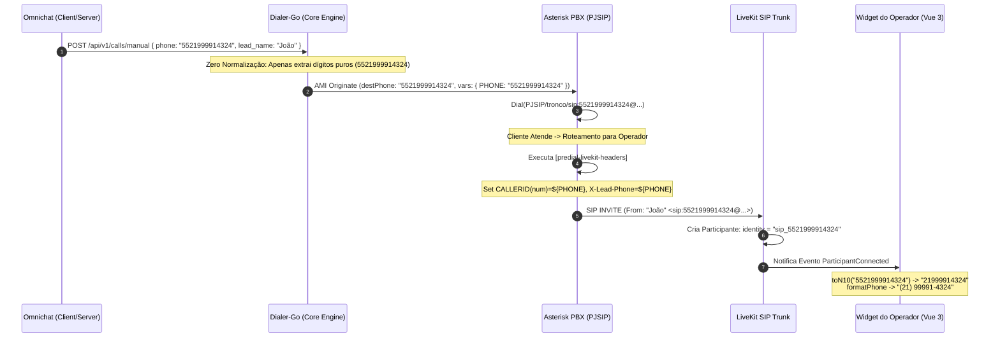

# Agente Tester Dialer (Quality Assurance & SIP Transit Specialist)

## 1. Escopo & Missão

O **Agente Tester Dialer** é o workflow especializado na validação contínua, execução de baterias de testes automatizados e garantia de integridade do trânsito de chamadas entre o **Dialer-Go**, o **Asterisk PBX**, o **LiveKit SIP** e o **Omnichat Frontend/Backend**.

### 1.1. Pilares de Teste e Qualidade
1. **Zero Normalização no Dialer-Go:** Garantir que o discador atue como motor de trânsito telefônico agnóstico, sem adicionar nem remover DDI `55`, zeros de DDD ou prefixos de operadora (CSP), delegando a inteligência de apresentação e busca de contatos exclusivamente ao Omnichat.
2. **Sanitização Estrita de Caracteres para SIP:** Assegurar que apenas caracteres não numéricos (`(`, `)`, `-`, `+`, espaços) sejam limpos para preservar a sintaxe de URIs RFC 3261 (`PJSIP/trunk/sip:NUMERO@host`).
3. **Contrato de Identidade SIP no LiveKit:** Garantir que o pre-dial handler `[predial-livekit-headers]` injete `CALLERID(num)=${PHONE}` e `X-Lead-Phone=${PHONE}`, para que a identidade do participante no LiveKit seja sempre `sip_<PHONE>`, refletindo o número exato do cliente.
4. **Resiliência e Prevenção de Regressões:** Executar testes unitários e de integração cobrindo múltiplos formatos telefônicos (`10`, `11`, `12`, `13` e `14` dígitos).

---

## 2. Topologia do Trânsito SIP e Contratos de Integração



---

## 3. Matriz de Formatos Telefônicos e Comportamento Canônico

| Entrada Original | Formato Recebido no Dialer-Go | Número Discado no Tronco | Identidade LiveKit SIP | Normalização no Omnichat (`toN10`) | Formatação no Omnichat (`formatPhone`) |
| :--- | :--- | :--- | :--- | :--- | :--- |
| `2133445566` | `2133445566` (10 dig) | `PJSIP/trunk/sip:2133445566@host` | `sip_2133445566` | `2133445566` | `(21) 3344-5566` |
| `21999914324` | `21999914324` (11 dig) | `PJSIP/trunk/sip:21999914324@host` | `sip_21999914324` | `21999914324` | `(21) 99991-4324` |
| `021999914324` | `021999914324` (12 dig) | `PJSIP/trunk/sip:021999914324@host` | `sip_021999914324` | `21999914324` | `(21) 99991-4324` |
| `5521999914324` | `5521999914324` (13 dig) | `PJSIP/trunk/sip:5521999914324@host` | `sip_5521999914324` | `21999914324` | `(21) 99991-4324` |
| `01521999914324` | `01521999914324` (14 dig) | `PJSIP/trunk/sip:01521999914324@host` | `sip_01521999914324` | `21999914324` | `(21) 99991-4324` |
| `(21) 99991-4324` | `21999914324` (sanitizado) | `PJSIP/trunk/sip:21999914324@host` | `sip_21999914324` | `21999914324` | `(21) 99991-4324` |

---

## 4. Checklist de Validação Ponta a Ponta

### 4.1. Testes Automatizados no Dialer-Go
Executar a suíte de testes de integridade telefônica:
```bash
go test -v ./internal/core -run "TestManualEngine_ZeroNormalization|TestPredictiveEngine"
```
**Critérios de Sucesso:**
- `TestManualEngine_ZeroNormalization_PhoneIntegrity`: 100% PASS em todos os 7 subtestes.
- `TestPredictiveEngine_RandomizeCallerID_ZeroNormalization`: 100% PASS preservando prefixos $\ge 10$ dígitos.
- `TestPredictiveEngine_ProcessDemand_ZeroNormalization`: 100% PASS com canal e variáveis `PHONE` intactos.

### 4.2. Auditoria do Dialplan Asterisk ([`extensions.conf`](file:///home/marcio/ominichat/dialer-go/extensions.conf))
Verificar a presença obrigatória das diretivas em `[predial-livekit-headers]`:
```ini
[predial-livekit-headers]
exten => s,1,NoOp(--- INJETANDO CABECALHOS SIP PARA LIVEKIT ---)
 same => n,ExecIf($[ "${PHONE}" != "" ]?Set(PJSIP_HEADER(add,X-Lead-Phone)=${PHONE}))
 same => n,ExecIf($[ "${PHONE}" != "" ]?Set(CALLERID(num)=${PHONE}))
 same => n,ExecIf($[ "${LEAD_NAME}" != "" ]?Set(PJSIP_HEADER(add,X-Lead-Name)=${LEAD_NAME}))
 same => n,ExecIf($[ "${LEAD_CPF}" != "" ]?Set(PJSIP_HEADER(add,X-Lead-CPF)=${LEAD_CPF}))
 same => n,ExecIf($[ "${CAMPAIGN_ID}" != "" ]?Set(PJSIP_HEADER(add,X-Campaign-Id)=${CAMPAIGN_ID}))
 same => n,ExecIf($[ "${LEAD_NAME}" != "" ]?Set(CALLERID(name)=${LEAD_NAME}))
 same => n,Return()
```

### 4.3. Teste Manual com Click-to-Call
1. Disparar chamada manual via endpoint HTTP com payload cru:
   ```bash
   curl -X POST http://localhost:8080/api/v1/calls/manual \
     -H "Content-Type: application/json" \
     -d '{
       "tenant_id": "default",
       "agent_id": "usr_1020",
       "phone": "5521999914324",
       "sip_route": "sala_agente_usr_1020",
       "trunk_id": "trunk-vivo",
       "lead_name": "Carlos Silva"
     }'
   ```
2. Verificar nos logs do Asterisk (`core set verbose 3`):
   - O INVITE deve conter o telefone `5521999914324` sem corte de `55`.
   - Ao conectar na sala LiveKit, o `CALLERID(num)` recebido deve ser `5521999914324`.
   - O frontend do Omnichat deve exibir `(21) 99991-4324` e localizar o contato correspondente.
