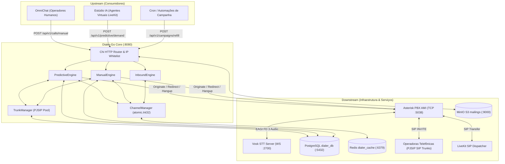

# Arquitetura Mestre do Projeto: Dialer-Go

Documento Mestre de Arquitetura, Invariantes e Grafo de Execução do subsistema **Dialer-Go**, regido pelas diretrizes canônicas de engenharia de software da plataforma.

---

## 1. Responsabilidade Unívoca

O **Dialer-Go** é o motor central de alta performance para orquestração, sinalização e comutação telefônica da plataforma OmniChat. Sua responsabilidade exclusiva compreende:
- Executar discagem telefônica automatizada multimodelo: **Preditiva** (com pacing e overdialing dinâmico), **Manual** (com prioridade preemptiva para operadores humanos) e **Receptiva** (roteamento dinâmico em sub-milissegundo para chamadas entrantes).
- Gerenciar a capacidade global e granular de canais telefônicos simultâneos por tronco SIP.
- Integrar-se diretamente à central telefônica Asterisk via **AMI TCP Socket** persistente para sinalização de canal de baixa latência e execução de dialplans em `extensions.conf`.
- Realizar triagem ultrarrápida de atendimento humano vs. máquina (AMD Híbrido com Vosk STT via EAGI) entregando áudio ao operador em menos de 1,5 segundo.
- Comutar pernas de áudio via protocolo SIP para agentes humanos (OmniChat) e salas virtuais WebRTC/SIP (LiveKit).

### O que o Dialer-Go NÃO faz:
- Não processa lógica de CRM, funis de vendas ou gestão de cadastros de clientes (responsabilidade do OmniChat).
- Não executa síntese de voz (TTS) ou raciocínio de inteligência artificial generativa de agentes (responsabilidade do Estúdio IA / LiveKit Agents).
- Não gerencia servidores WebRTC de borda de mídia (responsabilidade do LiveKit Server).
- Não transcreve conversas completas pós-atendimento (o Vosk STT via EAGI atua exclusivamente na triagem inicial de até 3 segundos para detecção de atendimento humano vs. caixa postal).

---

## 2. Invariantes Arquiteturais (Regras Inquebráveis)

1. **Linguagem Única e Binário Estático (100% Go):**
   - Nenhuma dependência de interpretadores externos (Node.js, Python, Ruby) no runtime de produção do discador. O binário Go 1.25 é compilado estaticamente com consumo mínimo de memória e CPU sob alta concorrência.
2. **Limite Rígido de 500 Linhas por Arquivo de Código-Fonte:**
   - Nenhum arquivo `.go` pode ultrapassar 500 linhas de código. Ao atingir 350 linhas, o plano de desacoplamento modular por responsabilidade (`<modulo>_<responsabilidade>.go`) deve ser ativado compulsoriamente.
3. **Tipagem Estrita e Validação de Bordas:**
   - Proibição absoluta de `interface{}` / `any` genérico. Todas as requisições HTTP e eventos AMI são desserializados em structs tipadas de domínio (`internal/domain/`). Respostas de erro seguem rigorosamente a RFC 7807 / RFC 9457 (`ProblemDetails`).
4. **Fronteira de Segurança por IP Whitelist em Memória:**
   - As requisições REST internas não realizam handshakes custosos de sessão ou JWT. A autorização é baseada estritamente em validação de IP de origem contra uma tabela de hashing em memória thread-safe (`sync.Map`), operando em tempo sub-microssegundo.
5. **Persistência Standalone Exclusiva (`dialer_db`):**
   - O banco relacional PostgreSQL do discador é estritamente isolado da base do CRM/Chat. Nenhuma query de mailing ou relatório pode degradar transações de atendimento.
6. **Lookup Receptivo O(1) em Tabela Auxiliar Indexada:**
   - Roteamento de chamadas entrantes jamais varre histórico ou CDR. A decisão de retorno consulta exclusivamente a tabela indexada B-Tree `phone_trunk_mappings`.
7. **Zero Normalização de Dígitos Telefônicos no Discador:**
   - O discador nunca altera, adiciona prefixos arbitrários ou remove dígitos de números telefônicos (`10`, `11`, `12`, `13`, `14` dígitos). O número é transmitido fielmente ao tronco operadora conforme parametrização técnica do tronco (`tech_prefix`).
8. **Quota de Reserva de Canais Humanos (10 Canais):**
   - O motor preditivo é proibido de consumir a capacidade total de canais do sistema. No mínimo 10 canais globais permanecem rigidamente reservados para chamadas manuais de operadores humanos (`HumanReserveQuota`).
9. **Abandono Regulatório Estrito (< 2 Segundos):**
   - Se uma chamada for atendida e não houver operador humano ou sala de agente disponível em até 2 segundos, a chamada deve ser desconectada com motivo regulatório (`ABANDONED`) e registrada em auditoria.
10. **Rastreabilidade Ponta a Ponta com CorrelationID:**
    - Toda jornada telefônica recebe um `correlation_id` único propagado pelas variáveis de canal do Asterisk até a tabela transacional `execution_traces`, viabilizando análise forense e detecção de quebra de processo.

---

## 3. Padrões de Design Patterns Adotados

| Subsistema / Domínio | Padrão Adotado | Justificativa Arquitetural |
| :--- | :--- | :--- |
| **Motores de Discagem** | **Strategy Pattern** | Permite alternar dinamicamente entre as estratégias de discagem (`PredictiveEngine`, `ManualEngine`, `InboundEngine`) respeitando contratos unificados de ciclo de vida e arbitragem de canais. |
| **Comunicação Telefônica (AMI)** | **Adapter Pattern** | Isola o protocolo TCP puro do Asterisk Manager Interface (`internal/adapters/ami`) atrás da interface abstrata `ports.AMIPort`, garantindo independência tecnológica. |
| **Persistência Relacional** | **Repository Pattern** | Segrega as queries SQL do PostgreSQL (`internal/adapters/postgres`) atrás de interfaces canônicas (`TrunkRepository`, `LeadRepository`, `CampaignRepository`, etc.), permitindo testes isolados com mocks. |
| **Eventos de Telefonia** | **Observer / Pub-Sub** | O leitor de socket AMI distribui eventos assíncronos (`AsyncAGI`, `UserEvent`, `Hangup`, `Newchannel`) via canais Go desacoplados para múltiplos assinantes simultâneos. |
| **Controle de Acesso HTTP** | **Middleware (Chain of Resp.)** | `IPWhitelistMiddleware` intercepta o fluxo HTTP Chi antes de qualquer processamento de rota, validando permissões de rede em sub-microssegundo. |
| **Reconexão de Socket & DB** | **Circuit Breaker / Retry Backoff** | Conexões com PostgreSQL e AMI implementam retentativas com backoff exponencial para absorver reinicializações de containers sem travar a aplicação em panics. |
| **Transações e Saturação** | **Transactional Outbox & Stored Procedures ACID** | Stored procedures PostgreSQL (`fn_audit_claim_predictive_batch`, `fn_audit_persist_predictive_result`, `fn_audit_recycle_campaign_leads`) garantem atomicidade e consistência estrita na reserva e devolução de leads em concorrência. |

---

## 4. Tech Stack e Runtimes

- **Arquitetura Base:** Arquitetura Hexagonal (Ports and Adapters) com Clean Architecture segregada em `domain`, `ports`, `core` e `adapters`.
- **Linguagem e Runtime:** Go 1.25 (`go 1.25.0 linux/amd64`).
- **Roteamento HTTP:** Chi Router v5 (`github.com/go-chi/chi/v5`).
- **Central Telefônica:** Asterisk PBX v20 LTS (AMI TCP Socket porta :5038, Dialplan `extensions.conf`, PJSIP).
- **Mecanismo de STT / AMD:** Vosk Speech-to-Text (`alphacep/kaldi-vosk-server:latest`) via WebSocket RFC 6455 em script EAGI Go (`cmd/vosk-eagi`) na porta :2700.
- **Persistência Relacional:** PostgreSQL 16 Alpine (`pgx/v5` connection pool com pooling transacional).
- **Cache Rápido e Filas:** Redis 7 Alpine (`github.com/redis/go-redis/v9`).
- **Armazenamento de Objetos (Mailings):** MinIO S3 API (`github.com/minio/minio-go/v7`).
- **Contêineres e Deploy:** Docker, Docker Compose e orquestração via Portainer com Traefik Reverse Proxy.

---

## 5. Grafo de Dependências

### Eventos Produzidos / Consumidos:
- **Consumidos do Asterisk AMI:** `AsyncAGIStart`, `AsyncAGIExec`, `UserEvent` (`PredictiveHuman`, `InboundCall`), `Hangup`, `Newchannel`, `Newstate`.
- **Disparados para o Asterisk AMI:** `Originate`, `Redirect`, `Hangup`, `PJSIPShowEndpoints`, `Command` (`pjsip reload`).
- **Notificações e Auditoria:** Registros síncronos/assíncronos em `execution_traces` e gravação de CDR em `cdrs`.

---

## 6. Master Route (Fluxos Principais de Execução)

### 6.1. Rota Preditiva (`POST /api/v1/predictive/demand`)
1. **Entrada HTTP:** `httpAdapter.PredictiveHandler.HandleDemand` interceptado por `IPWhitelistMiddleware`.
2. **Validação de Contrato:** Parsing e validação da struct `domain.PredictiveDemandRequest`.
3. **Checagem de Estado:** Verifica se campanha está pausada ou sem operadores disponíveis no Redis (`IsCampaignPaused`, `StoreAvailableAgents`).
4. **Cálculo de Pacing:** `PredictiveEngine.CalculateOverdialing` calcula número de canais a disparar baseado em operadores livres, TMR, TMA, probabilidade de contato e agressividade.
5. **Arbitragem de Slot:** `ChannelManager.CanAcquireSlot` valida capacidade global (`MaxGlobalChannels - HumanReserveQuota`) e capacidade por tronco.
6. **Reserva Atômica FILO:** `leadRepo.PopLead` invoca stored procedure ACID `fn_audit_claim_predictive_batch` para reservar leads elegíveis.
7. **Disparo Telefônico AMI:** `AMIPort.Originate` envia ação para o Asterisk no contexto de triagem AMD (`from-dialer-amd`).
8. **Triagem de Voz AMD Híbrida:** Asterisk executa `app_amd`. Se inconclusivo/fala longa, aciona `vosk-eagi` via streaming WebSocket.
9. **Entrega de Chamada:** Ao confirmar atendimento humano (`PredictiveHuman`), Asterisk AMI executa `Redirect` para a sala do operador ou sala LiveKit (`AGENT_ROOM`).
10. **Persistência Pós-Execução:** Na desconexão (`Hangup`), stored procedure `fn_audit_persist_predictive_result` persiste o CDR e atualiza o ciclo do lead.

### 6.2. Rota Manual (`POST /api/v1/calls/manual`)
1. **Entrada HTTP:** `httpAdapter.ManualHandler.HandleCall` validado por IP Whitelist.
2. **Validação de Contrato:** Validação de `domain.ManualCallRequest` (número de telefone, operador, rota SIP de destino).
3. **Prioridade Preemptiva:** `ChannelManager.AcquireSlot` consome prioritariamente a quota reservada (`HumanReserveQuota`), garantindo que operadores manuais nunca sofram bloqueio por campanhas automáticas.
4. **Disparo Telefônico:** `AMIPort.Originate` conecta diretamente o operador ao cliente via contexto `manual-outbound` com injeção de pre-dial headers.
5. **Auditoria:** Gravação de áudio com `MixMonitor` e log com `correlation_id` em `execution_traces`.

### 6.3. Rota Receptiva (Inbound Telephony)
1. **Entrada Telefônica:** Chamada externa atinge o Asterisk no contexto `[receptivo]`.
2. **Gatilho de Evento AMI:** Dialplan dispara `UserEvent(InboundCall, Channel, Phone, DID, Uniqueid)`.
3. **Lookup O(1):** `InboundEngine` consulta `phone_trunk_mappings` buscando `last_trunk` e `last_project`.
4. **Decisão de Roteamento:** Se encontrado retorno, comuta para a rota SIP prévia do cliente; caso contrário, direciona para o tronco receptivo padrão.
5. **Comutação Asterisk:** AMI despacha `Redirect` para o contexto `cos-inbound` com entrega sem fila residual.
