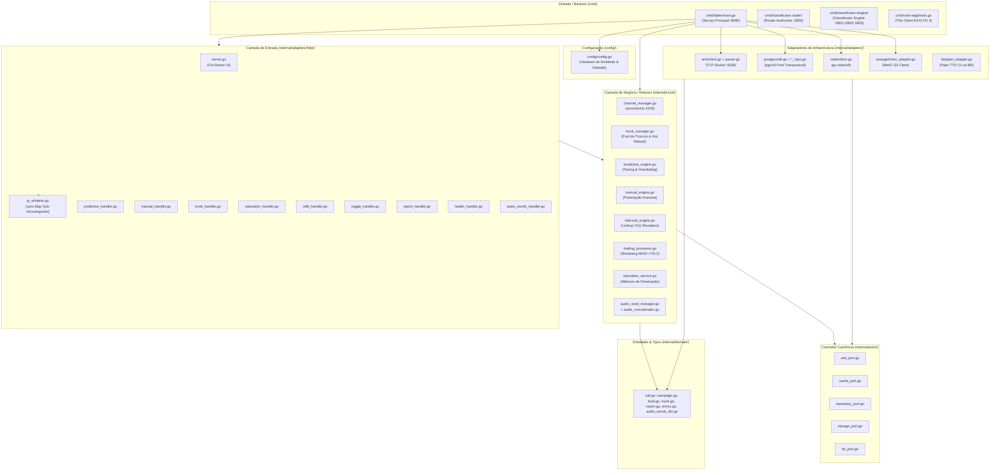

# Índice e Grafo de Arquitetura do Repositório: Dialer-Go

Este documento constitui o mapa arquitetural oficial e o índice do repositório **Dialer-Go** (`go 1.25.0`), detalhando cada diretório, arquivo-fonte, sua responsabilidade primária, métricas e conexões no grafo de execução.

---

## 1. Grafo Geral da Arquitetura Hexagonal

---

## 2. Índice Exaustivo de Componentes do Repositório

### 2.1. Raiz do Projeto
| Arquivo / Diretório | Responsabilidade | Padrões Aplicados | Governança Relacionada |
| :--- | :--- | :--- | :--- |
| [`.agents/ARCHITECT.md`](file:///home/marcio/ominichat/dialer-go/.agents/ARCHITECT.md) | Documento Mestre Canônico de Arquitetura, Invariantes, Grafo e Cláusula Pétrea de Autonomia. | Template Canônico Seção 4 | Regra 0.1 e 4 |
| [`.agents/workflows/agente-especialista-sst.md`](file:///home/marcio/ominichat/dialer-go/.agents/workflows/agente-especialista-sst.md) | Especialista em Speech-to-Text (STT), Vosk, Kaldi, Whisper, VAD, Piper TTS e Transcrição em Tempo Real. | Speech Processing / Fast AMD | Governança de Voz |
| [`ARCHITECT.md`](file:///home/marcio/ominichat/dialer-go/ARCHITECT.md) | Referência de entrada para o documento canônico em `.agents/ARCHITECT.md`. | Pointer / Bootstrap | Regra 0.1 e 4 |
| [`GEMINI.md`](file:///home/marcio/ominichat/dialer-go/GEMINI.md) | Regras Absolutas de Engenharia para IAs. | Governança Restrita | Regra 0.1 a 8 |
| [`README.md`](file:///home/marcio/ominichat/dialer-go/README.md) | Manual de Operação, Quickstart, Testes e Docker. | Guia Executivo | Geral |
| [`.env.example`](file:///home/marcio/ominichat/dialer-go/.env.example) | Contrato estrito de variáveis de ambiente. | Zero Hardcoding | Regra 5 |
| [`extensions.conf`](file:///home/marcio/ominichat/dialer-go/extensions.conf) | Dialplan Asterisk (AMD, pré-dials, contextos de entrega e descarte). | Dialplan Modular | `TELEPHONY_POLICIES.md` |
| [`amd.conf`](file:///home/marcio/ominichat/dialer-go/amd.conf) | Parametrização do módulo nativo `app_amd` do Asterisk. | Fast AMD Thresholds | `TELEPHONY_POLICIES.md` |
| [`Dockerfile`](file:///home/marcio/ominichat/dialer-go/Dockerfile) | Build multi-stage estático do binário Go 1.25. | Container Imutável | DevOps |
| [`docker-compose.yml`](file:///home/marcio/ominichat/dialer-go/docker-compose.yml) | Composição de produção (Traefik, Asterisk, Redis, Vosk). | Service Orchestration | DevOps |
| [`docker-compose.local.yml`](file:///home/marcio/ominichat/dialer-go/docker-compose.local.yml) | Ambiente de desenvolvimento local independente. | Local Stack | DevOps |

---

### 2.2. Entrada & Inicialização (`cmd/`)
| Arquivo | LOC | Responsabilidade | Padrões |
| :--- | :--- | :--- | :--- |
| [`cmd/dialer/main.go`](file:///home/marcio/ominichat/dialer-go/cmd/dialer/main.go) | 116 | Bootstrap, injeção de dependências, conexão resiliente e graceful shutdown. | Dependency Injection / Bootstrapper |
| [`cmd/classificator-router/main.go`](file:///home/marcio/ominichat/dialer-go/cmd/classificator-router/main.go) | 110 | Ponto de entrada do router WebSocket :2800 e API HTTP de status/telemetria :2809. | Bootstrapper / Service Entry |
| [`cmd/classificator-router/ring.go`](file:///home/marcio/ominichat/dialer-go/cmd/classificator-router/ring.go) | 145 | Anel circular autônomo de 3 portas com Fast-Path O(1), hunting circular sob falha e contadores atômicos. | Circuit Breaker / Autonomous Ring |
| [`cmd/classificator-router/proxy.go`](file:///home/marcio/ominichat/dialer-go/cmd/classificator-router/proxy.go) | 120 | Proxy reverso duplex WebSocket com splice de buffers e failover autônomo. | Transparent Proxy / Splice |
| [`cmd/classificator-engine/main.go`](file:///home/marcio/ominichat/dialer-go/cmd/classificator-engine/main.go) | 155 | Ponto de entrada do engine de classificação com health check /health e orquestração de chamadas. | Bootstrapper / Service Entry |
| [`cmd/classificator-engine/classifier.go`](file:///home/marcio/ominichat/dialer-go/cmd/classificator-engine/classifier.go) | 240 | Implementação de `SemanticClassifierPort` com dicionários pré-compilados, Levenshtein e regras de humanidade. | Strategy Pattern |
| [`cmd/classificator-engine/vosk_recognizer.go`](file:///home/marcio/ominichat/dialer-go/cmd/classificator-engine/vosk_recognizer.go) | 120 | Implementação de `SpeechRecognizerPort` consumindo o Vosk ASR via WebSocket streaming. | Adapter Pattern |
| [`cmd/classificator-engine/session.go`](file:///home/marcio/ominichat/dialer-go/cmd/classificator-engine/session.go) | 140 | Implementação de `ClassificationEnginePort` orquestrando chunks PCM e Fast-Exit com sink de eventos. | Facade / Pipeline |
| [`cmd/vosk-eagi/main.go`](file:///home/marcio/ominichat/dialer-go/cmd/vosk-eagi/main.go) | 165 | Script EAGI Thin Client Go desacoplado no Asterisk, comunicando com o Router (:2800) e aplicando fallback seguro. | Thin Client / Stream Forwarder |

---

### 2.3. Configuração Central (`config/`)
| Arquivo | LOC | Responsabilidade | Padrões |
| :--- | :--- | :--- | :--- |
| [`config/config.go`](file:///home/marcio/ominichat/dialer-go/config/config.go) | 81 | Leitura de variáveis de ambiente com fallback para defaults seguros de produção. | Singleton / Config Object |

---

### 2.4. Domínio & DTOs (`internal/domain/`)
| Arquivo | LOC | Responsabilidade | Contratos & RFCs |
| :--- | :--- | :--- | :--- |
| [`internal/domain/call.go`](file:///home/marcio/ominichat/dialer-go/internal/domain/call.go) | 175 | Entidades `ActiveChannel`, `CDR` (com transcrição de voz, áudio gravado e URLs), `CDRFilter` (busca textual `Search`), `CDRListResponse`, enums `CallType`, `CallDisposition`. | Domínio Puro |
| [`internal/domain/campaign.go`](file:///home/marcio/ominichat/dialer-go/internal/domain/campaign.go) | 91 | Entidade `Campaign`, `CampaignStats`, enums de saturação. | `CAMPAIGN_SATURATION.md` |
| [`internal/domain/lead.go`](file:///home/marcio/ominichat/dialer-go/internal/domain/lead.go) | 71 | Entidade Lead (Name original e FirstName normalizado), DTOs BatchLeadItem/BatchLeadRequest/Response. | Domínio Puro |
| [`internal/domain/trunk.go`](file:///home/marcio/ominichat/dialer-go/internal/domain/trunk.go) | 170 | Entidade `Trunk`, DTOs de cadastro, enums de transporte e registro. | `TRUNKS_LIFECYCLE.md` |
| [`internal/domain/report.go`](file:///home/marcio/ominichat/dialer-go/internal/domain/report.go) | 82 | DTOs de métricas operacionais consolidadas. | Problem Details |
| [`internal/domain/errors.go`](file:///home/marcio/ominichat/dialer-go/internal/domain/errors.go) | 109 | Estrutura canônica `ProblemDetails` e geradores de erro padronizados. | RFC 7807 / RFC 9457 |
| [`internal/domain/audio_words_dto.go`](file:///home/marcio/ominichat/dialer-go/internal/domain/audio_words_dto.go) | 88 | DTOs de pré-renderização de bancos de palavras e preview concatenado. | Domínio Puro |

---

### 2.5. Contratos Abstratos (`internal/ports/`)
| Arquivo | LOC | Responsabilidade | Papel Hexagonal |
| :--- | :--- | :--- | :--- |
| [`internal/ports/ami_port.go`](file:///home/marcio/ominichat/dialer-go/internal/ports/ami_port.go) | 25 | Contrato de controle de telefonia Asterisk (`Originate`, `Redirect`, `Hangup`). | Secondary Port |
| [`internal/ports/cache_port.go`](file:///home/marcio/ominichat/dialer-go/internal/ports/cache_port.go) | 43 | Contrato de controle de filas e locks rápidos em memória (Redis). | Secondary Port |
| [`internal/ports/repository_port.go`](file:///home/marcio/ominichat/dialer-go/internal/ports/repository_port.go) | 47 | Contratos de persistência relacional (`Trunk`, `Lead`, `Campaign`, `Report` com CDRs e transcrição, `Routing`). | Secondary Port |
| [`internal/ports/storage_port.go`](file:///home/marcio/ominichat/dialer-go/internal/ports/storage_port.go) | 10 | Contrato de armazenamento de objetos S3/MinIO. | Secondary Port |
| [`internal/ports/webhook_port.go`](file:///home/marcio/ominichat/dialer-go/internal/ports/webhook_port.go) | 25 | Contrato de notificação de desfecho de chamadas para upstream via Webhook. | Secondary Port |
| [`internal/ports/tts_port.go`](file:///home/marcio/ominichat/dialer-go/internal/ports/tts_port.go) | 15 | Contrato de conversão texto-para-áudio PCM WAV offline via modelo neural. | Secondary Port |

---

### 2.6. Motores de Negócio (`internal/core/`)
| Arquivo | LOC | Responsabilidade | Padrões Aplicados |
| :--- | :--- | :--- | :--- |
| [`internal/core/channel_manager.go`](file:///home/marcio/ominichat/dialer-go/internal/core/channel_manager.go) | 349 | Gestão thread-safe de concorrência com contadores atômicos, marcação determinística de atendimento e reserva de cota humana. | Mediator / Channel Arbitrator |
| [`internal/core/channel_manager_transcription.go`](file:///home/marcio/ominichat/dialer-go/internal/core/channel_manager_transcription.go) | 56 | Buffer thread-safe de transcrição contínua em tempo real e lookups especializados de canal. | Mediator Extension |
| [`internal/core/trunk_manager.go`](file:///home/marcio/ominichat/dialer-go/internal/core/trunk_manager.go) | 176 | Daemon de escuta AMI, qualificação periódica de troncos e recarga de dialplan/PJSIP. | Observer / Health Monitor |
| [`internal/core/trunk_manager_events.go`](file:///home/marcio/ominichat/dialer-go/internal/core/trunk_manager_events.go) | 279 | Handlers de eventos telefônicos (`Hangup`, `UserEvent`, `VarSet`), consolidação de tarifação e gravação determinística de CDR. | Observer / Event Processor |
| [`internal/core/trunk_manager_telemetry.go`](file:///home/marcio/ominichat/dialer-go/internal/core/trunk_manager_telemetry.go) | 95 | Monitoramento assíncrono de status de registro e latência RTT de endpoints PJSIP. | Observer / Telemetry |
| [`internal/core/trunk_manager_transcription.go`](file:///home/marcio/ominichat/dialer-go/internal/core/trunk_manager_transcription.go) | 41 | Ingestão e persistência incremental de transcrição em tempo real na tabela de CDRs. | Observer / Stream Ingestion |
| [`internal/core/call_notifier.go`](file:///home/marcio/ominichat/dialer-go/internal/core/call_notifier.go) | 179 | Despachante assíncrono de notificações de término e falhas de chamada via Webhook HTTP. | Observer / Async Notifier |
| [`internal/core/predictive_engine.go`](file:///home/marcio/ominichat/dialer-go/internal/core/predictive_engine.go) | 291 | Motor preditivo de discagem com overdialing auto-ajustável e triagem humana < 1,5s. | Strategy (Predictive) |
| [`internal/core/manual_engine.go`](file:///home/marcio/ominichat/dialer-go/internal/core/manual_engine.go) | 91 | Motor de discagem manual com preempção prioritária e bypass de fila preditiva. | Strategy (Manual) |
| [`internal/core/inbound_engine.go`](file:///home/marcio/ominichat/dialer-go/internal/core/inbound_engine.go) | 71 | Motor receptivo inteligente com lookup O(1) de retorno via `phone_trunk_mappings`. | Strategy (Inbound) |
| [`internal/core/mailing_processor.go`](file:///home/marcio/ominichat/dialer-go/internal/core/mailing_processor.go) | 173 | Orquestrador de ingestão de arquivos ZIP/CSV, processamento de streaming e pré-síntese TTS. | Pipeline / Batch Ingestion |
| [`internal/core/saturation_service.go`](file:///home/marcio/ominichat/dialer-go/internal/core/saturation_service.go) | 114 | Monitor de queima de leads, cálculo de burn rate, alertas de urgência e reciclagem automática. | Service / Saturation Engine |
| [`internal/core/audio_concatenator.go`](file:///home/marcio/ominichat/dialer-go/internal/core/audio_concatenator.go) | 129 | Concatenação e montagem determinística de cabeçalhos WAV PCM (16-bit 22050Hz Mono) em memória. | Builder / Binary Streamer |
| [`internal/core/audio_word_manager.go`](file:///home/marcio/ominichat/dialer-go/internal/core/audio_word_manager.go) | 335 | Gerenciador de cache com índice em memória O(1), síntese pontuada e processamento em lote para 200k leads. | Cache / Storage Manager |
| [`internal/core/amd_config_manager.go`](file:///home/marcio/ominichat/dialer-go/internal/core/amd_config_manager.go) | 211 | Gerenciador em memória de parâmetros AMD, silêncio máximo, frases de caixa postal e hot-reload Asterisk. | Strategy / Config Manager |

---

### 2.7. Adaptadores de Comunicação & Infraestrutura (`internal/adapters/`)
| Arquivo | LOC | Responsabilidade | Padrões |
| :--- | :--- | :--- | :--- |
| [`internal/adapters/ami/client.go`](file:///home/marcio/ominichat/dialer-go/internal/adapters/ami/client.go) | 348 | Cliente TCP nativo para Asterisk AMI com reconexão em background e pub-sub. | Adapter / Pub-Sub |
| [`internal/adapters/ami/parser.go`](file:///home/marcio/ominichat/dialer-go/internal/adapters/ami/parser.go) | 68 | Parser de mensagens textuais no formato chave-valor RFC do Asterisk AMI. | Protocol Parser |
| [`internal/adapters/postgres/db.go`](file:///home/marcio/ominichat/dialer-go/internal/adapters/postgres/db.go) | 87 | Pool transacional `pgx/v5` com retentativas de boot, verificação de saúde e auto-migração suave de colunas. | Adapter / Connection Pool |
| [`internal/adapters/postgres/trunk_repo.go`](file:///home/marcio/ominichat/dialer-go/internal/adapters/postgres/trunk_repo.go) | 219 | Repositório SQL de troncos SIP/PJSIP. | Repository |
| [`internal/adapters/postgres/routing_repo.go`](file:///home/marcio/ominichat/dialer-go/internal/adapters/postgres/routing_repo.go) | 67 | Repositório SQL da tabela rápida O(1) `phone_trunk_mappings`. | Repository |
| [`internal/adapters/postgres/lead_repo.go`](file:///home/marcio/ominichat/dialer-go/internal/adapters/postgres/lead_repo.go) | 160 | Repositório SQL de leads com inserção em chunks de 5k (200k leads) e suporte a name/first_name. | Repository |
| [`internal/adapters/postgres/campaign_repo.go`](file:///home/marcio/ominichat/dialer-go/internal/adapters/postgres/campaign_repo.go) | 139 | Repositório SQL de campanhas e atualização de ciclos de mailing. | Repository |
| [`internal/adapters/postgres/report_repo.go`](file:///home/marcio/ominichat/dialer-go/internal/adapters/postgres/report_repo.go) | 230 | Repositório SQL de CDRs com UPSERT atômico, busca textual GIN e atualização em tempo real de transcrição. | Repository |
| [`internal/adapters/postgres/report_repo_summary.go`](file:///home/marcio/ominichat/dialer-go/internal/adapters/postgres/report_repo_summary.go) | 136 | Repositório modular SQL para sumarização analítica de chamadas (`GetCallsSummary`). | Repository |
| [`internal/adapters/postgres/report_repo_test.go`](file:///home/marcio/ominichat/dialer-go/internal/adapters/postgres/report_repo_test.go) | 58 | Testes unitários do repositório de relatórios com cobertura de validações de borda. | Test Suite |
| [`internal/adapters/redis/client.go`](file:///home/marcio/ominichat/dialer-go/internal/adapters/redis/client.go) | 233 | Cliente Redis para filas, controle de agentes online, pausa e cache de relatórios. | Adapter / Cache |
| [`internal/adapters/storage/minio_adapter.go`](file:///home/marcio/ominichat/dialer-go/internal/adapters/storage/minio_adapter.go) | 72 | Cliente MinIO S3 para download em streaming de arquivos de mailing. | Adapter / S3 Client |
| [`internal/adapters/webhook/client.go`](file:///home/marcio/ominichat/dialer-go/internal/adapters/webhook/client.go) | 88 | Cliente HTTP para despacho de webhooks assíncronos de término de chamadas ao OmniChat. | Adapter / HTTP Client |
| [`internal/adapters/tts/piper_adapter.go`](file:///home/marcio/ominichat/dialer-go/internal/adapters/tts/piper_adapter.go) | 115 | Adaptador local para síntese neural pt-BR (Piper TTS / modelo ONNX Dii). | Adapter / CLI Runner |

---

### 2.8. Adaptador HTTP & Roteador Chi (`internal/adapters/http/`)
| Arquivo | LOC | Responsabilidade | Padrões |
| :--- | :--- | :--- | :--- |
| [`internal/adapters/http/server.go`](file:///home/marcio/ominichat/dialer-go/internal/adapters/http/server.go) | 132 | Montagem das rotas REST Chi v5, CDRs canônicos e injeção do middleware de segurança. | Front Controller / Router |
| [`internal/adapters/http/ip_whitelist.go`](file:///home/marcio/ominichat/dialer-go/internal/adapters/http/ip_whitelist.go) | 116 | Middleware de autorização por IP com verificação em memória `sync.Map`. | Middleware / Chain of Resp. |
| [`internal/adapters/http/predictive_handler.go`](file:///home/marcio/ominichat/dialer-go/internal/adapters/http/predictive_handler.go) | 47 | Endpoint `POST /api/v1/predictive/demand`. | HTTP Handler |
| [`internal/adapters/http/manual_handler.go`](file:///home/marcio/ominichat/dialer-go/internal/adapters/http/manual_handler.go) | 47 | Endpoint `POST /api/v1/calls/manual`. | HTTP Handler |
| [`internal/adapters/http/campaign_handler.go`](file:///home/marcio/ominichat/dialer-go/internal/adapters/http/campaign_handler.go) | 260 | Endpoints REST canônicos de CRUD de campanhas (`GET/POST /api/v1/campaigns`, `GET/PUT/DELETE /api/v1/campaigns/{id}`). | HTTP Handler / CRUD |
| [`internal/adapters/http/campaign_handler_test.go`](file:///home/marcio/ominichat/dialer-go/internal/adapters/http/campaign_handler_test.go) | 194 | Testes unitários para o CRUD de campanhas via HTTP. | Test Suite |
| [`internal/adapters/http/refill_handler.go`](file:///home/marcio/ominichat/dialer-go/internal/adapters/http/refill_handler.go) | 47 | Endpoint `POST /api/v1/campaigns/refill`. | HTTP Handler |
| [`internal/adapters/http/lead_batch_handler.go`](file:///home/marcio/ominichat/dialer-go/internal/adapters/http/lead_batch_handler.go) | 185 | Endpoint `POST /api/v1/campaigns/{id}/leads` (carga JSON em lote, normalização e pré-renderização O(1) de nomes). | HTTP Handler |
| [`internal/adapters/http/toggle_handler.go`](file:///home/marcio/ominichat/dialer-go/internal/adapters/http/toggle_handler.go) | 97 | Endpoint `POST /api/v1/campaigns/toggle`. | HTTP Handler |
| [`internal/adapters/http/saturation_handler.go`](file:///home/marcio/ominichat/dialer-go/internal/adapters/http/saturation_handler.go) | 77 | Endpoints `GET /api/v1/campaigns/{id}/saturation` e em lote. | HTTP Handler |
| [`internal/adapters/http/report_handler.go`](file:///home/marcio/ominichat/dialer-go/internal/adapters/http/report_handler.go) | 309 | Endpoints `GET /api/v1/reports/calls-summary`, `GET /api/v1/cdrs` (com busca textual `q`/`search`) e `GET /api/v1/cdrs/{id}`. | HTTP Handler |
| [`internal/adapters/http/report_handler_test.go`](file:///home/marcio/ominichat/dialer-go/internal/adapters/http/report_handler_test.go) | 263 | Testes unitários para validação de entrada, filtros, busca de transcrição e paginação de CDRs. | Test Suite |
| [`internal/adapters/http/trunk_handler.go`](file:///home/marcio/ominichat/dialer-go/internal/adapters/http/trunk_handler.go) | 388 | CRUD de troncos SIP/PJSIP (`/api/v1/trunks`). | HTTP Handler |
| [`internal/adapters/http/health_handler.go`](file:///home/marcio/ominichat/dialer-go/internal/adapters/http/health_handler.go) | 69 | Endpoint de telemetria `GET /health` e `GET /api/v1/health`. | Health Check Handler |
| [`internal/adapters/http/audio_words_handler.go`](file:///home/marcio/ominichat/dialer-go/internal/adapters/http/audio_words_handler.go) | 117 | Endpoints `POST /api/v1/audio/words` (upsert) e `GET/POST /api/v1/audio/preview` (concatenação). | HTTP Handler |
| [`internal/adapters/http/amd_handler.go`](file:///home/marcio/ominichat/dialer-go/internal/adapters/http/amd_handler.go) | 109 | Endpoints `GET/PUT /api/v1/amd/config` e `POST /api/v1/amd/reload`. | HTTP Handler |

---

### 2.9. Persistência Relacional SQL (`database/`)
| Arquivo | LOC | Responsabilidade |
| :--- | :--- | :--- |
| [`database/schema.sql`](file:///home/marcio/ominichat/dialer-go/database/schema.sql) | 363 | DDL das tabelas (`trunks`, `phone_trunk_mappings`, `campaigns`, `leads`, `cdrs` [transcription GIN index, recording_file, recording_url], `execution_traces`) e 4 stored procedures canônicas ACID. |
