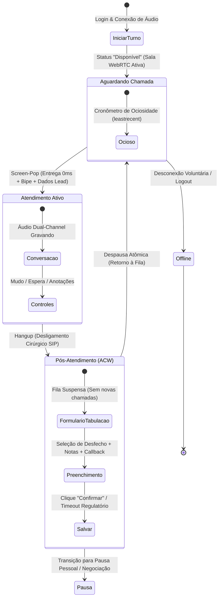

# Diretrizes Operacionais: Fluxo de Atendimento do Discador & Jornada do Atendente

Este documento especifica em detalhes a **jornada funcional completa do atendente**, as telas operacionais, o ciclo de vida da chamada entregue e as regras de pós-atendimento (tabulação / ACW) na plataforma **OmniChat**.

---

## 1. Visão Geral da Jornada do Atendente

A experiência do operador no discador preditivo divide-se em 5 macro-etapas sequenciais:

---

## 2. Etapa 1: Início de Turno & Conexão de Áudio (Setup)

### 2.1. Conexão Única por Turno (Zero Handshake Repetitivo)
1. Ao logar no OmniChat e acessar a aba de atendimento ou discador, o atendente abre o widget de voz ([`AgentVoiceWidget.vue`](file:///home/marcio/ecosystem/chat/client/src/components/workspace/AgentVoiceWidget.vue)).
2. O sistema solicita acesso ao microfone (caso não concedido) e estabelece conexão WebRTC com a sala persistente do operador:
   $$\text{Room ID: } \texttt{sala\_agente\_<user\_id>}$$
3. O operador seleciona o status **🟢 DISPONÍVEL**.
4. **Disparo de Presença:** O OmniChat notifica imediatamente o discador via Redis Pub/Sub (`dialer:agent_presence`) e REST (`POST /api/v1/queue/presence`).
5. O atendente é registrado como membro ativo na fila Asterisk com status `Not in use` e passa a compor a contagem de operadores livres no algoritmo de pacing do discador.

---

## 3. Etapa 2: Espera, Detecção & Screen-Pop (Entrega Imediata)

### 3.1. Classificação e Entrega em 0ms
1. O discador origina chamadas preditivas nos troncos SIP conforme o volume de operadores disponíveis e a probabilidade de contato.
2. O motor de triagem por inteligência de voz (Vosk STT via EAGI) reproduz a saudação inicial e escuta a resposta do destinatário:
   - Se detectar termos de operadora / caixa postal $\rightarrow$ Desliga imediatamente (`VOICEMAIL`).
   - Se detectar voz humana positiva (*"Alô"*, *"Oi"*, *"Quem fala"*) $\rightarrow$ Emite evento `PredictiveHuman`.
3. O Asterisk comuta a perna da chamada para a fila da campanha (`app_queue` com estratégia `leastrecent`).
4. A chamada é entregue ao operador que está **há mais tempo ocioso sem falar com clientes**.
5. O Asterisk disca via SIP Gateway para a sala WebRTC já conectada do operador.

### 3.2. Experiência Visual e Sonora do Operador (Screen-Pop)
* **Alerta Sonoro:** O atendente ouve um bipe sutil no headset indicando conexão da chamada.
* **Abertura Automática da Ficha:** O softphone se expande instantaneamente na tela exibindo:
  * **Nome do Lead / Cliente:** Obtido do mailing da campanha ou resolvido na base de contatos.
  * **Telefone Discado:** Formatado em padrão brasileiro com DDD e máscara (`(11) 98765-4321` ou `(11) 3456-7890`).
  * **CPF:** Formatado com máscara (`123.456.789-00`) para conferência cadastral rápida.
  * **Campanha de Origem:** Nome ou ID da operação de discagem.
  * **Histórico Prévio:** Se o contato já tiver registros anteriores, o histórico de conversas e tabulações passadas fica acessível a um clique.
* O cronômetro da chamada se inicia automaticamente (`00:01`, `00:02`...).

---

## 4. Etapa 3: Durante o Atendimento (Em Chamada)

### 4.1. Governança e Travas Operacionais
* **Status Visual:** Transiciona para **🔵 EM CHAMADA**.
* **Bloqueio de Fila:** O ramal é colocado em `In use` no Asterisk e o Redis marca o operador como ocupado. O discador não originará nenhuma chamada nova para esse operador enquanto a ligação estiver ativa.
* **Gravação Estéreo Dual-Channel:**
  * O áudio é gravado nativamente em estéreo de alta fidelidade:
    * **Canal Esquerdo (Left):** Voz do Atendente / Operador.
    * **Canal Direito (Right):** Voz do Cliente / Lead.
  * A gravação é transparente e não consome processamento do navegador.

### 4.2. Controles de Chamada Disponíveis na UI
O operador dispõe de ações rápidas no widget:
1. **Mudo (Mute / Unmute):** Desativa temporariamente o áudio do fone sem desligar o cliente.
2. **Espera (Hold):** Coloca o cliente em espera caso necessite consultar supervisão ou sistema interno.
3. **Transferência de Chamada:** Permite transferir para outro operador ou fila de especialista.
4. **Campo de Anotações:** Permite redigir notas e observações em tempo real durante a conversa.
5. **Navegação Multicanal:** O operador pode abrir o WhatsApp do cliente ou a aba de CRM sem derrubar a chamada telefônica.

---

## 5. Etapa 4: Desligamento (Hangup Cirúrgico)

A chamada é encerrada quando:
* O cliente desliga o telefone (Asterisk recebe `BYE` e remove a perna SIP).
* O atendente clica no botão vermelho **"Desligar"** na interface.

### Regra Técnica Fundamental: Desconexão Cirúrgica
* **A sala WebRTC NÃO é derrubada.**
* O sistema apenas remove o participante SIP da sala (`livekit-sip`), enviando o `SIP BYE` ao Asterisk.
* O fone de ouvido e o microfone do operador continuam ativos e conectados ao LiveKit, prontos para a próxima chamada sem renegociação de rede.

---

## 6. Etapa 5: Pós-Atendimento Obrigatório (Tabulação / ACW)

Logo após o desligamento, o atendente transiciona automaticamente para o estado **🟡 PÓS-ATENDIMENTO / TABULAÇÃO**.

### 6.1. Proteção de Fila (Fila Suspensa)
* A fila do discador fica **temporariamente suspensa para o atendente** (`paused = 1, reason = "ACW_Tabulacao"`).
* O discador **NÃO** entrega nenhuma nova chamada para o atendente enquanto ele estiver preenchendo os dados do cliente.
* O atributo `lastcall` do atendente permanece congelado no Asterisk, garantindo que o tempo gasto preenchendo a tabulação não penalize sua prioridade na fila justa (`leastrecent`).

### 6.2. Formulário de Tabulação na Interface
O widget de voz apresenta a tela de tabulação contendo:
1. **Duração da Chamada:** Tempo falado total (`billsec`).
2. **Seletor de Desfecho (Tabulação Primária):**
   * *Exemplos:* Venda Confirmada, Proposta Enviada, Retornar Mais Tarde, Sem Interesse, Caixa Postal Humana, Número Inválido, etc.
3. **Classificação de Qualidade:** Produtiva (contato com decisor) ou Improdutiva.
4. **Observações do Atendimento:** Descrição textual dos acordos firmados.
5. **Agendamento de Retorno (Callback):**
   * Se o desfecho exigir retorno, habilita seletor de Data e Horário.
   * Cria automaticamente um lembrete/tarefa no CRM para o próprio operador ou para a carteira da campanha.

### 6.3. Cronômetro de Tabulação e Automação de Timeout
* A interface exibe um cronômetro indicando o tempo de pós-atendimento.
* **Timeout de Segurança (Configurável, ex: 60 segundos):**
  * Se o operador exceder o tempo limite sem selecionar tabulação, o sistema aciona a auto-tabulação com código de contingência (código 99 - Tempo Esgotado) para evitar que o operador fique indefinidamente fora da operação ativa.

---

## 7. Etapa 6: Confirmação & Retorno Imediato à Fila

Ao clicar no botão verde **"Confirmar"**:
1. **Persistência no CRM:**
   * A rota `POST /api/calls/tabulate` é executada.
   * O registro de histórico é salvo no contato (`contacts`) e no CRM.
   * Caso configurado na campanha, o card de negócio do Lead avança de estágio no funil de vendas.
2. **Despausa Atômica no Discador:**
   * O OmniChat emite evento `ready / unpause` ao Dialer-Go e Asterisk.
   * O atendente volta a figurar como **🟢 DISPONÍVEL**.
3. **Pronto para a Próxima Chamada:**
   * Como a sala WebRTC já está aberta e o fone conectado, a próxima ligação que for atribuída a ele pelo discador preditivo tocará instantaneamente com latência zero (0ms).

---

## 8. Matriz de Estados e Telas da Interface

| Momento da Jornada | Status no Widget | Cor do Indicador | O que o Atendente Vê na Tela | Áudio do Fone | Novas Ligações? |
| :--- | :--- | :--- | :--- | :--- | :--- |
| **Aguardando** | Disponível | 🟢 Verde | Indicador de espera, tempo ocioso acumulado, atalhos de pausa | Silêncio / Sala Aberta | Sim (na sua vez) |
| **Chamando/Entrando** | Conectando | 🔵 Azul Pulsante | Screen-pop com Nome, Telefone, CPF e Campanha | Bipe de Conexão | Bloqueado |
| **Falando** | Em Chamada | 🔵 Azul | Cronômetro de fala, Botões de Mudo, Espera e Desligar, Notas | Conversação Bilateral | Bloqueado |
| **Desligou** | Tabulação | 🟡 Amarelo | Menu de Desfecho, Observações, Agendamento e Cronômetro ACW | Silêncio / Sala Aberta | **Pausado (Zero)** |
| **Descanso / Almoço** | Pausa Pessoal | 🟠 Laranja | Motivo da pausa, cronômetro de tempo de descanso | Desconectado | Bloqueado |
| **Fim do Expediente** | Offline | 🔴 Cinza/Vermelho | Botão para Iniciar Turno / Conectar Fone | Desconectado | Bloqueado |
