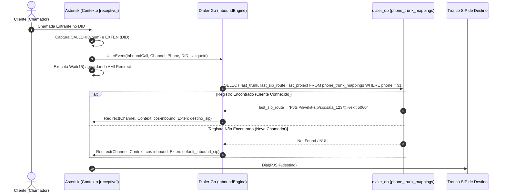

# Roteamento Receptivo O(1) e Retorno Dinâmico de Chamadas

Este documento especifica a mecânica de roteamento de chamadas entrantes (Inbound Telephony) no **Dialer-Go**, assegurando resolução sub-milissegundo para retornos de ligação.

---

## 1. Problema de Negócio: O Retorno de Chamadas Perdidas

Quando um cliente recebe uma discagem preditiva ou manual e não consegue atender a tempo, ao retornar a ligação para o DID de origem ele deve ser reconectado com o mesmo contexto de atendimento (mesmo operador, sala de agente virtual ou campanha), sem passar por árvores de URA complexas.

---

## 2. Topologia de Dados & Tabela Rápida `phone_trunk_mappings`

Para evitar varreduras de alta latência em tabelas massivas de CDR (`cdrs`), o discador mantém a tabela auxiliar dedicada e indexada:

```sql
CREATE TABLE IF NOT EXISTS phone_trunk_mappings (
    phone VARCHAR(32) PRIMARY KEY,
    last_trunk VARCHAR(64) NOT NULL,
    last_project VARCHAR(128),
    last_sip_route VARCHAR(128),
    tenant_id VARCHAR(64) NOT NULL,
    updated_at TIMESTAMP WITH TIME ZONE DEFAULT CURRENT_TIMESTAMP
);

CREATE INDEX IF NOT EXISTS idx_phone_trunk_mappings_tenant ON phone_trunk_mappings(tenant_id);
```

### Invariantes da Tabela:
* **Chave Primária `phone`:** Lookup garantido $O(1)$ via índice B-Tree primário.
* **Upsert Contínuo:** Toda chamada sainte bem-sucedida ou discada atualiza imediatamente o par `(phone, last_trunk, last_project, last_sip_route)`.

---

## 3. Algoritmo de Decisão de Roteamento Receptivo



---

## 4. Garantia de Isolamento Multi-Tenant

* A verificação do tenant é compulsória.
* Caso a chamada entrante pertença a um DID compartilhado, o mapeamento valida o `tenant_id` registrado no DID para garantir que a ligação nunca seja roteada para operadores ou salas de outro contratante.
