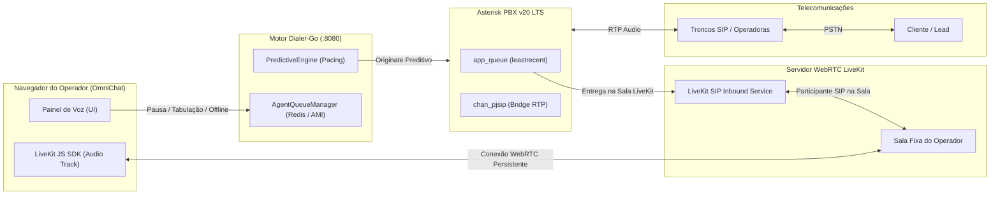
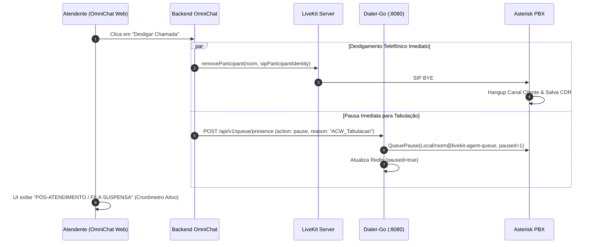
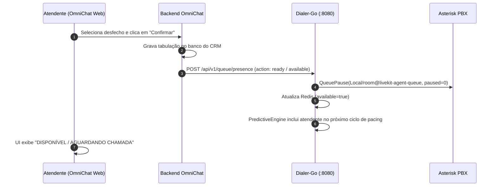

# Arquitetura Canônica de Filas Preditivas, LiveKit & Gestão de Estados de Atendimento

Documento normativo e diretriz de engenharia para distribuição de chamadas preditivas, gerenciamento de conexões WebRTC via LiveKit e governança de estados dos operadores no **Dialer-Go** e **OmniChat**.

---

## 1. Visão Geral da Arquitetura

A integração de telefonia preditiva e WebRTC é composta por quatro camadas desacopladas:



---

## 2. Abordagem de Salas Fixas Persistentes (Persistent WebRTC Rooms)

Para garantir **latência zero na entrega de chamadas** e **eliminar handshakes repetitivos de WebRTC** (ICE, STUN/TURN, troca de SDP), a arquitetura adota salas fixas por operador.

### 2.1. Regras Fundamentais de Sala
1. **Conexão Única por Turno:** O operador conecta à sua sala (`room: room_<agent_id>` ou `room: <username>`) ao iniciar o expediente de voz e permanece nela durante todo o período ativo.
2. **Injeção de Perna SIP:** Ao entregar uma chamada, o Asterisk disca via SIP para o LiveKit, que entra na sala existente do operador como um **participante SIP** (`sip_cliente_<uniqueid>`).
3. **Desligamento Cirúrgico:** Ao término da chamada (ou clique em "Desligar"), **a sala NÃO é destruída**. O backend/frontend remove exclusivamente o participante SIP (`roomService.removeParticipant`), provocando o `SIP BYE` imediato no Asterisk sem desconectar o fone do atendente.

---

## 3. Máquina de Estados Unificada do Operador

A governança do operador deve ser sincronizada atomicamente entre **OmniChat (UI)**, **LiveKit (WebRTC)**, **Asterisk (`app_queue`)** e **Dialer-Go (Redis)**:

| Estado do Operador | Estado no LiveKit | Estado na Fila Asterisk | Pacing do Discador | Preservação de `lastcall` |
| :--- | :--- | :--- | :--- | :--- |
| **🟢 DISPONÍVEL / PRONTO** | Conectado na Sala | `Not In Use` (Despausado) | Conta como Agente Livre (+1) | Mantém timestamp original |
| **🔵 EM CHAMADA** | Conectado + Participante SIP | `In Use` (Ocupado) | Conta como Agente Ocupado (0) | Atualizado no Hangup |
| **🟡 PÓS-ATENDIMENTO / TABULAÇÃO** | Conectado na Sala (Sem SIP) | `Paused` (Motivo: `ACW_Tabulacao`) | **Pausado (0)** — Zero chamadas enviadas | **Preservado** |
| **🟣 NEGOCIAÇÃO (Chat/WhatsApp)** | **Desconecta da Sala** | `Paused` (Motivo: `Negociacao_Texto`) | **Pausado (0)** | **Preservado** |
| **🟠 PAUSA (Almoço / Banheiro / Feedback)** | **Desconecta da Sala** | `Paused` (Motivo: `Pausa_<Tipo>`) | **Pausado (0)** | **Preservado** |
| **🔴 OFFLINE / LOGOUT** | **Desconecta & Destrói Sala** | `Removed` (Removido da Fila) | Removido do Cálculo (-1) | Resetado |

---

## 4. Política de Saída da Sala LiveKit (Desconexão WebRTC)

A desconexão da sala WebRTC do LiveKit (`room.disconnect()`) **só ocorre** quando o atendente sai voluntariamente da operação ativa de voz:

### 4.1. Gatilhos de Saída da Sala:
1. **Transição para Aba de Negociação / WhatsApp:** Quando o atendente clica para atender clientes por texto puro ou fechar contrato via chat, o painel de voz desativa o microfone e desconecta do LiveKit, liberando recursos do servidor.
2. **Pausa Pessoal / Almoço / Descanso:** Ao selecionar qualquer pausa no menu do CRM, o WebSocket e os tracks WebRTC são fechados.
3. **Offline / Fechamento de Janela (Logout):** Ao deslogar ou fechar o navegador, o evento de `beforeunload` ou timeout de heartbeat remove o atendente do Asterisk e purga a sala no LiveKit.

---

## 5. Controle de Tempos, Ociosidade Justa & Estratégia `leastrecent`

A distribuição de chamadas é regida pela política de **justiça temporal absoluta**: a próxima chamada é obrigatoriamente entregue ao operador que está **há mais tempo ocioso sem falar com clientes**.

### 5.1. Como o Asterisk Controla Isso com `leastrecent`
No arquivo [`mode/dialer/queues.conf`](file:///home/marcio/ecosystem/dialer-go/mode/dialer/queues.conf):
```ini
[dialer-queue-template](!)
strategy = leastrecent
wrapuptime = 0
ringinuse = no
shared_lastcall = yes
```

* **`strategy = leastrecent`:** O Asterisk ordena a fila pelo atributo `lastcall` (timestamp Unix da última vez que o atendente finalizou uma chamada).
* **`shared_lastcall = yes`:** Garante que o timestamp da última chamada seja propagado em todas as filas que o atendente participa.
* **`ringinuse = no`:** Impede que o Asterisk envie chamada para um ramal que já tenha perna ativa.

### 5.2. Por que o Estado `Paused` (Tabulação) Não Prejudica a Justiça da Fila?
Quando um atendente entra em **Tabulação (`Paused`)**:
1. O Asterisk **não altera o seu timestamp de última chamada (`lastcall`)**.
2. Enquanto estiver pausado, o Asterisk ignora o membro na hora de entregar chamadas.
3. No momento em que o atendente clica em **"Confirmar Tabulação" (`Unpause`)**, ele volta para a fila com seu `lastcall` original preservado.

#### Exemplo Prático de Fila Justa:
* **Operador A:** Terminou uma chamada às **10:00** e tabulou em 15 segundos (Disponível às **10:00:15**).
* **Operador B:** Terminou uma chamada às **09:55** e ficou aguardando (Disponível desde **09:55:00**).
* **Operador C:** Terminou uma chamada às **09:58**, tabulou por 2 minutos e confirmou às **10:00:00** (Disponível às **10:00:00**).
* **Resultado:** Quando a próxima chamada humana for classificada pelo discador, a fila entrega na seguinte ordem estrita:
  1. 🥇 **Operador B** (Sem falar há 5 minutos)
  2. 🥈 **Operador C** (Sem falar há 2 minutos)
  3. 🥉 **Operador A** (Sem falar há 15 segundos)

---

## 6. Diagramas de Sequência

### 6.1. Ciclo de Desligamento e Início de Tabulação (Sem Destruir a Sala)



### 6.2. Conclusão de Tabulação (Retorno à Fila)



---

## 7. Contrato de Presença e Controle de Fila (`POST /api/v1/queue/presence`)

O OmniChat deve disparar o endpoint canônico de presença do Dialer-Go nas transições de estado:

```json
{
  "tenant_id": "default",
  "campaign_id": "12",
  "agent_id": "emerson",
  "livekit_room": "room_emerson",
  "action": "pause",
  "reason": "ACW_Tabulacao",
  "paused": true
}
```

### Valores Válidos para `action`:
* **`ready` / `available`:** Despausa o atendente na fila Asterisk e libera no Redis.
* **`pause`:** Pausa o atendente na fila Asterisk com o motivo em `reason`.
* **`leave` / `offline`:** Remove o atendente da fila Asterisk e purga do Redis.
